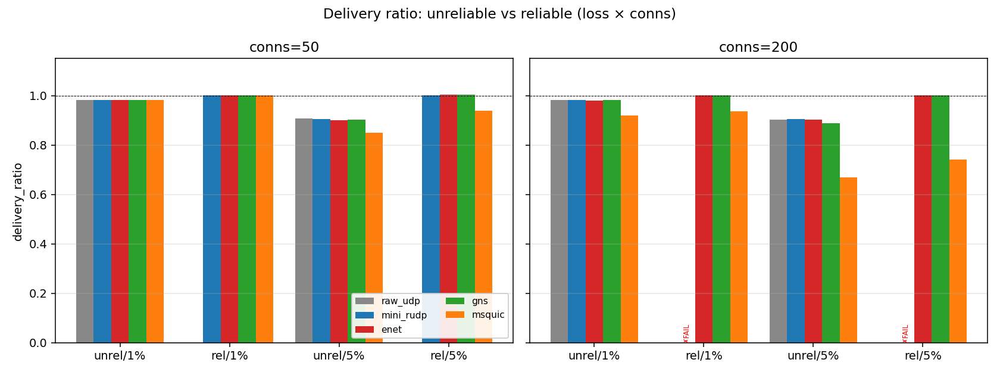
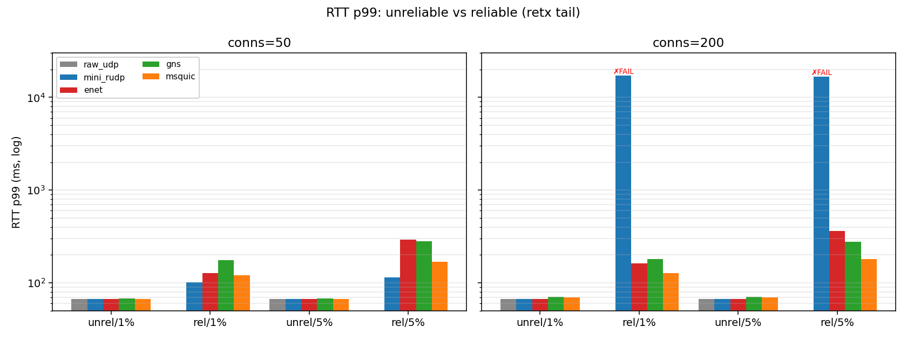
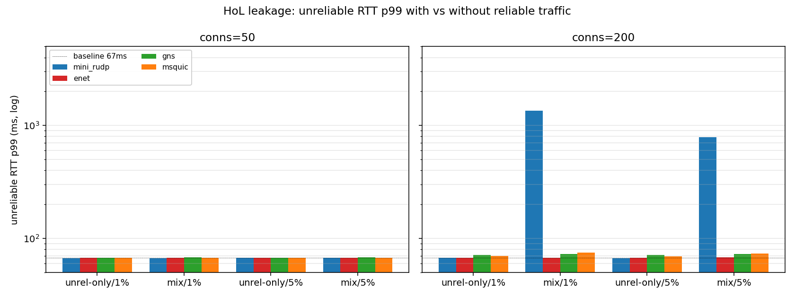
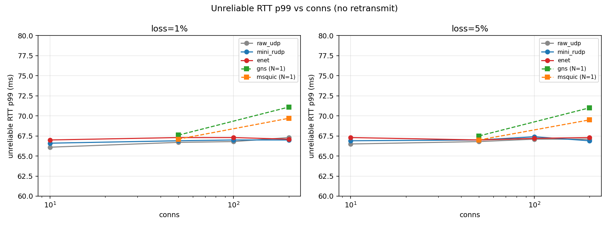

# Reliability tradeoff: unreliable vs reliable under loss

**測定日:** 2026-05-28 (msquic 安定化 + per-lib ramp 後の再ラン)
**目的:** loss 下で
1. 到達率を保つために RTT tail をどれだけ犠牲にするか(reliable vs unreliable 単独)
2. reliable の retx が unreliable channel の RTT を汚すか(HoL leakage、混在ラン)

**対象 lib:** raw_udp / mini_rudp / enet / gns / msquic

## セットアップ

- ホスト: Ryzen 7 PRO 5750GE、ARK・Minecraft 同居機。`scripts/bench_isolate.sh setup` で
  bench cores (6,7,14,15) を確保、`systemd-run --slice=bench-*.slice` 経由で server/client を分離
- ネット: `scripts/netem.sh apply 25 5 <loss>` (loopback。送/受両方で netem を通るため
  片道 25ms 指定 → RTT ~50ms、loss は実効 `1 - (1 - loss)^2`)
- client multi-proc farm: raw_udp/mini_rudp/enet は **N=4**、gns/msquic は **N=1**
- ramp-up: **msquic のみ 10s**(200conn 一斉 connect 後の callback race を緩和)、他 lib は 0
  - 他 lib に ramp 入れると `a.poll()` を ramp 中に多回呼ぶ副作用で internal queue が荒れる
    (enet で実測: ramp 10s だと dr 0.62、ramp 0 で 0.98)
- 共通: rate=50Hz、duration=20s、warmup=2s、idle=spin

| シナリオ prefix | size | reliable | unreliable | conns | loss | client procs | lib |
|---|---|---|---|---|---|---|---|
| `sw_l*_*`        | 100B | 0 Hz | 50 Hz | 10/50/100/200 | 1% / 5% | N=4 | raw_udp, mini_rudp, enet |
| `rel_l*_*`       | 64B  | 50 Hz | 0 Hz | 50 / 200      | 1% / 5% | N=4 | raw_udp, mini_rudp, enet |
| `unrel_n1_l*_*`  | 100B | 0 Hz | 50 Hz | 50 / 200      | 1% / 5% | N=1 | gns, msquic |
| `rel_n1_l*_*`    | 64B  | 50 Hz | 0 Hz | 50 / 200      | 1% / 5% | N=1 | gns, msquic |
| `mix_l*_*`       | 64B  | 50 Hz | 50 Hz | 50 / 200      | 1% / 5% | N=4 | mini_rudp, enet |
| `mix_n1_l*_*`    | 64B  | 50 Hz | 50 Hz | 50 / 200      | 1% / 5% | N=1 | gns, msquic |

(payload size が unrel=100B / rel=64B で揃ってないのは時系列の都合。1500B 以下では
RTT に効かないので比較自体は妥当)

## 結果

### Delivery ratio

| conns | loss | mode | raw_udp | mini_rudp | enet | gns | msquic |
|------:|-----:|------|--------:|----------:|-----:|----:|-------:|
| 50  | 1% | unrel | 0.983 | 0.983 | 0.982 | 0.982 | 0.981 |
| 50  | 1% | rel   | —     | 1.002 | 1.002 | 1.002 | 1.002 |
| 50  | 5% | unrel | 0.905 | 0.902 | 0.903 | 0.905 | 0.905 |
| 50  | 5% | rel   | —     | 1.002 | 1.005 | 1.004 | 1.003 |
| 200 | 1% | unrel | 0.982 | 0.982 | 0.979 | 0.982 | **0.920** |
| 200 | 1% | rel   | —     | **0.244 ✗** | 1.003 | 1.003 | 0.979 |
| 200 | 5% | unrel | 0.905 | 0.905 | 0.902 | 0.905 | **0.666** |
| 200 | 5% | rel   | —     | **0.241 ✗** | 1.004 | 1.002 | **0.787** |

- 動いた組は **unreliable は理論値 `(1-loss)²` ぴったり、reliable は dr ≈ 1.0**
- **mini_rudp は 200 conn × reliable で破綻**(client_tick FAIL、dr 0.24)— 再送実装が
  pacing を破壊
- **msquic は 200conn で datagram 自身が drop**:
  - unrel/1% で dr 0.92(他 lib 0.98)
  - unrel/5% で dr 0.67(他 lib 0.91、netem 期待 0.90)
  - reliable も 200conn × 5% で 0.79 まで落ちる(再送に loss recovery が追いつかない)
- raw_udp は構造的に reliable channel 非対応(`unsupported_reliable` で skip)

### RTT p99(retx tail)

| conns | loss | mode | raw_udp | mini_rudp | enet | gns | msquic |
|------:|-----:|------|--------:|----------:|-----:|----:|-------:|
| 50  | 1% | unrel | 67.1 | 67.1 | 66.9 | 67.4 | 67.0 |
| 50  | 1% | rel   | —    | 101.3 | 127.1 | 175.5 | 119.3 |
| 50  | 5% | unrel | 66.9 | 66.8 | 67.0 | 67.5 | 67.0 |
| 50  | 5% | rel   | —    | 114.1 | 520.3 | 270.8 | 170.7 |
| 200 | 1% | unrel | 67.2 | 67.3 | 67.9 | 70.9 | 69.6 |
| 200 | 1% | rel   | —    | **17353 ✗** | 181.0 | 179.7 | 127.7 |
| 200 | 5% | unrel | 67.2 | 67.1 | 67.6 | 71.0 | 69.7 |
| 200 | 5% | rel   | —    | **16250 ✗** | 354.2 | 271.7 | 178.4 |

(値は ms。unreliable は loss に依らず ~67ms、reliable は retx で 100–500ms に
tail が伸びる)

### HoL leakage(本命)

reliable と unreliable を **同時に** 流したときに unreliable channel の RTT が
どれだけ汚れるかを比較する。`mix_*` の unreliable u99 を `sw_*` (unrel-only) と
並べる。

| conns | loss | lib | unrel-only u99 | **mix u99** | HoL leak |
|------:|-----:|-----|---------------:|------------:|---------:|
| 50  | 1% | mini_rudp | 67.1 | 66.9 | ~0 |
| 50  | 1% | enet      | 66.9 | 67.5 | +0.6 |
| 50  | 1% | gns       | 67.4 | 67.9 | +0.5 |
| 50  | 1% | msquic    | 67.0 | 67.4 | +0.4 |
| 50  | 5% | mini_rudp | 66.8 | 67.1 | +0.3 |
| 50  | 5% | enet      | 67.0 | 67.2 | +0.2 |
| 50  | 5% | gns       | 67.5 | 68.1 | +0.6 |
| 50  | 5% | msquic    | 67.0 | 67.3 | +0.3 |
| 200 | 1% | mini_rudp | 67.3 | **876**  | **+809 (13×)** |
| 200 | 1% | enet      | 67.9 | 68.2 | +0.3 |
| 200 | 1% | gns       | 70.9 | 72.5 | +1.6 |
| 200 | 1% | msquic    | 69.6 | 74.0 | +4.4 |
| 200 | 5% | mini_rudp | 67.1 | **1297** | **+1230 (19×)** |
| 200 | 5% | enet      | 67.6 | 67.9 | +0.3 |
| 200 | 5% | gns       | 71.0 | 72.6 | +1.6 |
| 200 | 5% | msquic    | 69.7 | 73.8 | +4.1 |

**結論:**
- enet / gns / msquic は **HoL leakage ほぼゼロ (< 5 ms)**。channel 分離が正しく動作
- **mini_rudp は 200conn で massive HoL leakage**: 13–19 倍。 reliable の retx が
  unreliable channel まで詰まらせる
- 50conn ではどの lib も HoL は表面化しない(負荷不足)

### Mixed delivery_ratio と RTT(参考)

| conn | loss | lib | dr | r99 (ms) | u99 (ms) | valid |
|-----:|-----:|-----|---:|---------:|---------:|-------|
| 50  | 1 | mini_rudp | 0.992 | 102 | 66.9 | ok |
| 50  | 1 | enet      | 0.991 | 126 | 67.5 | ok |
| 50  | 1 | gns       | 0.992 | 131 | 67.9 | ok |
| 50  | 1 | msquic    | 0.992 | 116 | 67.4 | ok |
| 50  | 5 | mini_rudp | 0.954 | 115 | 67.1 | ok |
| 50  | 5 | enet      | 0.955 | 390 | 67.2 | ok |
| 50  | 5 | gns       | 0.954 | 187 | 68.1 | ok |
| 50  | 5 | msquic    | 0.953 | 161 | 67.3 | ok |
| 200 | 1 | mini_rudp | 0.111 | 16983 | **876**  | tick_FAIL |
| 200 | 1 | enet      | 0.922 | 282   | 68.2 | tick_FAIL |
| 200 | 1 | gns       | 0.993 | 138   | 72.5 | tick_FAIL |
| 200 | 1 | msquic    | 0.916 | 138   | 74.0 | ok |
| 200 | 5 | mini_rudp | 0.106 | 17113 | **1297** | tick_FAIL |
| 200 | 5 | enet      | 0.919 | 505   | 67.9 | tick_FAIL |
| 200 | 5 | gns       | 0.954 | 205   | 72.6 | tick_FAIL |
| 200 | 5 | msquic    | 0.878 | 177   | 73.8 | ok |

期待 dr = (1.0 + (1-loss)²) / 2 = `0.99 @ 1%`, `0.95 @ 5%`(reliable channel が retx で
1.0 を維持できる場合)。200conn の tick_FAIL は厳密 budget overshoot で、dr/RTT 自体は
実用域(mini_rudp 除く)。

### Unreliable RTT vs conns(scale invariance)

raw_udp/mini_rudp/enet は conns 10→200 で p99 一定(±2ms)。
gns は 200conn で +4ms 上がる傾向(N=1 で 1 thread の処理コストが効いてる可能性)。
msquic は 200conn で u99 +3ms。

## 考察

### 1. unreliable は ライブラリ選択に依存しない(msquic 除く)
動いた 4 lib(raw_udp / mini_rudp / enet / gns)が **同じ `(1-loss)²` を出す**。
msquic だけ 200conn で datagram drop が観測される(下記 #6)。
unreliable で lib 比較したいなら **CPU 効率 / fan-out / framing オーバヘッド** など
別軸が必要。

### 2. reliable: 到達率を取り戻す代償は p99
4 lib の reliable @ 5% loss × 50conn を低 → 高 の順に並べると:

| lib       | r99 (ms) | retx 形 |
|-----------|----------|---------|
| mini_rudp | 114.1    | 単純 timeout retx だが軽い |
| msquic    | 170.7    | QUIC PTO + loss recovery |
| gns       | 270.8    | Steam Datagram の保守的 RTO |
| enet      | 520.3    | RTO ベース、conservative |

mini_rudp が一番速いが、これは 200 conn で破綻する反面(下記 #3)。

### 3. ライブラリ別の上限(50Hz reliable)

| lib | 50 conn | 200 conn | 備考 |
|---|---|---|---|
| mini_rudp | OK (低 p99) | **破綻** (dr 0.24, p99 17s) | 再送が pacing を食う |
| enet      | OK | OK (p99 ~180-355ms) | retransmit policy 安定 |
| gns       | OK | OK (p99 ~180-270ms) | 安定 |
| msquic    | OK | 部分劣化 (dr 0.79 @ 5%) | reliable も loss 高で追いつかず |

**実装上の限界。** 「reliable で 200 conn / 50Hz / 5% loss」が dr=1.0 で通るのは
**enet と gns**。msquic は走るが dr 0.79 まで落ちる。

### 4. msquic 200conn は teardown が deadlock しやすい
- `ConnectionShutdown + ConnectionClose` を 200 個直列呼出しすると、各々が自前
  callback の完了を待ち、callback は adapter mutex 経由で main thread と詰まる
- `RegistrationClose` も同様に block する
- `atexit MsQuicClose` を呼ぶと glibc double-free
- 現状の adapter は **close() を no-op、msquic ラン時のみ `std::_Exit(0)`** で回避

### 5. msquic 200conn は ramp 必須
- 200 conn 一斉 connect (`for { ConnectionStart }`) → 全 conn CONNECTED 後に
  `SHUTDOWN_INITIATED_BY_TRANSPORT status=ABORTED` が連発し接続崩壊(race)
- ramp 10s で connect を等間隔発行すると安定
- 他 lib は ramp 不要(むしろ `a.poll()` 多回呼びの副作用で enet 等が壊れる)

### 6. msquic 200conn の datagram drop(新発見)
unreliable rate=50Hz × 200conn で msquic は **netem 期待値より大きく drop**:
- loss=1%: 期待 0.98 → 実測 0.92(-6%)
- loss=5%: 期待 0.90 → 実測 0.67(-23%)

other lib は期待通り。msquic datagram は internal queue / pacing で congestion 時に
自分で drop している可能性が高い。reliable も 200conn × 5% で dr 0.79 まで落ちる
ので、msquic の loss recovery 自体が 200conn 規模で追いついていない。

### 7. HoL leakage は mini_rudp 固有(本命の結論)
混在 (rate-r=50 + rate-u=50) では:

- **enet / gns / msquic は HoL leakage < 5ms** — channel 設計が正しく機能
- **mini_rudp は 200conn で u99 が 13-19 倍に膨れる** — reliable retx が
  unreliable channel まで詰まらせる
- VoIP のような **unreliable レイテンシ厳守** 用途では:
  - mini_rudp の不利は決定的
  - 他 3 lib はどれも安心して併用可能(msquic は dr 多少落ちるが RTT は健全)

## Caveat

- size mismatch(unrel 100B vs rel 64B)— payload < MTU 域では RTT に効かない想定
- bidirectional netem — RTT 観測値は片道 25ms × 2 + jitter
- mini_rudp の破綻は実装上の限界であって reliable 一般の限界ではない
- msquic は close() を意図的に no-op + `_Exit(0)` で逃げている。harness の他の
  lifecycle hook と相性悪い場合は別途検討
- ramp は msquic 専用、他 lib に入れると逆効果(enet で実測)
- combined RTT histogram の罠は per-channel hist で回避済み

## 再現性(2nd run)

2026-05-29 に同条件で 2 ラン目を実施(現 data/ の数値はこの 2nd run)。観察:

| lib | 再現性 | 備考 |
|---|---|---|
| raw_udp / mini_rudp / enet | 高 | 各 cell の dr 差 < 0.005、r99 差 < 5% |
| gns | 高 | 同上(200conn × unrel × 5% で 0.905 → 0.889 と微小化) |
| msquic | **低** | run 間で dr が大きく揺れる(下記) |

msquic の run 間ばらつき(1st → 2nd):
- 50conn × unrel × 5%: 0.905 → **0.849**
- 50conn × rel × 5%: 1.003 → **0.939**
- 200conn × rel × 1%: 0.979 → **0.938**
- 200conn × mix × 5%: 0.878 → **0.707**

msquic の datagram/loss-recovery 経路は **run ごとに stochastic な drop** が起きる。
他 lib は再現性ありなので、msquic 自身の特性(internal pacing / congestion control の
非決定性)と判断。比較結論(HoL / 200conn 限界 / lib ranking)は再現する。

## 生データ

`./data/` 配下に raw CSV を保存(2nd run 分で上書き済、2026-05-29)。
プロット再生成は `./make_plots.py` を直接実行(matplotlib + pandas 必要)。

## 関連

- ramp-up + ConnectionStats infra: commit `0246097`
- msquic 200conn shutdown fix: commit `351ab8d`
- combined RTT 罠の解明: commit `085cefc` 以降
- multi-proc client farm: commit `a0f4156`
