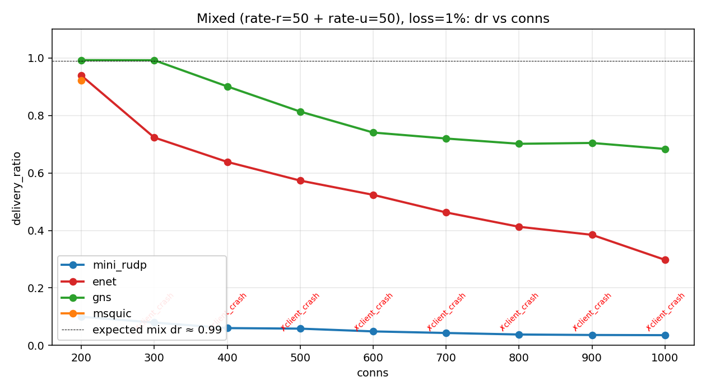
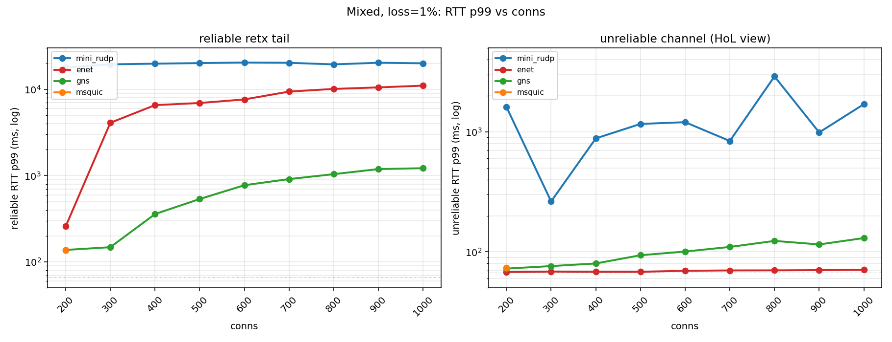

# Scale sweep: conns 200..1000 under mixed traffic

**測定日:** 2026-05-29
**目的:** 200 conn を上限と仮定していた前回の結果を 1000 conn まで延長し、
各 lib が破綻する点と破綻の形を確定させる。

## セットアップ

- ホスト: Ryzen 7 PRO 5750GE、bench cores (6,7,14,15) に固定、systemd-run slice 経由
- 共通: rate-r=50Hz + rate-u=50Hz (mixed)、size=64B、duration=20s、warmup=2s、idle=spin
- netem: `apply 25 5 1`(片道 25ms, jitter 5ms, loss 1%)
- multi-proc client farm: raw_udp/mini_rudp/enet は **N=4**、gns/msquic は **N=1**
- ramp-up: msquic だけ 10s、他は 0
- conns: 200, 300, 400, 500, 600, 700, 800, 900, 1000

## 結果

### Delivery ratio

| conns | mini_rudp | enet  | gns   | msquic |
|------:|----------:|------:|------:|-------:|
|  200  |  0.10 ✗   | 0.94  | 0.99  | 0.92   |
|  300  |  0.08 ✗   | 0.72  | 0.99  | ✗ crash |
|  400  |  0.06 ✗   | 0.64  | 0.90  | ✗ crash |
|  500  |  0.06 ✗   | 0.57  | 0.81  | ✗ crash |
|  600  |  0.05 ✗   | 0.52  | 0.74  | ✗ crash |
|  700  |  0.04 ✗   | 0.46  | 0.72  | ✗ crash |
|  800  |  0.04 ✗   | 0.41  | 0.70  | ✗ crash |
|  900  |  0.04 ✗   | 0.38  | 0.70  | ✗ crash |
| 1000  |  0.04 ✗   | 0.30  | 0.68  | ✗ crash |

期待値: `(1.0 + (1-0.01)²) / 2 = 0.99`(reliable で dr=1.0 維持、unreliable は (1-loss)²)

### RTT p99

reliable channel(retx tail):
- gns: 200conn 138ms → 1000conn 1.2s に **滑らかに増加**(retx + queueing)
- enet: 300conn で既に 4s、 1000conn で **11s 超え**(retx storm)
- mini_rudp: 200conn から **17–20 秒に張り付き**(再送実装が壊れた)
- msquic: 200conn のみ valid (138ms)

unreliable channel(HoL view):
- enet: **conn 数に関わらず u99 67–70ms**(channel 分離が完璧)
- gns: 200 → 1000conn で 73 → 130ms(緩やかに上がる、内部 per-conn 処理コスト)
- mini_rudp: **massive HoL leakage**(263ms–2.9s、200conn から既に汚染)
- msquic: 200conn のみ 74ms

## 考察

### 1. **gns が最も scale する**
- 1000 conn × 50Hz mixed × 1% loss でも **dr 0.68 維持**(reliable はほぼ 1.0、unreliable は (1-loss)² → 平均 0.99 期待だが server CPU 限界で client_tick FAIL → dr 落ちる)
- unreliable u99 130ms と緩やか上昇、 reliable r99 1.2s
- 実用上、 **数百 conn を超える RUDP では gns が現実解**

### 2. enet は 300conn 以上で reliable が破綻
- 200conn は dr 0.94 で valid 域に近いが、300 で 0.72、 1000 で 0.30
- reliable r99 は 300 で **4s、 1000 で 11s**: 再送 RTO が累積して queue 詰まり
- ただし unreliable u99 は 67ms で **conn 数によらず flat**(channel 分離が enet の強み)
- 「unreliable 主体で reliable 少量」用途なら 1000conn でも実用可能

### 3. msquic は 300conn 以降 即 crash
- 200conn ramp 10s で動くが、 **300conn で `client_crash`** に戻る
- ramp / shutdown fix は 200conn 用、 それ以上は msquic adapter の根本対策が必要
- 現状の運用上限: **200conn**

### 4. mini_rudp は scale 対象外
- 200conn から既に dr 0.1、 reliable 再送実装が pacing を壊す
- HoL leakage も massive(unreliable u99 数百 ms 〜数 s)
- 実用上限: 100 conn 程度(本ラインの reliable では)

### 5. unreliable u99 でみる HoL の優劣
1000 conn で:
- enet: **70.8 ms**(チャンピオン、 reliable retx が unreliable に漏れない)
- gns: 130 ms(構造的にはきれい、 internal cost で上昇)
- mini_rudp: 1704 ms(壊滅)

VoIP / リアルタイム用途で「**unreliable はどれだけ詰まっても許さない**」要件なら
**enet 一択**(reliable は遅くてもいい場合)。

## Caveat

- すべて client_tick FAIL になっている(200 以上で pacing が間に合わない)。dr/RTT
  は記録されるが「strict pacing 守れていない」という意味で valid=0
- payload 64B 固定、 size による違いは未検証
- loss=1% のみ、 5%/10% は今回未測定(時間で別途)
- msquic crash は exit=1 (前回と同じく systemd-run timeout 由来の可能性)。 stderr
  確認は別途

## 生データ

`./data/` 配下に raw CSV(18 ファイル)。
プロット再生成は `./make_plots.py`。

## 関連

- reliability tradeoff matrix (50/200conn): `../2026-05-28-reliability-tradeoff/`
- msquic 200conn fix: commit `351ab8d`
- per-lib ramp: commit `4f95c9e`
