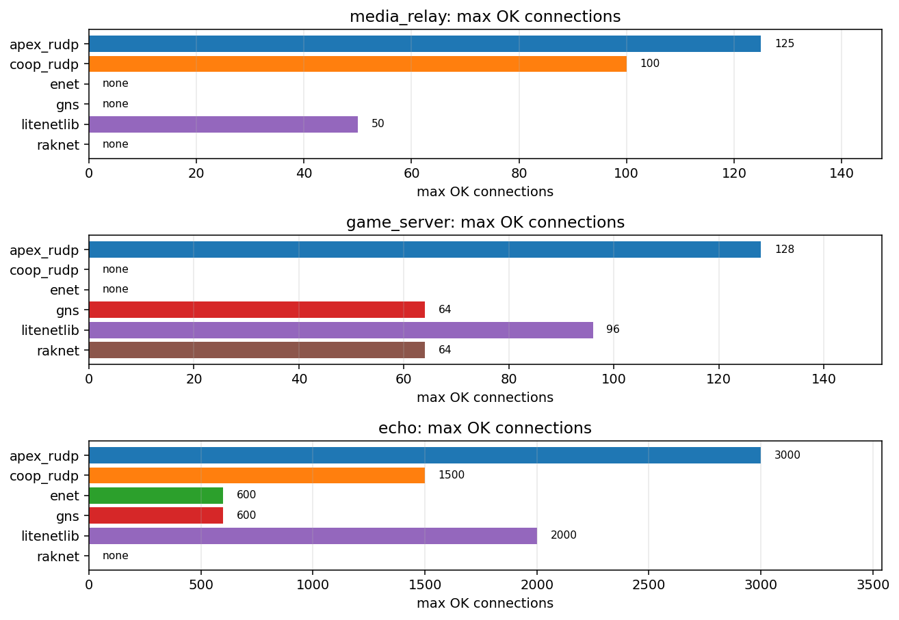
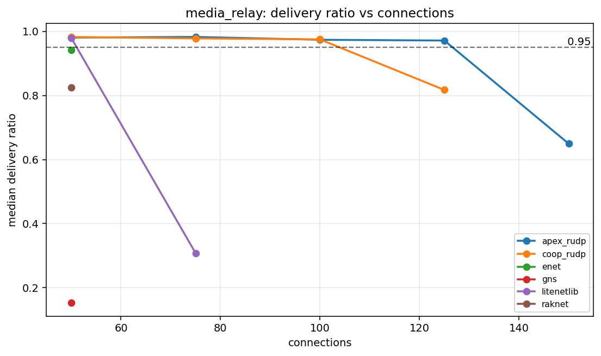
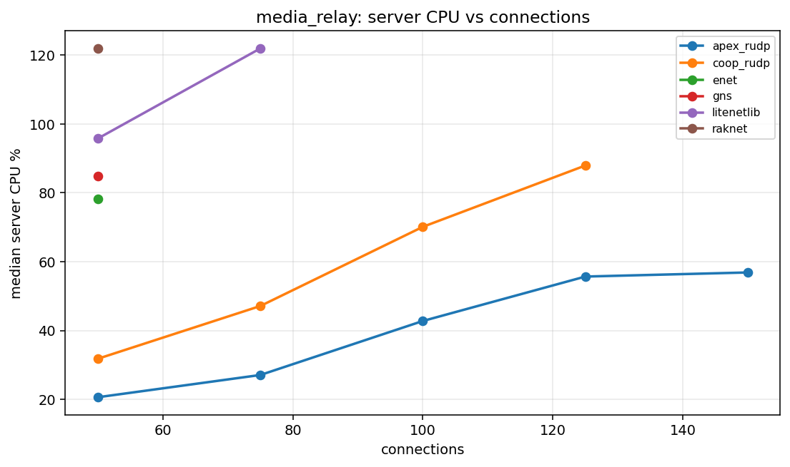
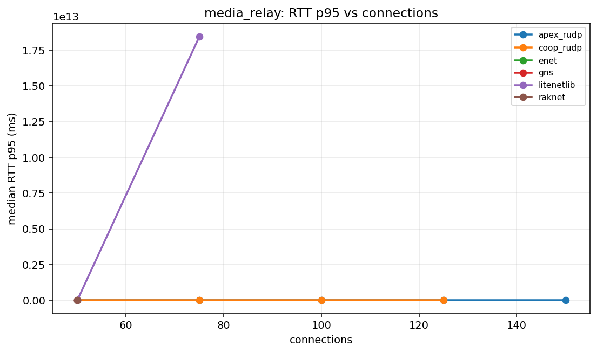
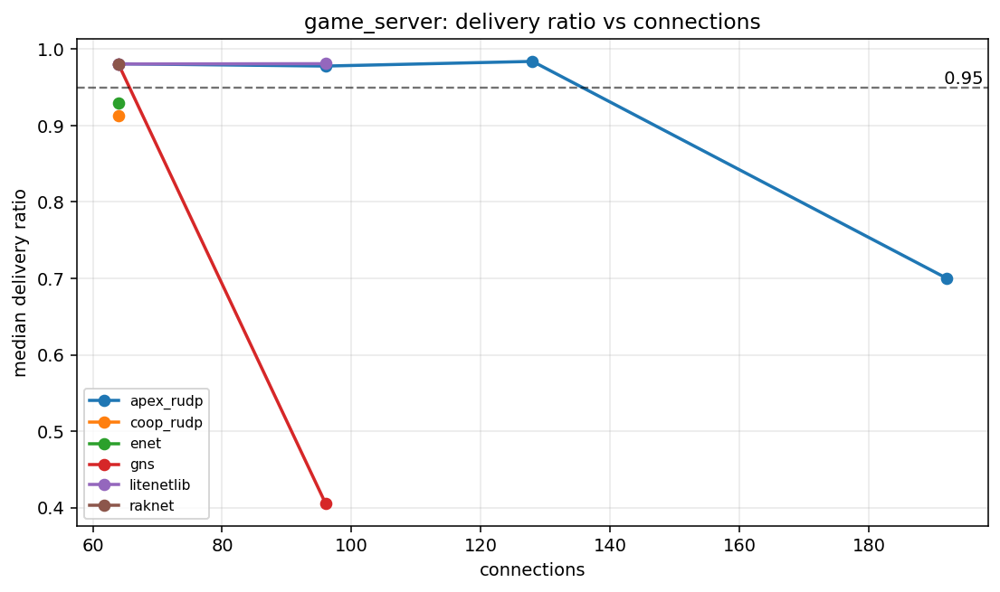
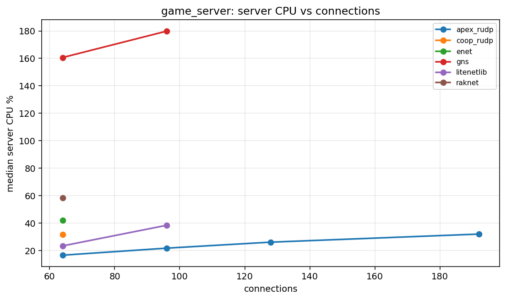
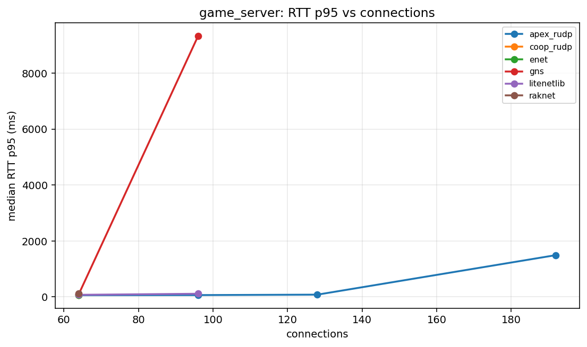
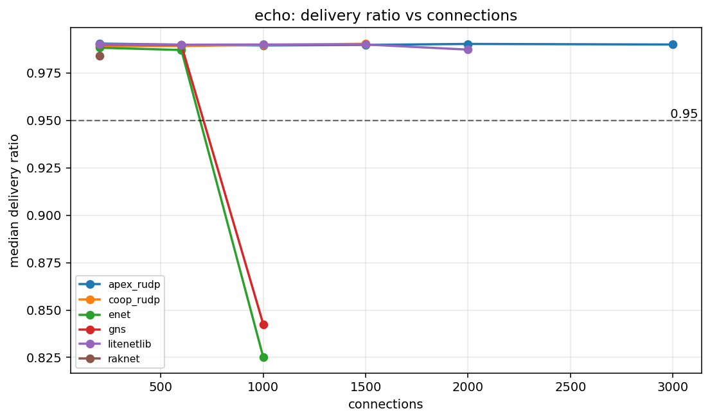
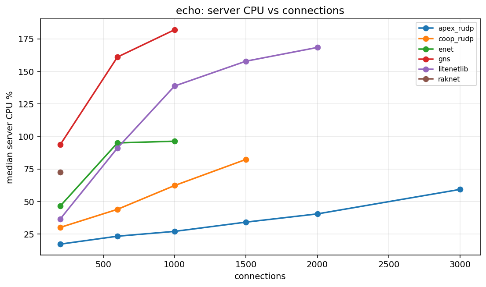
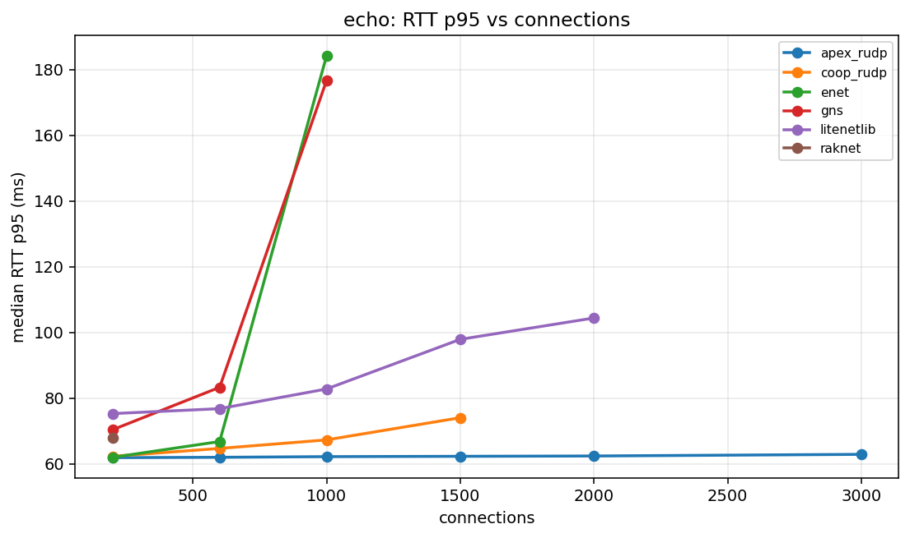

# Canonical Benchmark Report

Generated: 2026-06-08 18:59:52 UTC

Result directory: `docs/measurements/2026-06-08-canonical-raknet-final (published from results/final_saturation_profiles_full_raknet_20260608T153112Z)`

This report is generated by `scripts/run_canonical_tests.sh`. It is the first file to open after a canonical benchmark run.

## Verdict

| profile | strongest | max OK | break | max OK readout |
| --- | --- | --- | --- | --- |
| media_relay | apex_rudp | 125 | 150 (delivery<0.95) | delivery 0.9713, CPU 55.68% |
| game_server | apex_rudp | 128 | 192 (delivery<0.95) | delivery 0.9839, CPU 26.09% |
| echo | apex_rudp | 3000 | not broken | delivery 0.9900, CPU 59.35% |

OK means aggregate valid runs meet the gate and median `delivery_ratio >= 0.95`.

## Graphs

### `media_relay`

### `game_server`

### `echo`

## Capacity Table

| profile | library | status | last OK | last OK delivery | last OK CPU | break | break reason | break delivery | break CPU |
| --- | --- | --- | --- | --- | --- | --- | --- | --- | --- |
| echo | apex_rudp | not_broken | 3000 | 0.9900 | 59.35 | not broken |  |  |  |
| echo | coop_rudp | broken | 1500 | 0.9904 | 82.37 | 2000 | aggregate_invalid:client_tick |  |  |
| echo | enet | broken | 600 | 0.9871 | 95.05 | 1000 | delivery<0.95 | 0.8251 | 96.35 |
| echo | gns | broken | 600 | 0.9898 | 160.99 | 1000 | delivery<0.95 | 0.8425 | 181.95 |
| echo | litenetlib | broken | 2000 | 0.9873 | 168.36 | 3000 | aggregate_invalid:client_tick |  |  |
| echo | raknet | broken | none |  |  | 200 | aggregate_invalid:valid_runs=1/3 | 0.9841 | 72.61 |
| game_server | apex_rudp | broken | 128 | 0.9839 | 26.09 | 192 | delivery<0.95 | 0.7003 | 31.97 |
| game_server | coop_rudp | broken | none |  |  | 64 | delivery<0.95 | 0.9124 | 31.61 |
| game_server | enet | broken | none |  |  | 64 | delivery<0.95 | 0.9299 | 42.15 |
| game_server | gns | broken | 64 | 0.9798 | 160.63 | 96 | aggregate_invalid:valid_runs=1/3 | 0.4054 | 179.86 |
| game_server | litenetlib | broken | 96 | 0.9809 | 38.39 | 128 | aggregate_invalid:client_tick |  |  |
| game_server | raknet | broken | 64 | 0.9805 | 58.25 | 96 | aggregate_invalid:client_tick |  |  |
| media_relay | apex_rudp | broken | 125 | 0.9713 | 55.68 | 150 | delivery<0.95 | 0.6493 | 56.87 |
| media_relay | coop_rudp | broken | 100 | 0.9749 | 70.12 | 125 | delivery<0.95 | 0.8172 | 87.92 |
| media_relay | enet | broken | none |  |  | 50 | delivery<0.95 | 0.9415 | 78.25 |
| media_relay | gns | broken | none |  |  | 50 | delivery<0.95 | 0.1530 | 84.77 |
| media_relay | litenetlib | broken | 50 | 0.9795 | 95.76 | 75 | aggregate_invalid:valid_runs=1/3 | 0.3079 | 121.92 |
| media_relay | raknet | broken | none |  |  | 50 | delivery<0.95 | 0.8251 | 121.81 |

## Profiles

| profile | mode | traffic | payload | conn sweep | client procs |
| --- | --- | --- | --- | --- | --- |
| media_relay | broadcast | r0/u30 | 1000 | 50 75 100 125 150 200 | 1 |
| game_server | broadcast | r1/u20 | 128 | 64 96 128 192 256 | 1 |
| echo | echo | r50/u50 | 64 | 200 600 1000 1500 2000 3000 | 4 |

## Data Files

- [`capacity.csv`](capacity.csv)
- [`summary.csv`](summary.csv)
- [`results_all.csv`](results_all.csv)
- [`scenarios_all.csv`](scenarios_all.csv)
- [`profiles.csv`](profiles.csv)
