# Canonical Benchmark Report

Generated: 2026-06-09 23:33:22 UTC

Result directory: `docs/measurements/2026-06-09-canonical-193536Z (published from results/canonical_final_benchmark_20260609T193536Z)`

This report is generated by `scripts/run_canonical_tests.sh`. It is the first file to open after a canonical benchmark run.

## Verdict

| profile | strongest | max OK | break | max OK readout |
| --- | --- | --- | --- | --- |
| media_relay | apex_rudp | 150 | 200 (delivery<0.95) | delivery 0.9773, CPU 113.74% |
| game_server | apex_rudp | 256 | not broken | delivery 0.9805, CPU 60.69% |
| reliable_echo | apex_rudp | 3000 | not broken | delivery 1.0000, CPU 36.43% |
| echo | apex_rudp | 3000 | not broken | delivery 0.9905, CPU 58.71% |

OK means aggregate valid runs meet the gate and median `delivery_ratio >= 0.95`.

## Graphs

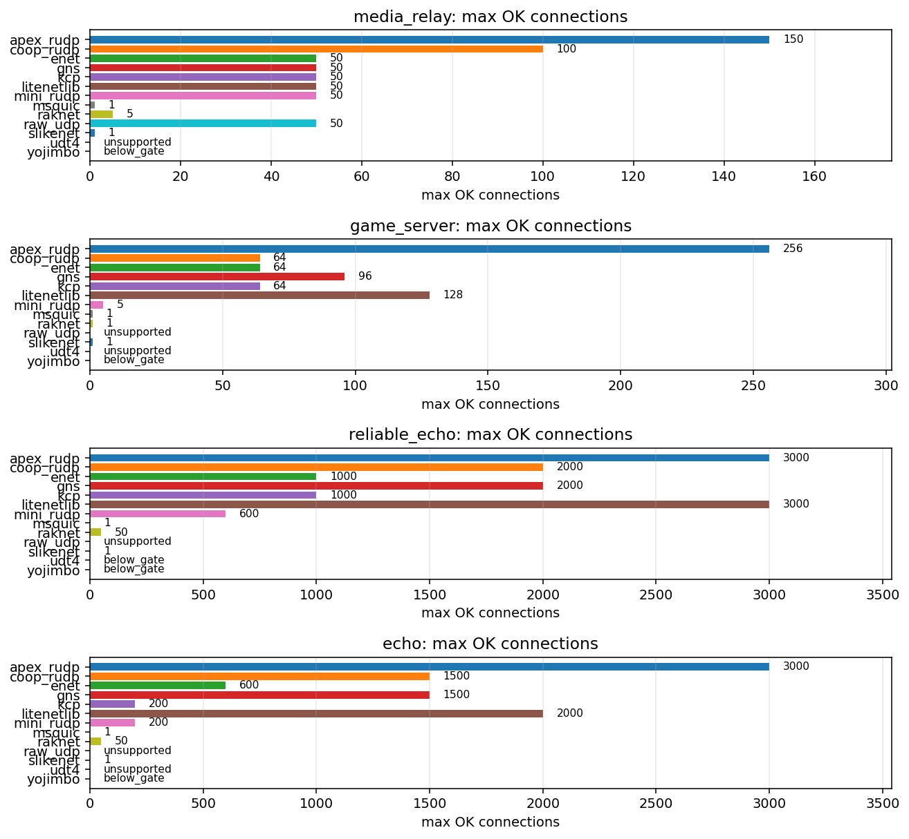

### `media_relay`

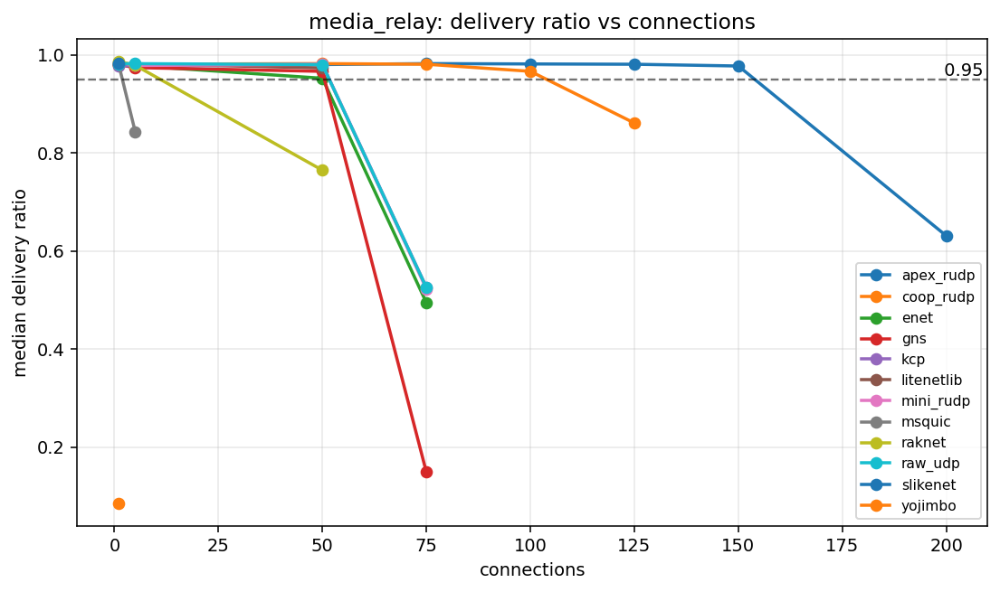

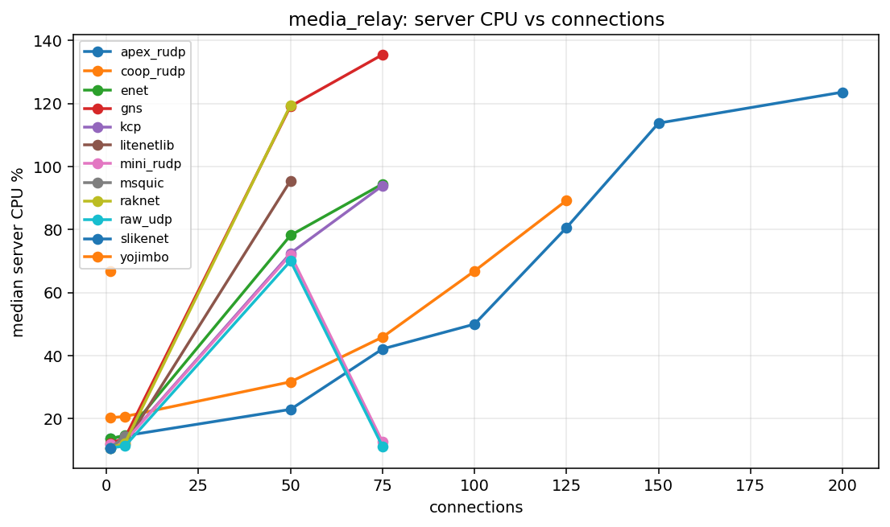

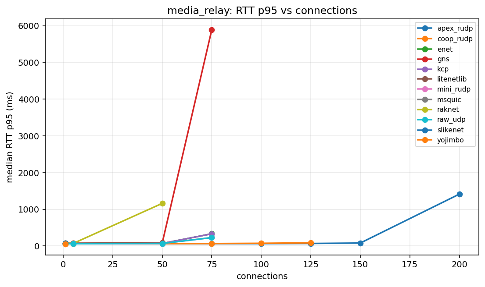

### `game_server`

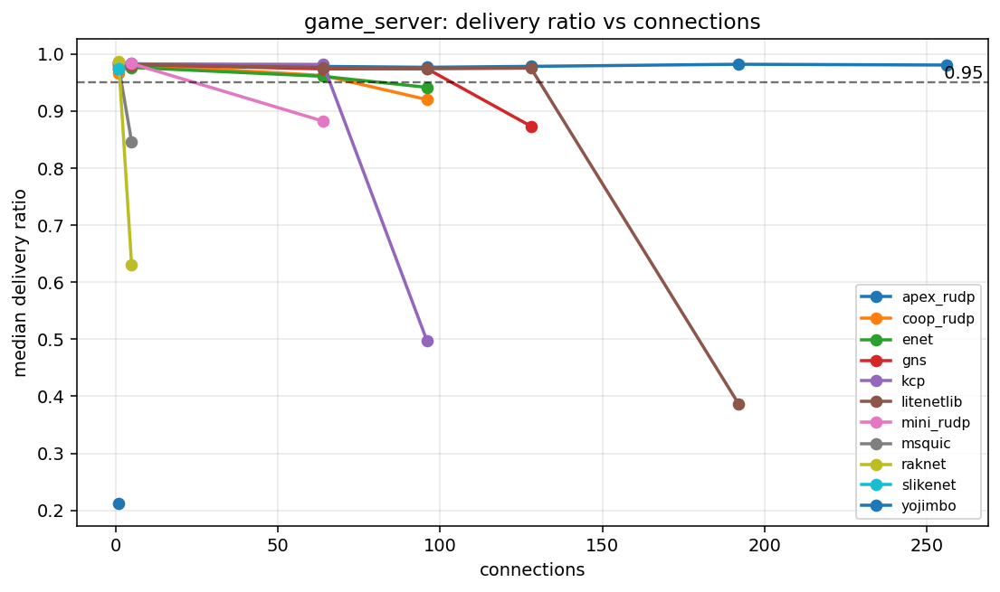

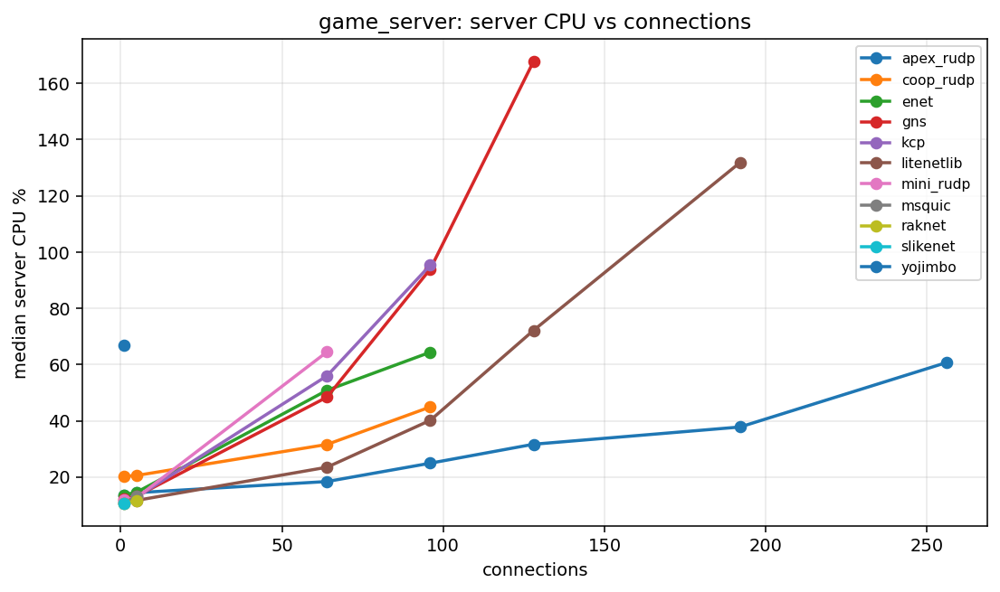

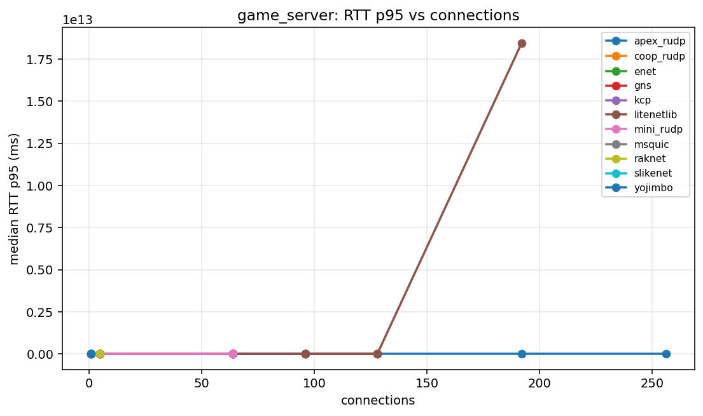

### `reliable_echo`

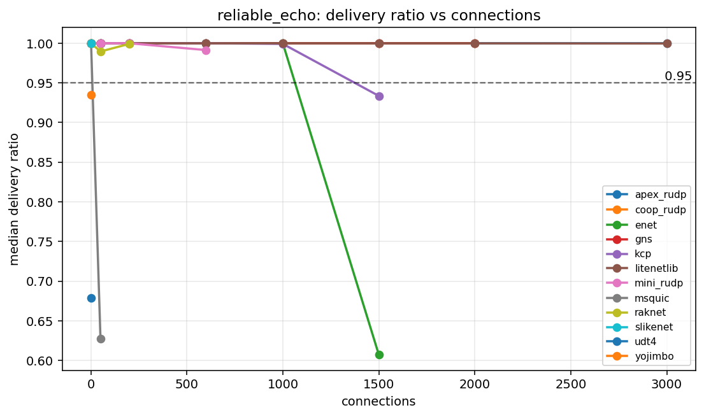

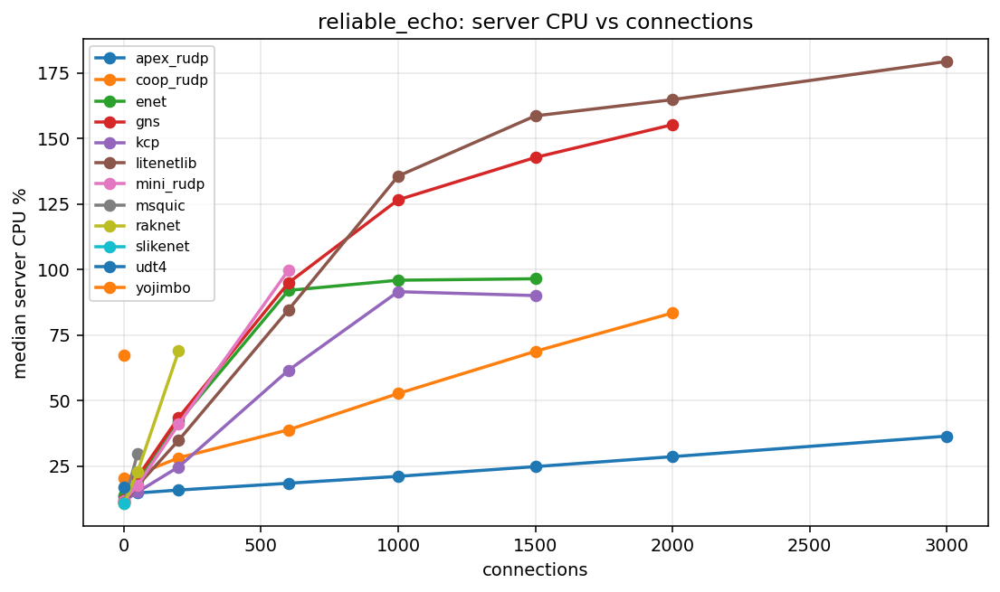

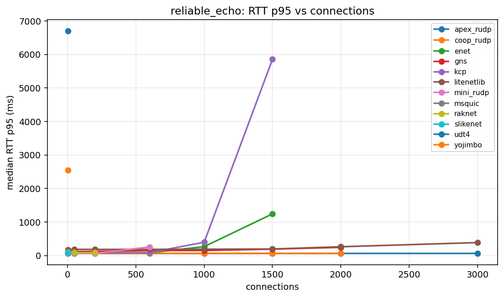

### `echo`

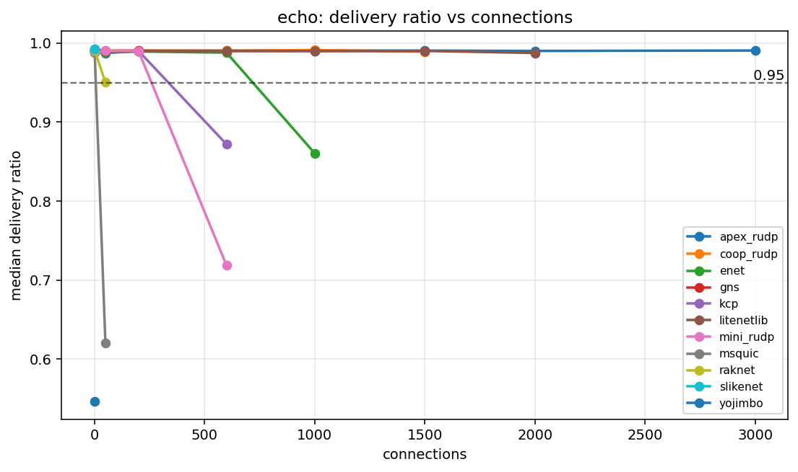

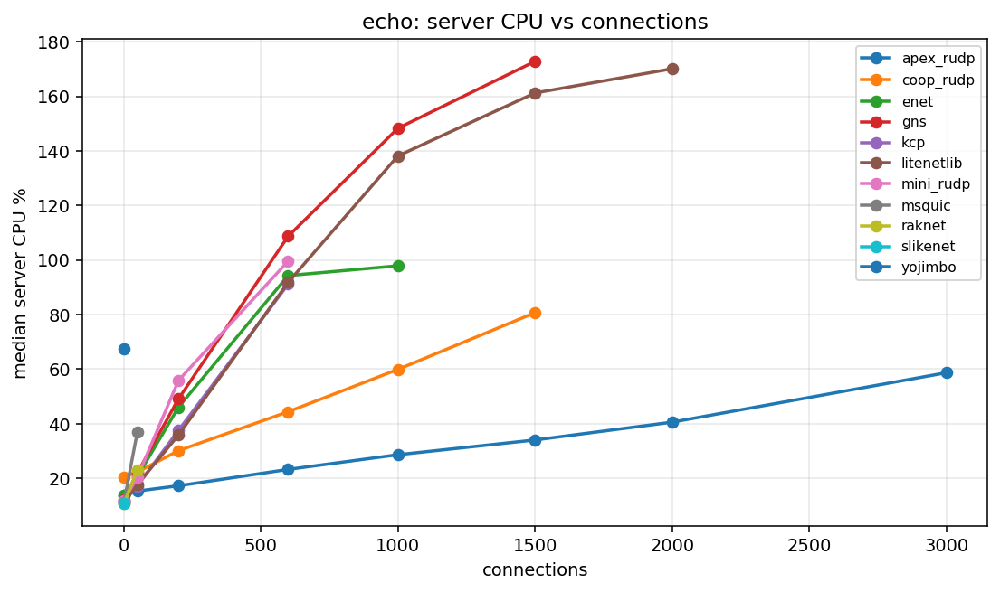

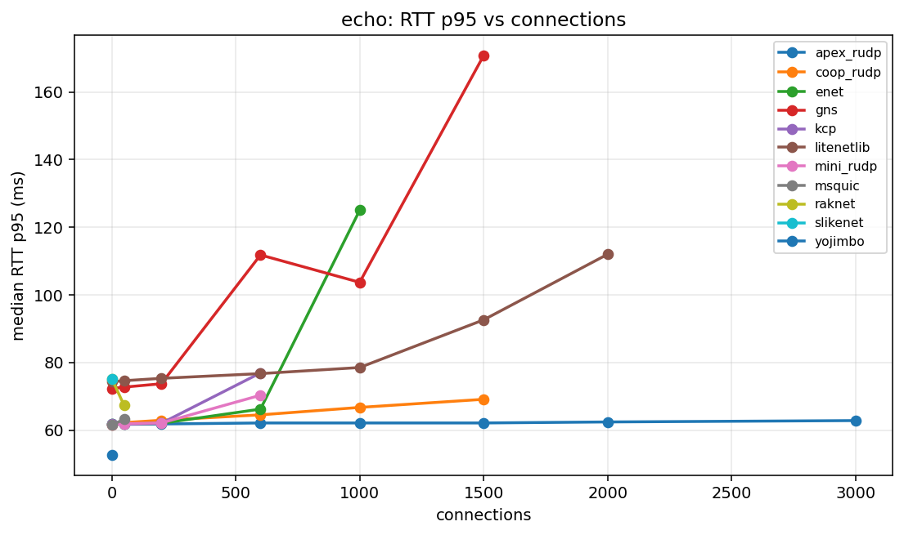

## Capacity Table

| profile | library | status | last OK | last OK delivery | last OK CPU | break | break reason | break delivery | break CPU |
| --- | --- | --- | --- | --- | --- | --- | --- | --- | --- |
| echo | apex_rudp | not_broken | 3000 | 0.9905 | 58.71 | not broken |  |  |  |
| echo | coop_rudp | broken | 1500 | 0.9892 | 80.70 | 2000 | aggregate_invalid:client_tick |  |  |
| echo | enet | broken | 600 | 0.9878 | 94.31 | 1000 | delivery<0.95 | 0.8606 | 97.89 |
| echo | gns | broken | 1500 | 0.9900 | 172.79 | 2000 | aggregate_invalid:client_tick |  |  |
| echo | kcp | broken | 200 | 0.9901 | 37.56 | 600 | delivery<0.95 | 0.8719 | 91.16 |
| echo | litenetlib | broken | 2000 | 0.9874 | 170.08 | 3000 | aggregate_invalid:client_tick |  |  |
| echo | mini_rudp | broken | 200 | 0.9901 | 55.86 | 600 | delivery<0.95 | 0.7185 | 99.60 |
| echo | msquic | broken | 1 | 0.9905 | 11.04 | 50 | delivery<0.95 | 0.6206 | 36.91 |
| echo | raknet | broken | 50 | 0.9503 | 23.03 | 200 | aggregate_invalid:client_tick |  |  |
| echo | raw_udp | unsupported | unsupported |  |  | 1 | unsupported_reliable |  |  |
| echo | slikenet | broken | 1 | 0.9920 | 10.76 | 50 | unsupported_conns |  |  |
| echo | udt4 | unsupported | unsupported |  |  | 1 | unsupported_unreliable |  |  |
| echo | yojimbo | below_gate | below_gate |  |  | 1 | delivery<0.95 | 0.5465 | 67.55 |
| game_server | apex_rudp | not_broken | 256 | 0.9805 | 60.69 | not broken |  |  |  |
| game_server | coop_rudp | broken | 64 | 0.9621 | 31.58 | 96 | delivery<0.95 | 0.9199 | 44.91 |
| game_server | enet | broken | 64 | 0.9607 | 50.84 | 96 | delivery<0.95 | 0.9414 | 64.38 |
| game_server | gns | broken | 96 | 0.9740 | 93.97 | 128 | delivery<0.95 | 0.8733 | 167.81 |
| game_server | kcp | broken | 64 | 0.9816 | 55.99 | 96 | delivery<0.95 | 0.4968 | 95.37 |
| game_server | litenetlib | broken | 128 | 0.9751 | 72.15 | 192 | aggregate_invalid:valid_runs=1/3 | 0.3863 | 131.83 |
| game_server | mini_rudp | broken | 5 | 0.9830 | 12.68 | 64 | delivery<0.95 | 0.8821 | 64.51 |
| game_server | msquic | broken | 1 | 0.9786 | 10.63 | 5 | delivery<0.95 | 0.8455 | 13.27 |
| game_server | raknet | broken | 1 | 0.9869 | 10.60 | 5 | delivery<0.95 | 0.6296 | 11.61 |
| game_server | raw_udp | unsupported | unsupported |  |  | 1 | unsupported_reliable |  |  |
| game_server | slikenet | broken | 1 | 0.9738 | 10.55 | 5 | unsupported_conns |  |  |
| game_server | udt4 | unsupported | unsupported |  |  | 1 | unsupported_unreliable |  |  |
| game_server | yojimbo | below_gate | below_gate |  |  | 1 | delivery<0.95 | 0.2119 | 67.00 |
| media_relay | apex_rudp | broken | 150 | 0.9773 | 113.74 | 200 | delivery<0.95 | 0.6309 | 123.57 |
| media_relay | coop_rudp | broken | 100 | 0.9665 | 66.83 | 125 | delivery<0.95 | 0.8610 | 89.22 |
| media_relay | enet | broken | 50 | 0.9523 | 78.15 | 75 | delivery<0.95 | 0.4946 | 94.44 |
| media_relay | gns | broken | 50 | 0.9664 | 119.10 | 75 | delivery<0.95 | 0.1490 | 135.46 |
| media_relay | kcp | broken | 50 | 0.9804 | 72.48 | 75 | delivery<0.95 | 0.5261 | 93.90 |
| media_relay | litenetlib | broken | 50 | 0.9733 | 95.49 | 75 | aggregate_invalid:client_tick |  |  |
| media_relay | mini_rudp | broken | 50 | 0.9806 | 72.01 | 75 | delivery<0.95 | 0.5227 | 12.61 |
| media_relay | msquic | broken | 1 | 0.9817 | 10.66 | 5 | delivery<0.95 | 0.8435 | 14.42 |
| media_relay | raknet | broken | 5 | 0.9787 | 12.29 | 50 | delivery<0.95 | 0.7648 | 119.44 |
| media_relay | raw_udp | broken | 50 | 0.9801 | 70.02 | 75 | delivery<0.95 | 0.5254 | 11.17 |
| media_relay | slikenet | broken | 1 | 0.9833 | 10.60 | 5 | unsupported_conns |  |  |
| media_relay | udt4 | unsupported | unsupported |  |  | 1 | unsupported_unreliable |  |  |
| media_relay | yojimbo | below_gate | below_gate |  |  | 1 | delivery<0.95 | 0.0850 | 66.85 |
| reliable_echo | apex_rudp | not_broken | 3000 | 1.0000 | 36.43 | not broken |  |  |  |
| reliable_echo | coop_rudp | broken | 2000 | 1.0000 | 83.43 | 3000 | aggregate_invalid:client_tick |  |  |
| reliable_echo | enet | broken | 1000 | 0.9999 | 95.92 | 1500 | delivery<0.95 | 0.6072 | 96.48 |
| reliable_echo | gns | broken | 2000 | 1.0000 | 155.28 | 3000 | aggregate_invalid:client_tick |  |  |
| reliable_echo | kcp | broken | 1000 | 0.9992 | 91.55 | 1500 | delivery<0.95 | 0.9336 | 90.06 |
| reliable_echo | litenetlib | not_broken | 3000 | 0.9997 | 179.43 | not broken |  |  |  |
| reliable_echo | mini_rudp | broken | 600 | 0.9914 | 99.72 | 1000 | aggregate_invalid:server_crash |  |  |
| reliable_echo | msquic | broken | 1 | 1.0000 | 11.01 | 50 | delivery<0.95 | 0.6276 | 29.64 |
| reliable_echo | raknet | broken | 50 | 0.9896 | 22.73 | 200 | aggregate_invalid:valid_runs=1/3 | 0.9992 | 68.93 |
| reliable_echo | raw_udp | unsupported | unsupported |  |  | 1 | unsupported_reliable |  |  |
| reliable_echo | slikenet | broken | 1 | 1.0000 | 10.69 | 50 | unsupported_conns |  |  |
| reliable_echo | udt4 | below_gate | below_gate |  |  | 1 | delivery<0.95 | 0.6790 | 17.02 |
| reliable_echo | yojimbo | below_gate | below_gate |  |  | 1 | delivery<0.95 | 0.9350 | 67.27 |

## Profiles

| profile | mode | traffic | payload | conn sweep | client procs |
| --- | --- | --- | --- | --- | --- |
| media_relay | broadcast | r0/u30 | 1000 | 1 5 50 75 100 125 150 200 | 4 |
| game_server | broadcast | r1/u20 | 128 | 1 5 64 96 128 192 256 | 4 |
| reliable_echo | echo | r50/u0 | 64 | 1 50 200 600 1000 1500 2000 3000 | 4 |
| echo | echo | r50/u50 | 64 | 1 50 200 600 1000 1500 2000 3000 | 4 |

## Data Files

- [`capacity.csv`](capacity.csv)
- [`summary.csv`](summary.csv)
- [`results_all.csv`](results_all.csv)
- [`scenarios_all.csv`](scenarios_all.csv)
- [`profiles.csv`](profiles.csv)
