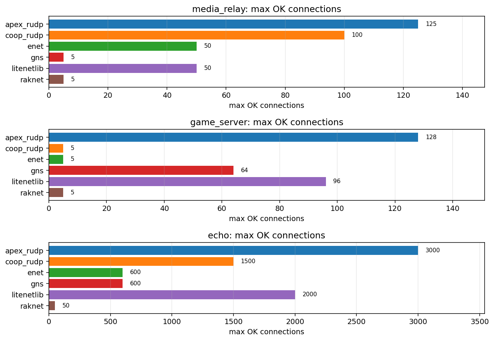
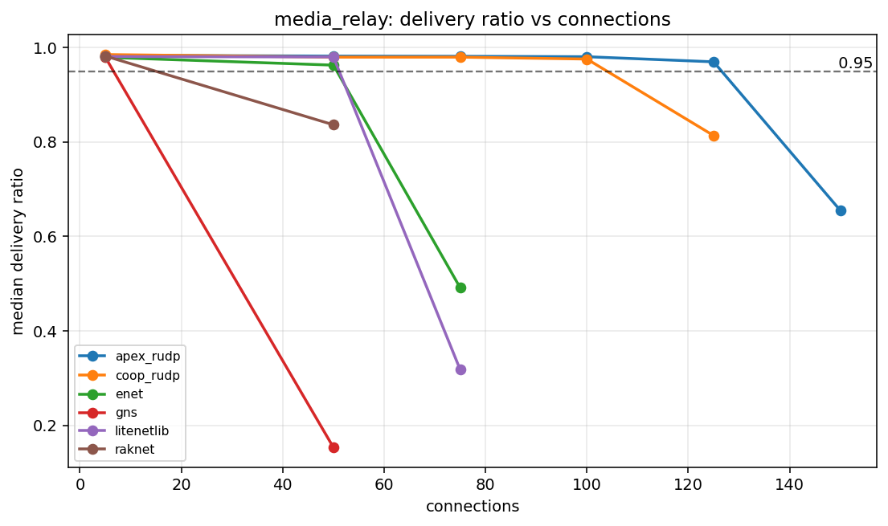
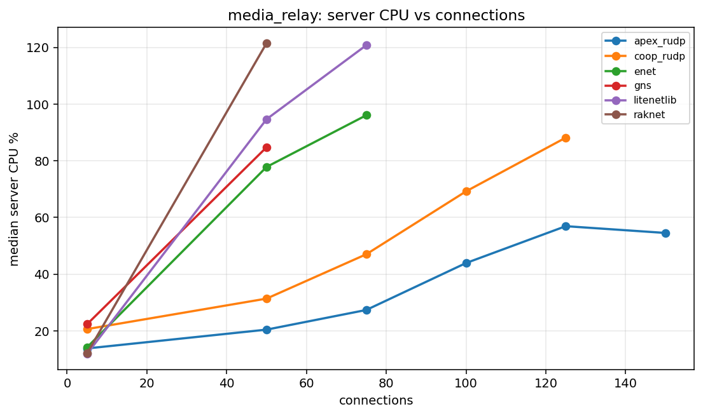
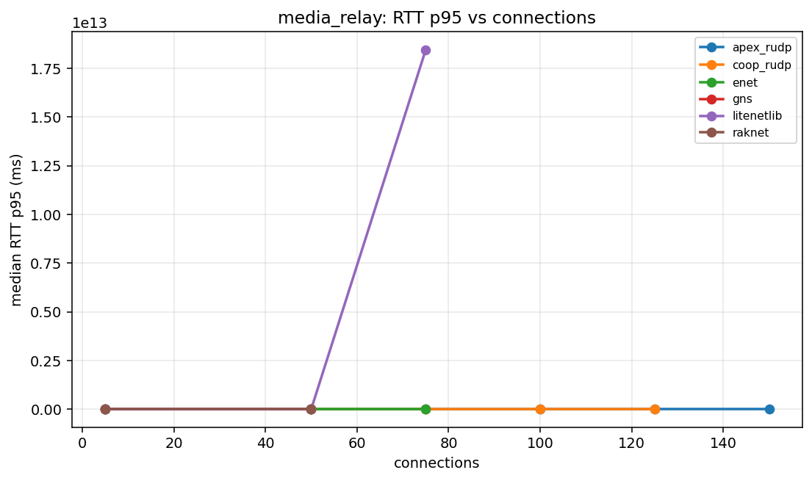
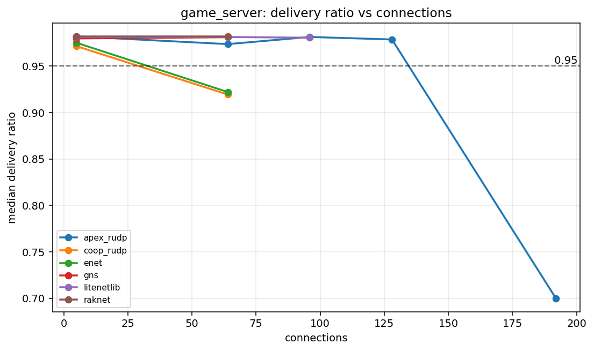
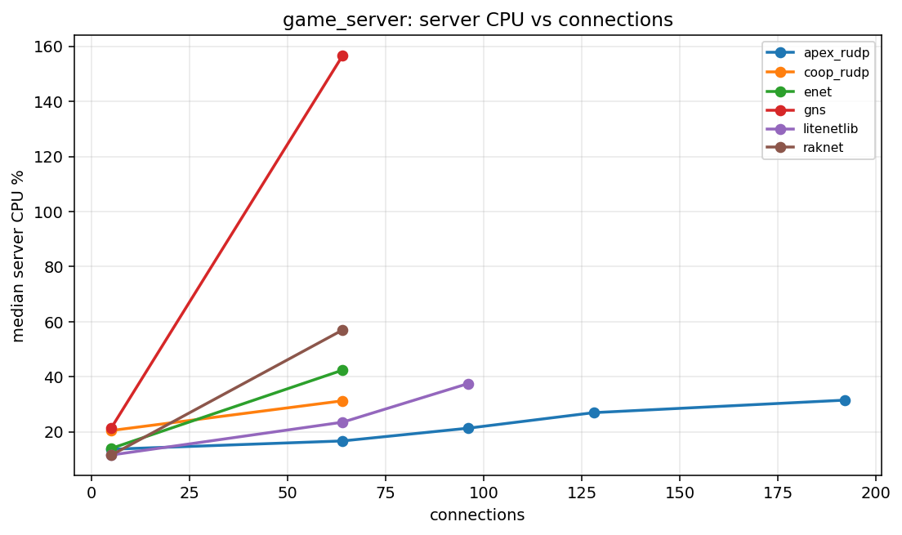
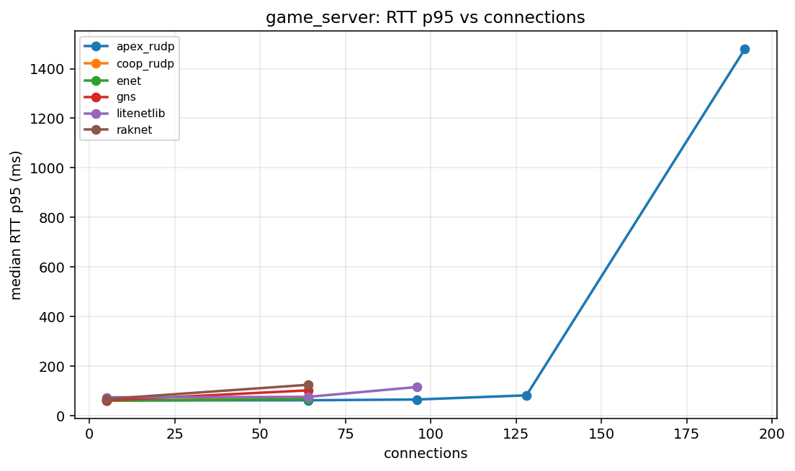
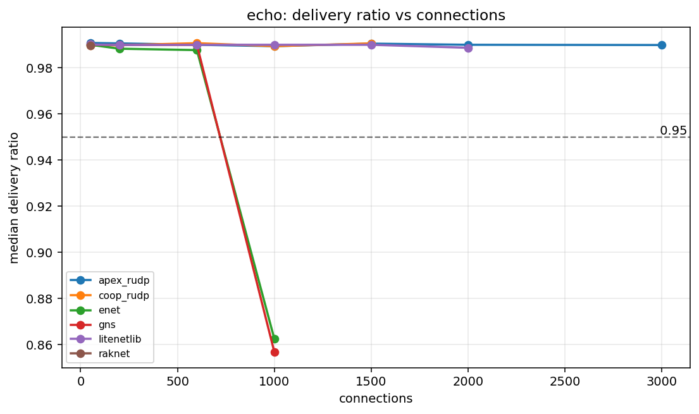
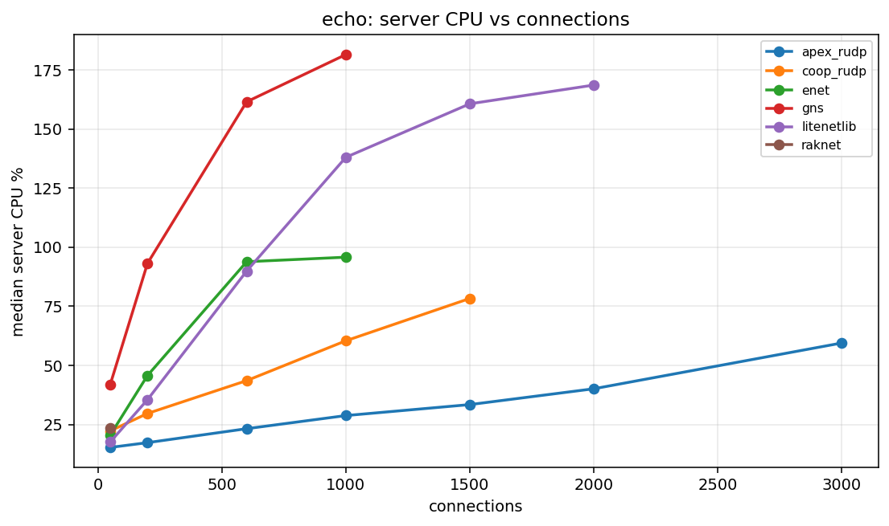
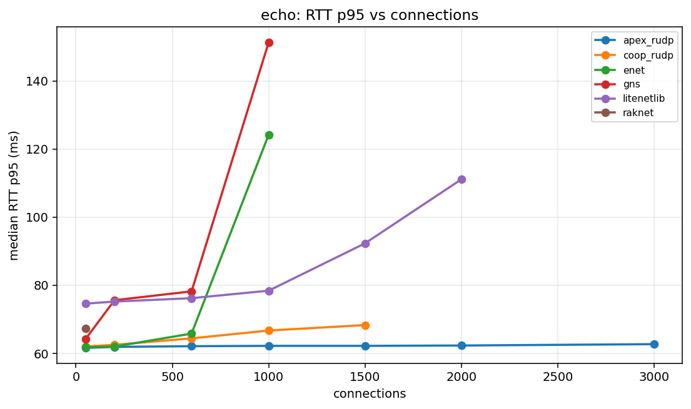

# Canonical Benchmark Report

Generated: 2026-06-08 20:56:08 UTC

Result directory: `docs/measurements/2026-06-09-canonical-floor (published from results/canonical_floor_20260609T192928Z)`

This report is generated by `scripts/run_canonical_tests.sh`. It is the first file to open after a canonical benchmark run.

## Verdict

| profile | strongest | max OK | break | max OK readout |
| --- | --- | --- | --- | --- |
| media_relay | apex_rudp | 125 | 150 (delivery<0.95) | delivery 0.9696, CPU 56.92% |
| game_server | apex_rudp | 128 | 192 (delivery<0.95) | delivery 0.9786, CPU 26.96% |
| echo | apex_rudp | 3000 | not broken | delivery 0.9899, CPU 59.48% |

OK means aggregate valid runs meet the gate and median `delivery_ratio >= 0.95`.

## Graphs

### `media_relay`

### `game_server`

### `echo`

## Capacity Table

| profile | library | status | last OK | last OK delivery | last OK CPU | break | break reason | break delivery | break CPU |
| --- | --- | --- | --- | --- | --- | --- | --- | --- | --- |
| echo | apex_rudp | not_broken | 3000 | 0.9899 | 59.48 | not broken |  |  |  |
| echo | coop_rudp | broken | 1500 | 0.9906 | 78.31 | 2000 | aggregate_invalid:client_tick |  |  |
| echo | enet | broken | 600 | 0.9877 | 93.84 | 1000 | delivery<0.95 | 0.8624 | 95.76 |
| echo | gns | broken | 600 | 0.9900 | 161.46 | 1000 | delivery<0.95 | 0.8567 | 181.43 |
| echo | litenetlib | broken | 2000 | 0.9887 | 168.53 | 3000 | aggregate_invalid:client_tick |  |  |
| echo | raknet | broken | 50 | 0.9896 | 23.38 | 200 | aggregate_invalid:client_tick |  |  |
| game_server | apex_rudp | broken | 128 | 0.9786 | 26.96 | 192 | delivery<0.95 | 0.6997 | 31.50 |
| game_server | coop_rudp | broken | 5 | 0.9714 | 20.47 | 64 | delivery<0.95 | 0.9193 | 31.27 |
| game_server | enet | broken | 5 | 0.9750 | 13.98 | 64 | delivery<0.95 | 0.9220 | 42.42 |
| game_server | gns | broken | 64 | 0.9810 | 156.68 | 96 | aggregate_invalid:server_crash |  |  |
| game_server | litenetlib | broken | 96 | 0.9805 | 37.52 | 128 | aggregate_invalid:client_tick |  |  |
| game_server | raknet | broken | 5 | 0.9816 | 11.55 | 64 | aggregate_invalid:valid_runs=1/3 | 0.9816 | 57.00 |
| media_relay | apex_rudp | broken | 125 | 0.9696 | 56.92 | 150 | delivery<0.95 | 0.6547 | 54.53 |
| media_relay | coop_rudp | broken | 100 | 0.9755 | 69.21 | 125 | delivery<0.95 | 0.8134 | 88.16 |
| media_relay | enet | broken | 50 | 0.9626 | 77.83 | 75 | delivery<0.95 | 0.4912 | 96.07 |
| media_relay | gns | broken | 5 | 0.9795 | 22.32 | 50 | delivery<0.95 | 0.1530 | 84.78 |
| media_relay | litenetlib | broken | 50 | 0.9799 | 94.68 | 75 | aggregate_invalid:valid_runs=1/3 | 0.3178 | 120.79 |
| media_relay | raknet | broken | 5 | 0.9819 | 12.05 | 50 | delivery<0.95 | 0.8363 | 121.52 |

## Profiles

| profile | mode | traffic | payload | conn sweep | client procs |
| --- | --- | --- | --- | --- | --- |
| media_relay | broadcast | r0/u30 | 1000 | 5 50 75 100 125 150 200 | 1 |
| game_server | broadcast | r1/u20 | 128 | 5 64 96 128 192 256 | 1 |
| echo | echo | r50/u50 | 64 | 50 200 600 1000 1500 2000 3000 | 4 |

## Data Files

- [`capacity.csv`](capacity.csv)
- [`summary.csv`](summary.csv)
- [`results_all.csv`](results_all.csv)
- [`scenarios_all.csv`](scenarios_all.csv)
- [`profiles.csv`](profiles.csv)
