# Canonical Benchmark Report

Generated: 2026-06-10 06:40:54 UTC

Result directory: `docs/measurements/2026-06-10-canonical-022240Z (published from results/canonical_final_benchmark_20260610T022240Z)`

This report is generated by `scripts/run_canonical_tests.sh`. It is the first file to open after a canonical benchmark run.

## Verdict

| profile | strongest | max OK | break | max OK readout |
| --- | --- | --- | --- | --- |
| media_relay | apex_rudp | 150 | 200 (delivery<0.95) | delivery 0.9777, CPU 115.12% |
| game_server | apex_rudp | 256 | not broken | delivery 0.9824, CPU 55.04% |
| reliable_echo | apex_rudp | 3000 | not broken | delivery 1.0000, CPU 36.54% |
| echo | apex_rudp | 3000 | not broken | delivery 0.9902, CPU 59.11% |

OK means aggregate valid runs meet the gate and median `delivery_ratio >= 0.95`.

## Graphs

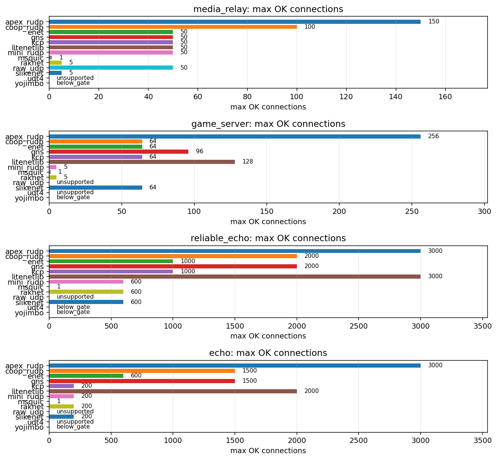

### `media_relay`

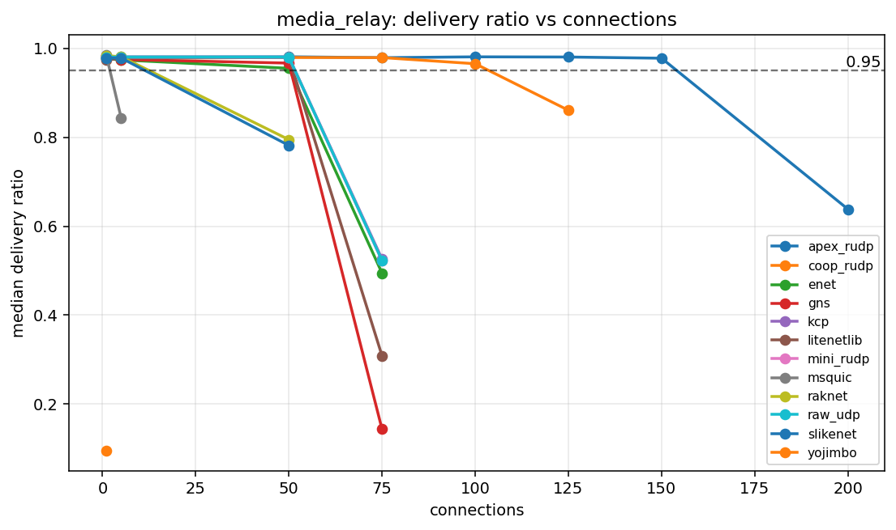

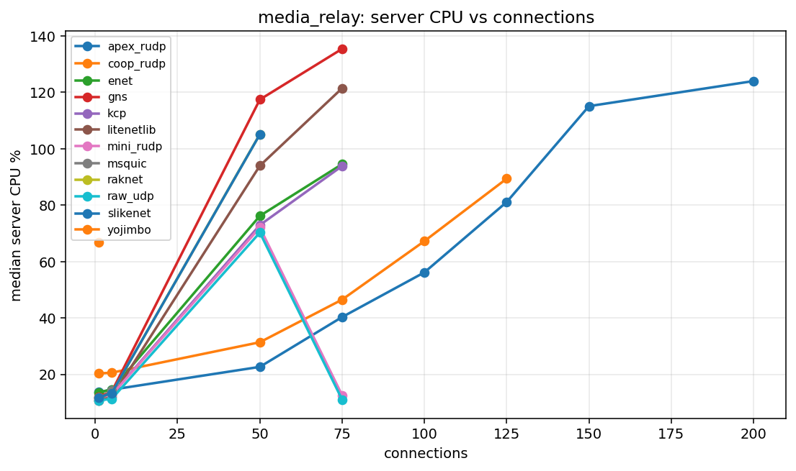

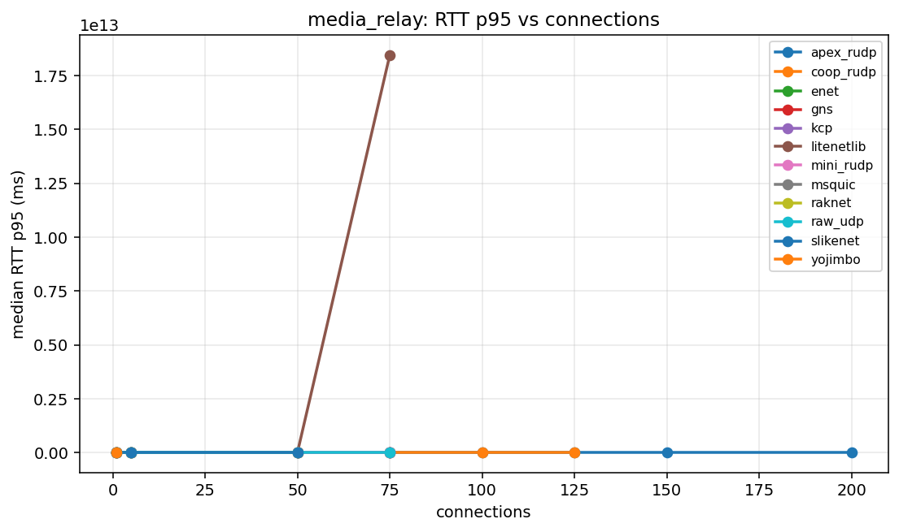

### `game_server`

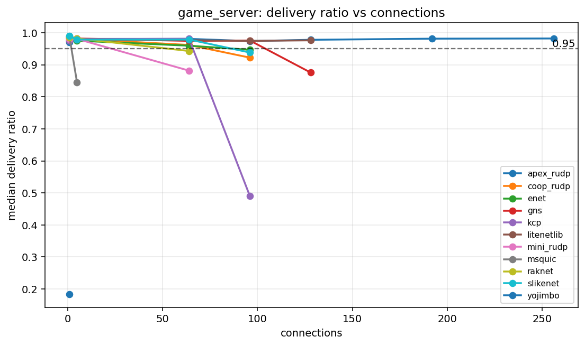

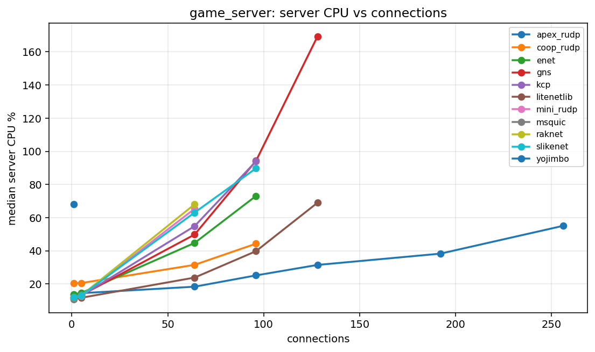

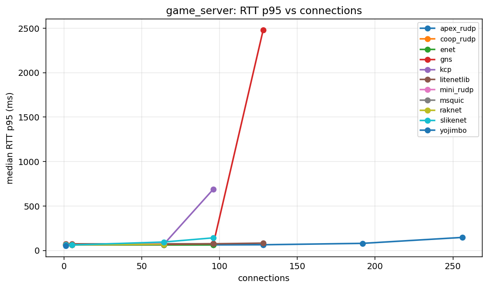

### `reliable_echo`

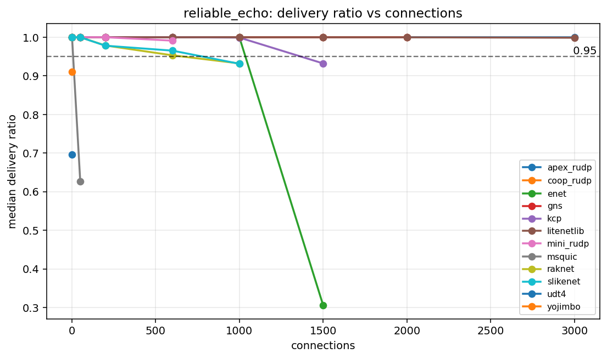

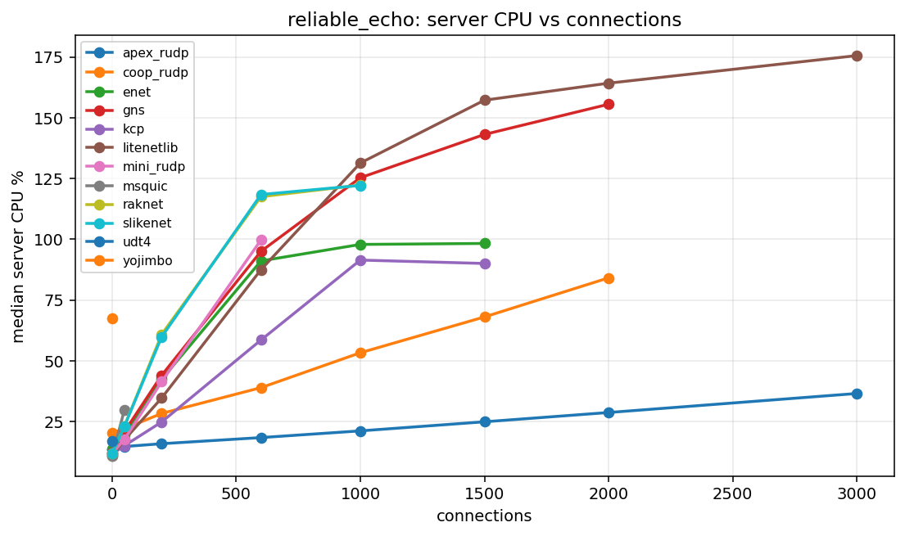

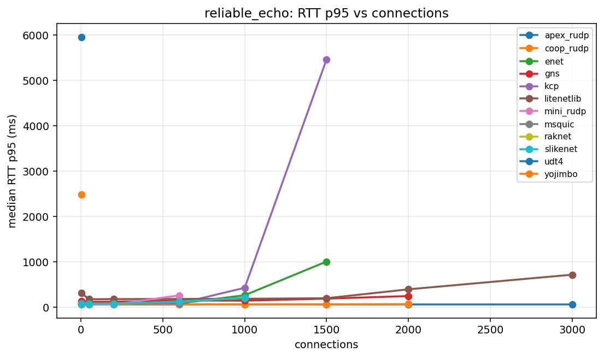

### `echo`

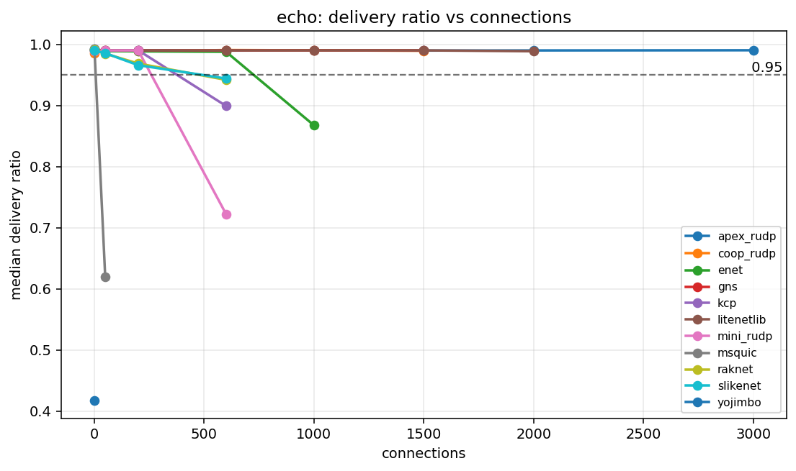

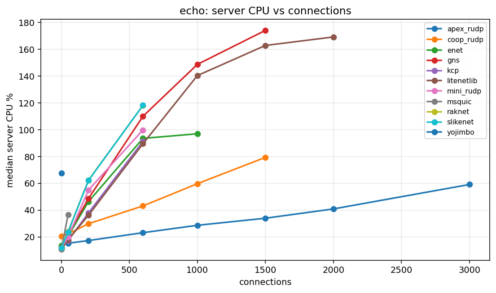

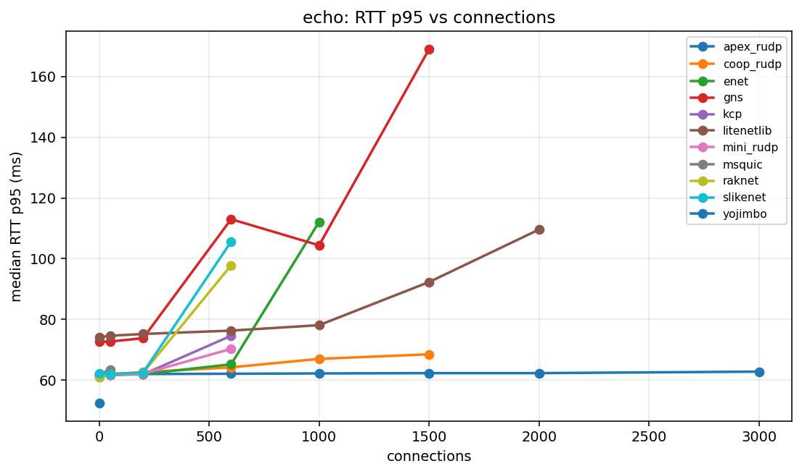

## Capacity Table

| profile | library | status | last OK | last OK delivery | last OK CPU | break | break reason | break delivery | break CPU |
| --- | --- | --- | --- | --- | --- | --- | --- | --- | --- |
| echo | apex_rudp | not_broken | 3000 | 0.9902 | 59.11 | not broken |  |  |  |
| echo | coop_rudp | broken | 1500 | 0.9894 | 79.32 | 2000 | aggregate_invalid:client_tick |  |  |
| echo | enet | broken | 600 | 0.9877 | 93.50 | 1000 | delivery<0.95 | 0.8674 | 96.93 |
| echo | gns | broken | 1500 | 0.9900 | 174.03 | 2000 | aggregate_invalid:client_tick |  |  |
| echo | kcp | broken | 200 | 0.9901 | 37.95 | 600 | delivery<0.95 | 0.8991 | 91.23 |
| echo | litenetlib | broken | 2000 | 0.9886 | 169.12 | 3000 | aggregate_invalid:client_tick |  |  |
| echo | mini_rudp | broken | 200 | 0.9900 | 55.02 | 600 | delivery<0.95 | 0.7222 | 99.77 |
| echo | msquic | broken | 1 | 0.9925 | 10.99 | 50 | delivery<0.95 | 0.6191 | 36.74 |
| echo | raknet | broken | 200 | 0.9685 | 62.42 | 600 | delivery<0.95 | 0.9418 | 118.07 |
| echo | raw_udp | unsupported | unsupported |  |  | 1 | unsupported_reliable |  |  |
| echo | slikenet | broken | 200 | 0.9658 | 62.13 | 600 | delivery<0.95 | 0.9439 | 118.14 |
| echo | udt4 | unsupported | unsupported |  |  | 1 | unsupported_unreliable |  |  |
| echo | yojimbo | below_gate | below_gate |  |  | 1 | delivery<0.95 | 0.4170 | 67.46 |
| game_server | apex_rudp | not_broken | 256 | 0.9824 | 55.04 | not broken |  |  |  |
| game_server | coop_rudp | broken | 64 | 0.9621 | 31.50 | 96 | delivery<0.95 | 0.9226 | 44.27 |
| game_server | enet | broken | 64 | 0.9598 | 44.72 | 96 | delivery<0.95 | 0.9471 | 73.07 |
| game_server | gns | broken | 96 | 0.9761 | 94.26 | 128 | delivery<0.95 | 0.8760 | 169.24 |
| game_server | kcp | broken | 64 | 0.9815 | 54.84 | 96 | delivery<0.95 | 0.4906 | 93.98 |
| game_server | litenetlib | broken | 128 | 0.9766 | 68.95 | 192 | aggregate_invalid:client_tick |  |  |
| game_server | mini_rudp | broken | 5 | 0.9810 | 12.71 | 64 | delivery<0.95 | 0.8819 | 65.33 |
| game_server | msquic | broken | 1 | 0.9881 | 10.65 | 5 | delivery<0.95 | 0.8455 | 13.33 |
| game_server | raknet | broken | 5 | 0.9824 | 13.10 | 64 | delivery<0.95 | 0.9433 | 68.04 |
| game_server | raw_udp | unsupported | unsupported |  |  | 1 | unsupported_reliable |  |  |
| game_server | slikenet | broken | 64 | 0.9791 | 63.05 | 96 | delivery<0.95 | 0.9386 | 89.74 |
| game_server | udt4 | unsupported | unsupported |  |  | 1 | unsupported_unreliable |  |  |
| game_server | yojimbo | below_gate | below_gate |  |  | 1 | delivery<0.95 | 0.1833 | 67.92 |
| media_relay | apex_rudp | broken | 150 | 0.9777 | 115.12 | 200 | delivery<0.95 | 0.6383 | 124.01 |
| media_relay | coop_rudp | broken | 100 | 0.9653 | 67.27 | 125 | delivery<0.95 | 0.8607 | 89.41 |
| media_relay | enet | broken | 50 | 0.9550 | 76.21 | 75 | delivery<0.95 | 0.4945 | 94.56 |
| media_relay | gns | broken | 50 | 0.9667 | 117.45 | 75 | delivery<0.95 | 0.1437 | 135.43 |
| media_relay | kcp | broken | 50 | 0.9800 | 72.96 | 75 | delivery<0.95 | 0.5262 | 93.89 |
| media_relay | litenetlib | broken | 50 | 0.9795 | 93.99 | 75 | delivery<0.95 | 0.3085 | 121.47 |
| media_relay | mini_rudp | broken | 50 | 0.9799 | 72.08 | 75 | delivery<0.95 | 0.5227 | 12.60 |
| media_relay | msquic | broken | 1 | 0.9850 | 10.72 | 5 | delivery<0.95 | 0.8437 | 14.41 |
| media_relay | raknet | broken | 5 | 0.9810 | 13.39 | 50 | delivery<0.95 | 0.7947 | 105.17 |
| media_relay | raw_udp | broken | 50 | 0.9801 | 70.30 | 75 | delivery<0.95 | 0.5229 | 11.09 |
| media_relay | slikenet | broken | 5 | 0.9781 | 13.41 | 50 | delivery<0.95 | 0.7816 | 105.10 |
| media_relay | udt4 | unsupported | unsupported |  |  | 1 | unsupported_unreliable |  |  |
| media_relay | yojimbo | below_gate | below_gate |  |  | 1 | delivery<0.95 | 0.0950 | 66.88 |
| reliable_echo | apex_rudp | not_broken | 3000 | 1.0000 | 36.54 | not broken |  |  |  |
| reliable_echo | coop_rudp | broken | 2000 | 1.0000 | 84.12 | 3000 | aggregate_invalid:client_tick |  |  |
| reliable_echo | enet | broken | 1000 | 0.9997 | 97.88 | 1500 | delivery<0.95 | 0.3055 | 98.28 |
| reliable_echo | gns | broken | 2000 | 1.0000 | 155.57 | 3000 | aggregate_invalid:client_tick |  |  |
| reliable_echo | kcp | broken | 1000 | 0.9991 | 91.44 | 1500 | delivery<0.95 | 0.9321 | 90.04 |
| reliable_echo | litenetlib | not_broken | 3000 | 0.9987 | 175.59 | not broken |  |  |  |
| reliable_echo | mini_rudp | broken | 600 | 0.9912 | 99.73 | 1000 | aggregate_invalid:server_crash |  |  |
| reliable_echo | msquic | broken | 1 | 1.0000 | 10.97 | 50 | delivery<0.95 | 0.6271 | 29.85 |
| reliable_echo | raknet | broken | 600 | 0.9532 | 117.52 | 1000 | delivery<0.95 | 0.9322 | 122.31 |
| reliable_echo | raw_udp | unsupported | unsupported |  |  | 1 | unsupported_reliable |  |  |
| reliable_echo | slikenet | broken | 600 | 0.9653 | 118.42 | 1000 | delivery<0.95 | 0.9312 | 122.16 |
| reliable_echo | udt4 | below_gate | below_gate |  |  | 1 | delivery<0.95 | 0.6960 | 17.02 |
| reliable_echo | yojimbo | below_gate | below_gate |  |  | 1 | delivery<0.95 | 0.9110 | 67.54 |

## Profiles

| profile | mode | traffic | payload | conn sweep | client procs |
| --- | --- | --- | --- | --- | --- |
| media_relay | broadcast | r0/u30 | 1000 | 1 5 50 75 100 125 150 200 | 4 |
| game_server | broadcast | r1/u20 | 128 | 1 5 64 96 128 192 256 | 4 |
| reliable_echo | echo | r50/u0 | 64 | 1 50 200 600 1000 1500 2000 3000 | 4 |
| echo | echo | r50/u50 | 64 | 1 50 200 600 1000 1500 2000 3000 | 4 |

## Data Files

- [`capacity.csv`](capacity.csv)
- [`summary.csv`](summary.csv)
- [`results_all.csv`](results_all.csv)
- [`scenarios_all.csv`](scenarios_all.csv)
- [`profiles.csv`](profiles.csv)
