# Canonical Benchmark Report

Generated: 2026-06-12 08:18:49 UTC

Result directory: `docs/measurements/2026-06-12-canonical-060653Z (published from results/canonical_final_benchmark_20260612T060653Z)`

This report is generated by `scripts/run_canonical_tests.sh`. It is the first file to open after a canonical benchmark run.

## Verdict

| profile | strongest | max OK | break | max OK readout |
| --- | --- | --- | --- | --- |
| media_relay | coop_rudp | 150 | 200 (delivery<0.95) | delivery 0.9818, CPU 68.29% |
| game_server | apex_rudp | 256 | not broken | delivery 0.9819, CPU 64.96% |
| reliable_echo | apex_rudp | 3000 | not broken | delivery 1.0000, CPU 35.29% |
| echo | apex_rudp | 3000 | not broken | delivery 0.9897, CPU 53.82% |

OK means aggregate valid runs meet the gate and median `delivery_ratio >= 0.95`.

## Graphs

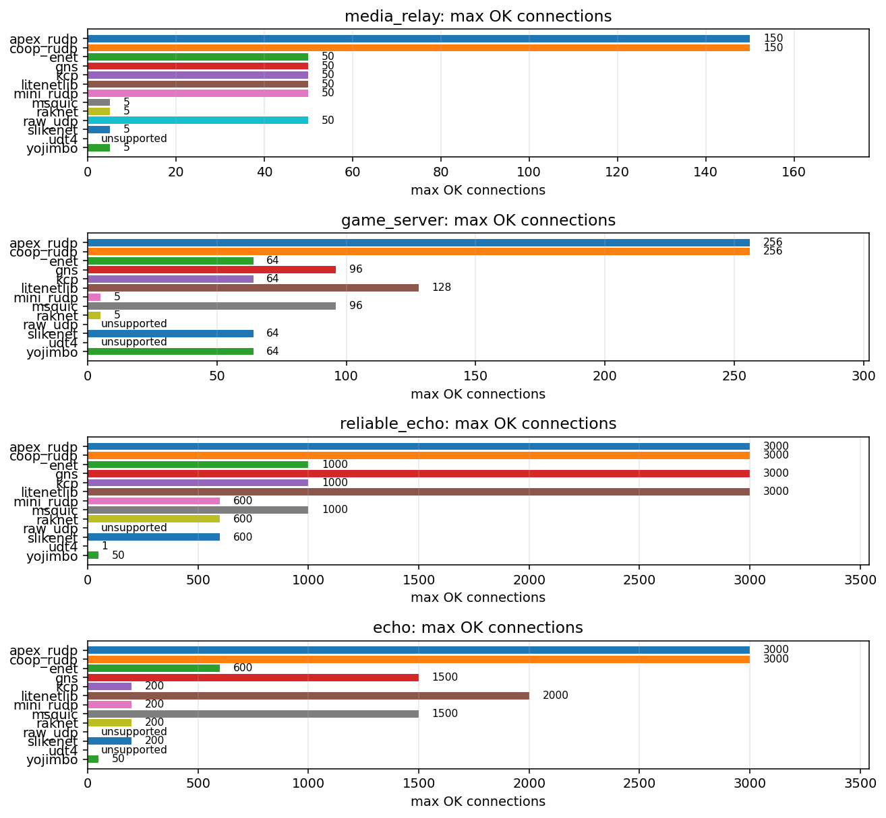

### `media_relay`

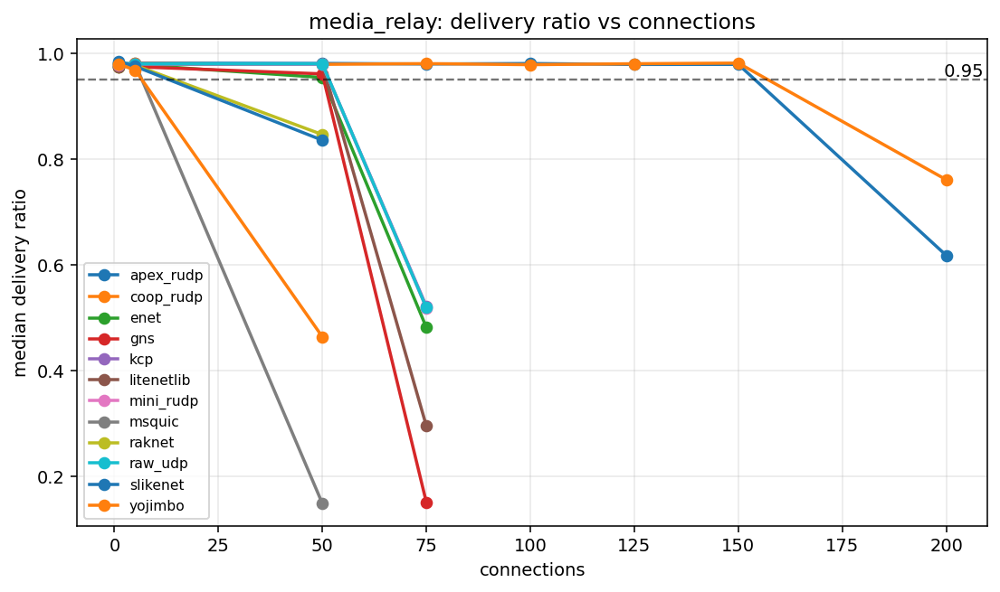

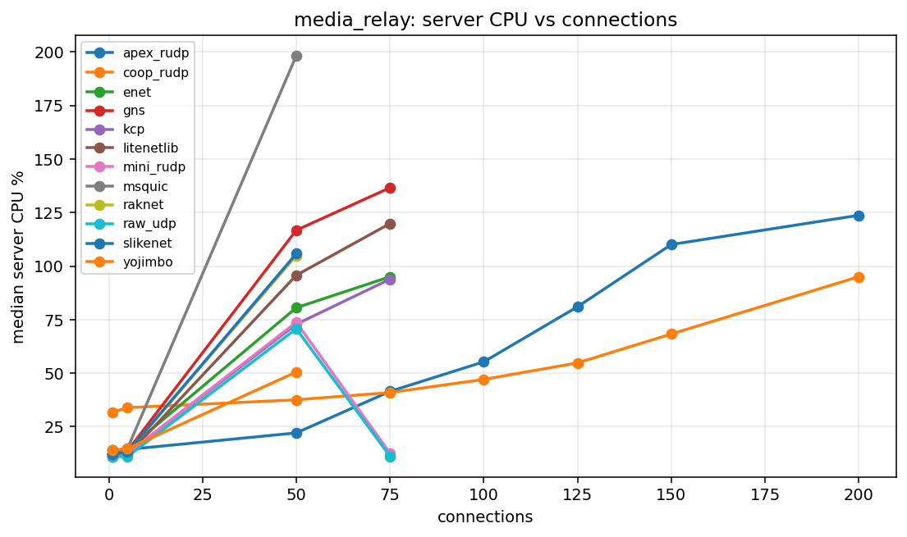

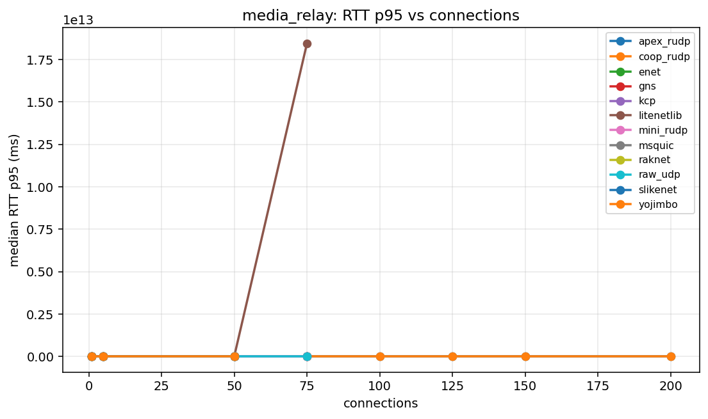

### `game_server`

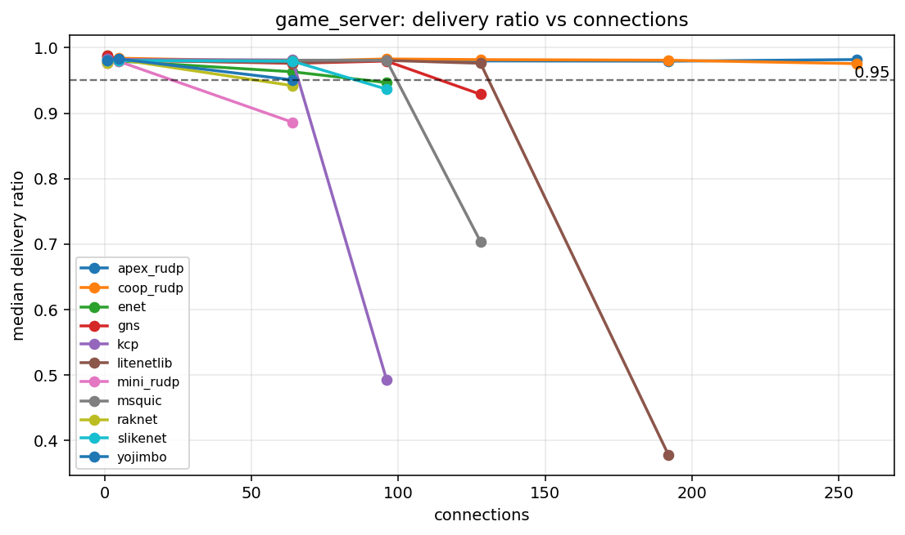

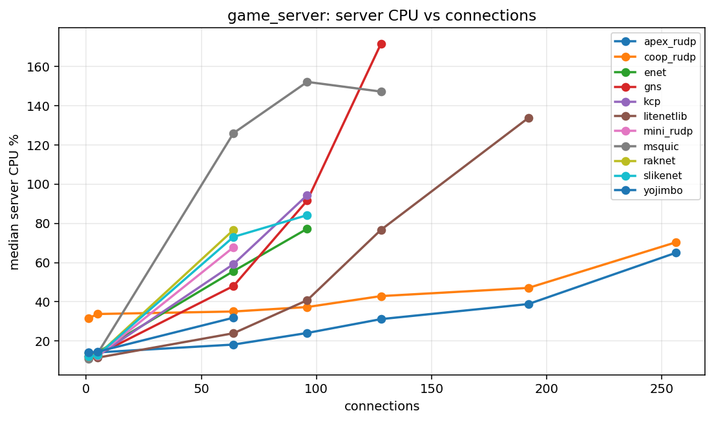

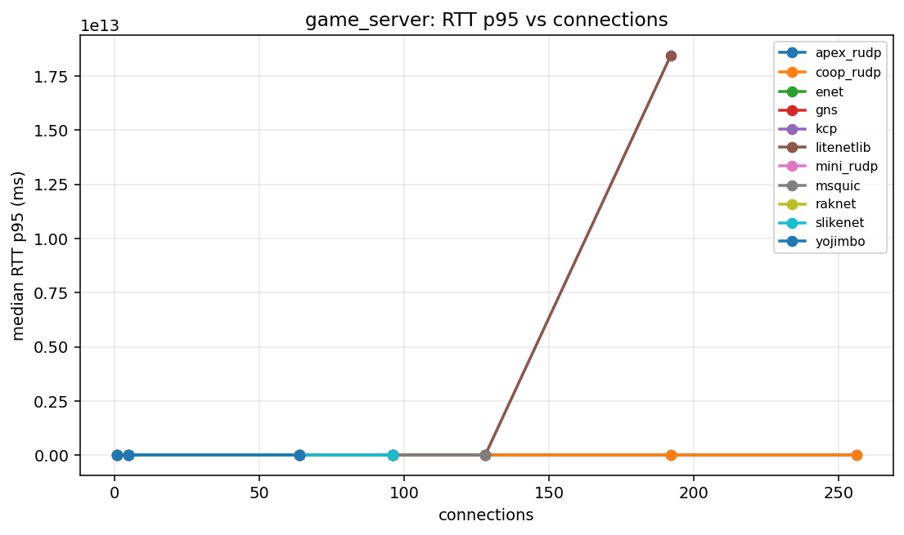

### `reliable_echo`

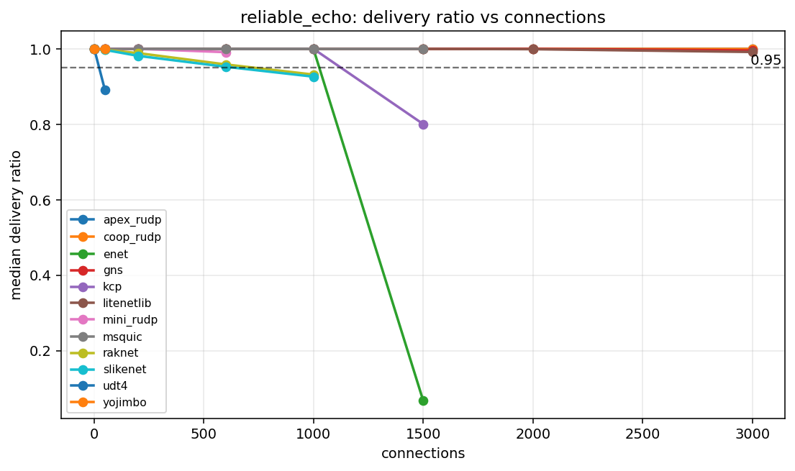

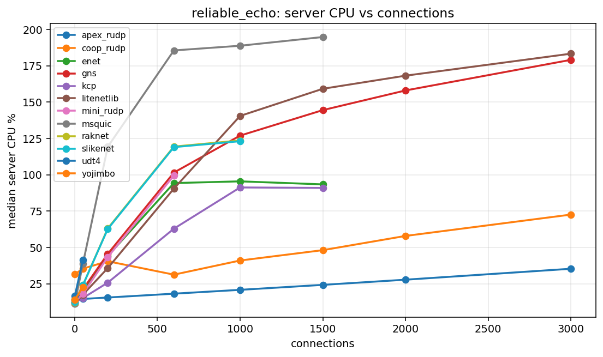

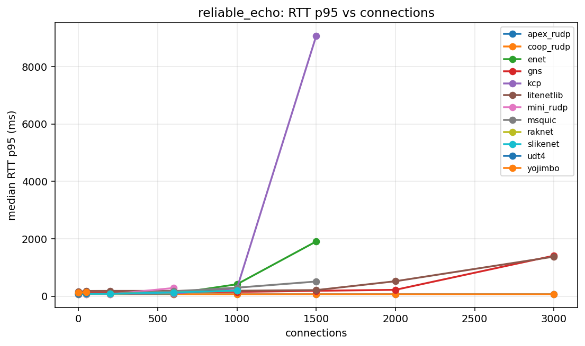

### `echo`

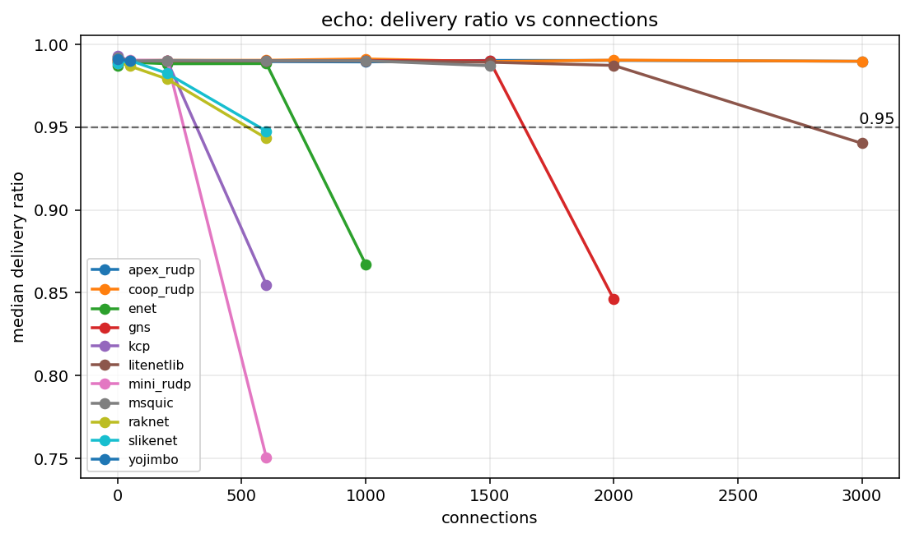

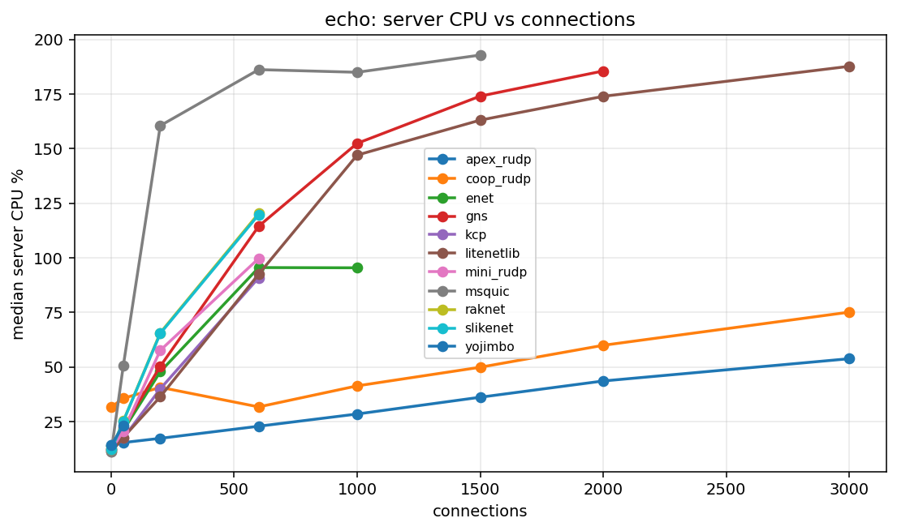

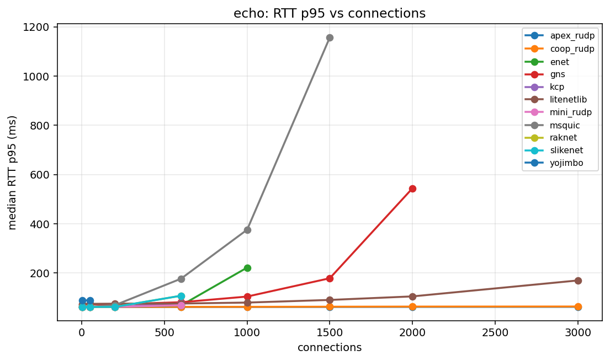

## Capacity Table

| profile | library | status | last OK | last OK delivery | last OK CPU | break | break reason | break delivery | break CPU |
| --- | --- | --- | --- | --- | --- | --- | --- | --- | --- |
| echo | apex_rudp | not_broken | 3000 | 0.9897 | 53.82 | not broken |  |  |  |
| echo | coop_rudp | not_broken | 3000 | 0.9897 | 75.14 | not broken |  |  |  |
| echo | enet | broken | 600 | 0.9883 | 95.55 | 1000 | delivery<0.95 | 0.8673 | 95.44 |
| echo | gns | broken | 1500 | 0.9900 | 174.05 | 2000 | delivery<0.95 | 0.8461 | 185.57 |
| echo | kcp | broken | 200 | 0.9901 | 40.02 | 600 | delivery<0.95 | 0.8549 | 90.90 |
| echo | litenetlib | broken | 2000 | 0.9872 | 173.95 | 3000 | delivery<0.95 | 0.9402 | 187.71 |
| echo | mini_rudp | broken | 200 | 0.9902 | 57.63 | 600 | aggregate_invalid:valid_runs=1/3 | 0.7505 | 99.75 |
| echo | msquic | broken | 1500 | 0.9870 | 192.85 | 2000 | aggregate_invalid:client_tick |  |  |
| echo | raknet | broken | 200 | 0.9790 | 65.68 | 600 | delivery<0.95 | 0.9432 | 120.37 |
| echo | raw_udp | unsupported | unsupported |  |  | 1 | unsupported_reliable |  |  |
| echo | slikenet | broken | 200 | 0.9824 | 65.37 | 600 | delivery<0.95 | 0.9475 | 119.79 |
| echo | udt4 | unsupported | unsupported |  |  | 1 | unsupported_unreliable |  |  |
| echo | yojimbo | broken | 50 | 0.9899 | 23.26 | 200 | unsupported_conns |  |  |
| game_server | apex_rudp | not_broken | 256 | 0.9819 | 64.96 | not broken |  |  |  |
| game_server | coop_rudp | not_broken | 256 | 0.9756 | 70.31 | not broken |  |  |  |
| game_server | enet | broken | 64 | 0.9632 | 55.64 | 96 | delivery<0.95 | 0.9467 | 77.25 |
| game_server | gns | broken | 96 | 0.9796 | 91.64 | 128 | delivery<0.95 | 0.9288 | 171.57 |
| game_server | kcp | broken | 64 | 0.9813 | 59.22 | 96 | delivery<0.95 | 0.4932 | 94.39 |
| game_server | litenetlib | broken | 128 | 0.9762 | 76.67 | 192 | aggregate_invalid:valid_runs=1/3 | 0.3776 | 133.75 |
| game_server | mini_rudp | broken | 5 | 0.9789 | 12.43 | 64 | delivery<0.95 | 0.8861 | 67.81 |
| game_server | msquic | broken | 96 | 0.9807 | 152.13 | 128 | delivery<0.95 | 0.7037 | 147.19 |
| game_server | raknet | broken | 5 | 0.9820 | 12.79 | 64 | delivery<0.95 | 0.9420 | 76.66 |
| game_server | raw_udp | unsupported | unsupported |  |  | 1 | unsupported_reliable |  |  |
| game_server | slikenet | broken | 64 | 0.9794 | 73.10 | 96 | delivery<0.95 | 0.9367 | 84.18 |
| game_server | udt4 | unsupported | unsupported |  |  | 1 | unsupported_unreliable |  |  |
| game_server | yojimbo | broken | 64 | 0.9508 | 31.88 | 96 | unsupported_conns |  |  |
| media_relay | apex_rudp | broken | 150 | 0.9793 | 110.10 | 200 | delivery<0.95 | 0.6179 | 123.75 |
| media_relay | coop_rudp | broken | 150 | 0.9818 | 68.29 | 200 | delivery<0.95 | 0.7611 | 95.04 |
| media_relay | enet | broken | 50 | 0.9546 | 80.57 | 75 | delivery<0.95 | 0.4817 | 95.04 |
| media_relay | gns | broken | 50 | 0.9614 | 116.77 | 75 | delivery<0.95 | 0.1510 | 136.62 |
| media_relay | kcp | broken | 50 | 0.9796 | 72.86 | 75 | delivery<0.95 | 0.5217 | 93.90 |
| media_relay | litenetlib | broken | 50 | 0.9794 | 95.73 | 75 | aggregate_invalid:valid_runs=1/3 | 0.2954 | 119.91 |
| media_relay | mini_rudp | broken | 50 | 0.9795 | 73.77 | 75 | delivery<0.95 | 0.5191 | 12.63 |
| media_relay | msquic | broken | 5 | 0.9804 | 14.84 | 50 | delivery<0.95 | 0.1488 | 198.30 |
| media_relay | raknet | broken | 5 | 0.9777 | 13.13 | 50 | delivery<0.95 | 0.8466 | 104.92 |
| media_relay | raw_udp | broken | 50 | 0.9803 | 70.73 | 75 | delivery<0.95 | 0.5192 | 11.13 |
| media_relay | slikenet | broken | 5 | 0.9756 | 13.12 | 50 | delivery<0.95 | 0.8359 | 105.82 |
| media_relay | udt4 | unsupported | unsupported |  |  | 1 | unsupported_unreliable |  |  |
| media_relay | yojimbo | broken | 5 | 0.9685 | 14.72 | 50 | delivery<0.95 | 0.4641 | 50.53 |
| reliable_echo | apex_rudp | not_broken | 3000 | 1.0000 | 35.29 | not broken |  |  |  |
| reliable_echo | coop_rudp | not_broken | 3000 | 1.0000 | 72.57 | not broken |  |  |  |
| reliable_echo | enet | broken | 1000 | 0.9995 | 95.44 | 1500 | aggregate_invalid:valid_runs=1/3 | 0.0676 | 93.36 |
| reliable_echo | gns | not_broken | 3000 | 0.9959 | 179.07 | not broken |  |  |  |
| reliable_echo | kcp | broken | 1000 | 1.0000 | 91.24 | 1500 | delivery<0.95 | 0.8006 | 90.93 |
| reliable_echo | litenetlib | not_broken | 3000 | 0.9917 | 183.31 | not broken |  |  |  |
| reliable_echo | mini_rudp | broken | 600 | 0.9912 | 99.46 | 1000 | aggregate_invalid:client_tick |  |  |
| reliable_echo | msquic | broken | 1000 | 1.0000 | 188.77 | 1500 | aggregate_invalid:valid_runs=1/3 | 1.0000 | 194.77 |
| reliable_echo | raknet | broken | 600 | 0.9587 | 119.37 | 1000 | delivery<0.95 | 0.9318 | 123.59 |
| reliable_echo | raw_udp | unsupported | unsupported |  |  | 1 | unsupported_reliable |  |  |
| reliable_echo | slikenet | broken | 600 | 0.9525 | 119.00 | 1000 | delivery<0.95 | 0.9263 | 123.06 |
| reliable_echo | udt4 | broken | 1 | 1.0000 | 16.49 | 50 | delivery<0.95 | 0.8904 | 41.42 |
| reliable_echo | yojimbo | broken | 50 | 1.0000 | 22.67 | 200 | unsupported_conns |  |  |

## Profiles

| profile | mode | traffic | payload | conn sweep | client procs |
| --- | --- | --- | --- | --- | --- |
| media_relay | broadcast | r0/u30 | 1000 | 1 5 50 75 100 125 150 200 | 8 |
| game_server | broadcast | r1/u20 | 128 | 1 5 64 96 128 192 256 | 8 |
| reliable_echo | echo | r50/u0 | 64 | 1 50 200 600 1000 1500 2000 3000 | 8 |
| echo | echo | r50/u50 | 64 | 1 50 200 600 1000 1500 2000 3000 | 8 |

## Data Files

- [`capacity.csv`](capacity.csv)
- [`summary.csv`](summary.csv)
- [`results_all.csv`](results_all.csv)
- [`scenarios_all.csv`](scenarios_all.csv)
- [`profiles.csv`](profiles.csv)
