# Canonical Benchmark Report

Generated: 2026-06-17 07:55:37 UTC

Result directory: `docs/measurements/2026-06-16-canonical-154955Z (published from results/canonical_final_benchmark_20260616T154955Z)`

This report is generated by `go run ./cmd/rudp-bench-canonical`. It is the first file to open after a canonical benchmark run.

## Verdict

| profile | strongest | max OK | break | max OK readout |
| --- | --- | --- | --- | --- |
| media_relay | coop_rudp | 150 | 200 (delivery<0.95) | delivery 0.9803, CPU 64.75% |
| game_server | apex_rudp | 256 | not broken | delivery 0.9812, CPU 62.65% |
| reliable_echo | apex_rudp | 3000 | not broken | delivery 1.0000, CPU 34.20% |
| echo | apex_rudp | 3000 | not broken | delivery 0.9897, CPU 57.26% |

OK means aggregate valid runs meet the gate and median `delivery_ratio >= 0.95`.

## Graphs

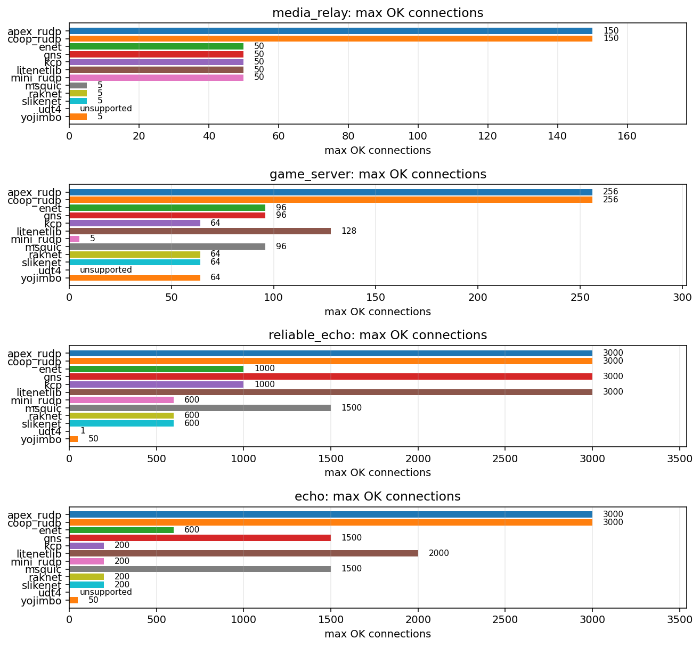

### `media_relay`

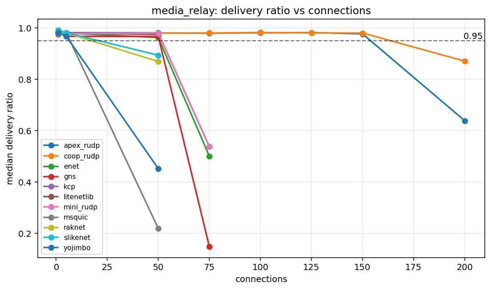

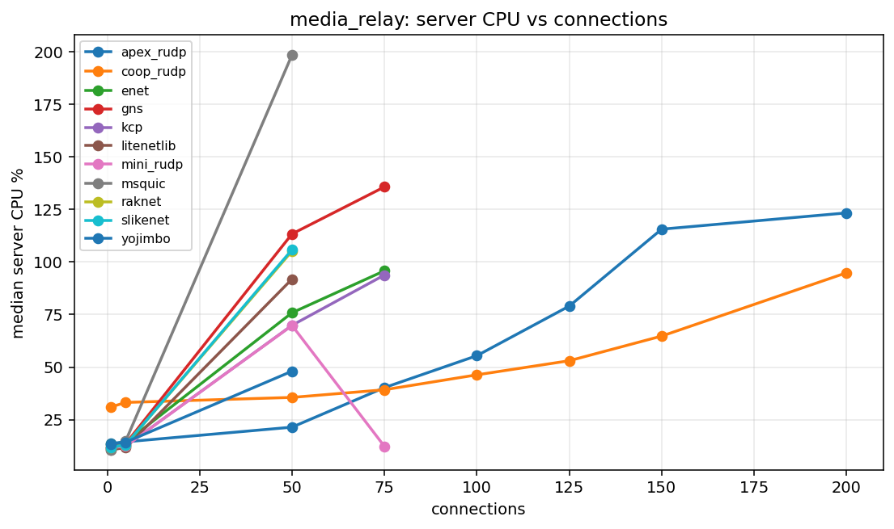

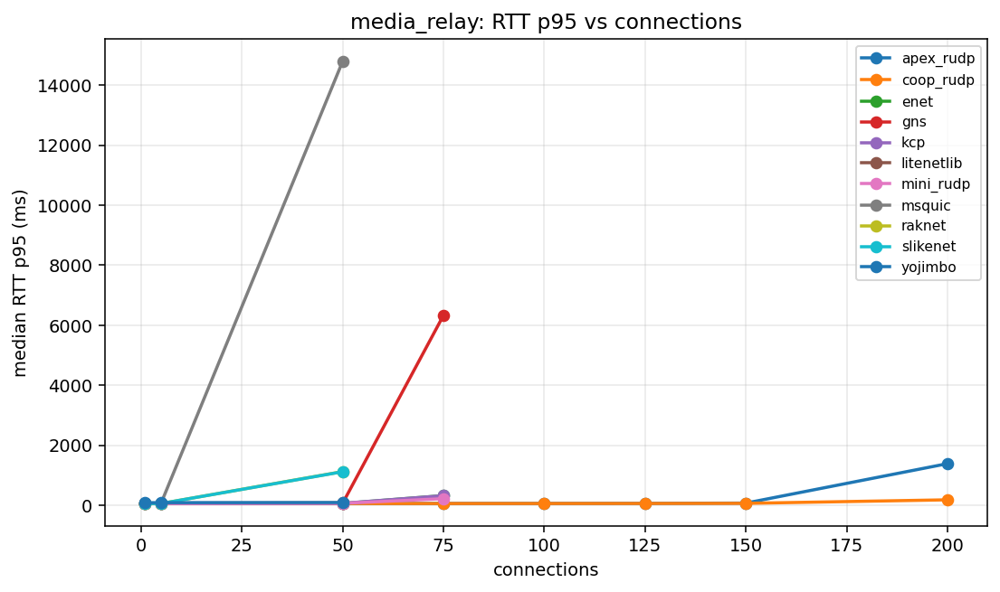

### `game_server`

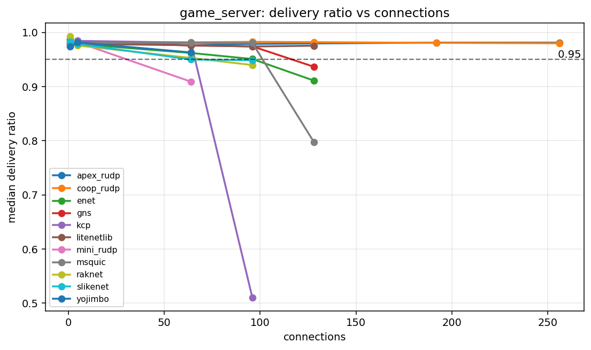

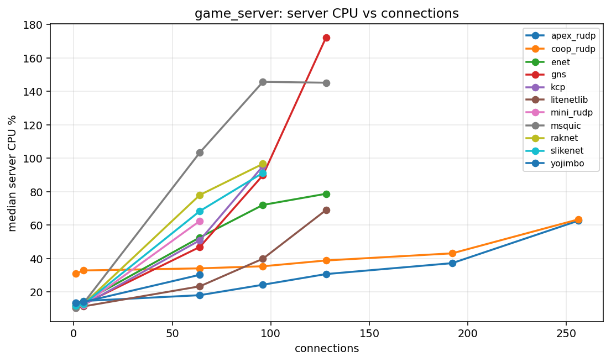

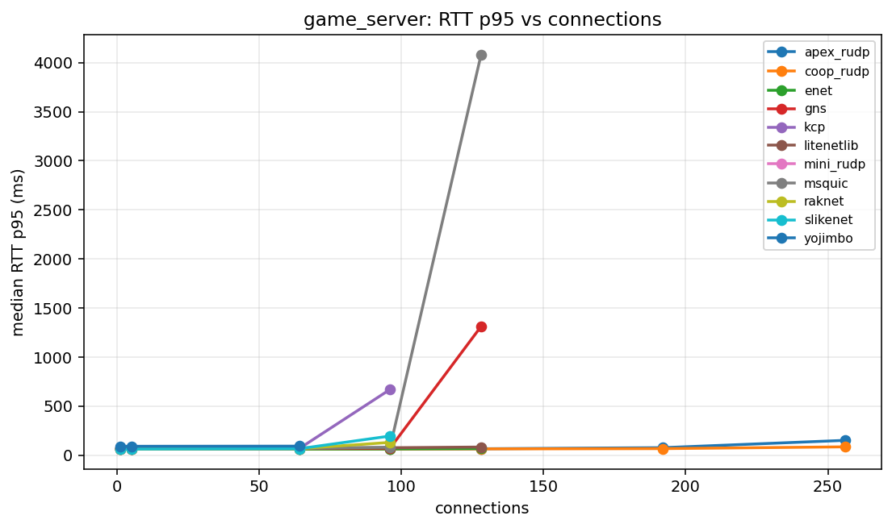

### `reliable_echo`

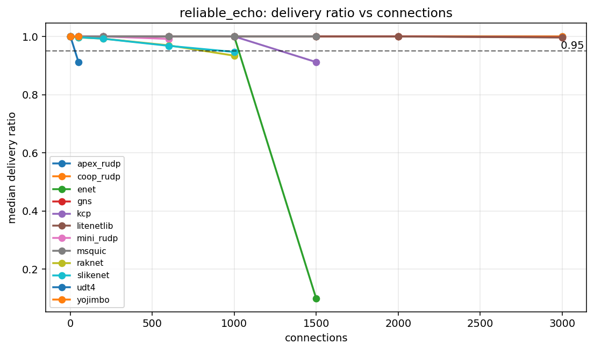

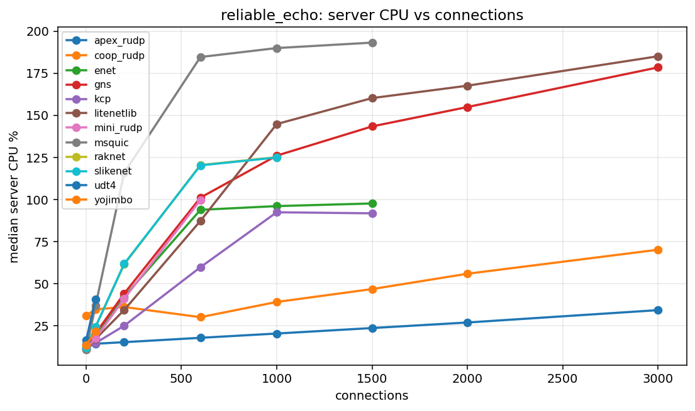

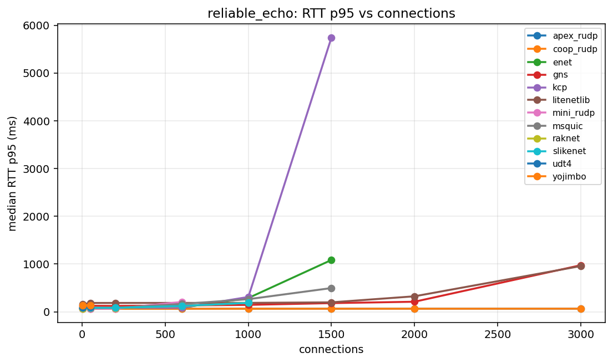

### `echo`

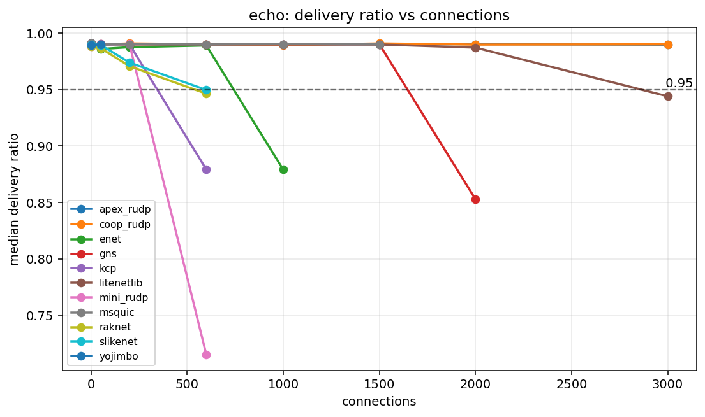

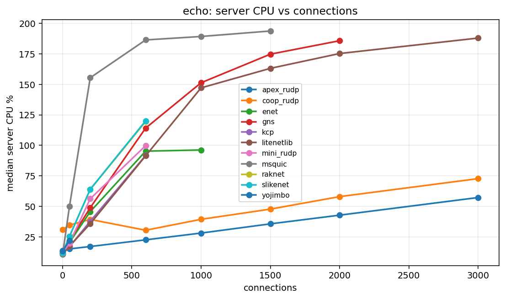

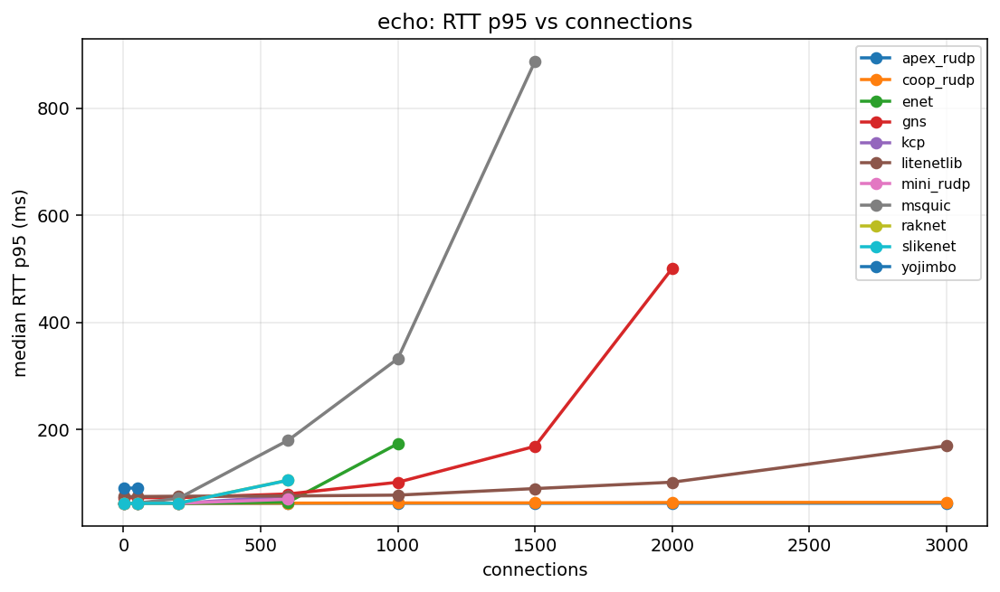

## Capacity Table

| profile | library | status | last OK | last OK delivery | last OK CPU | break | break reason | break delivery | break CPU |
| --- | --- | --- | --- | --- | --- | --- | --- | --- | --- |
| echo | apex_rudp | not_broken | 3000 | 0.9897 | 57.26 | not broken |  |  |  |
| echo | coop_rudp | not_broken | 3000 | 0.9900 | 72.75 | not broken |  |  |  |
| echo | enet | broken | 600 | 0.9890 | 95.26 | 1000 | delivery<0.95 | 0.8791 | 96.23 |
| echo | gns | broken | 1500 | 0.9901 | 174.73 | 2000 | delivery<0.95 | 0.8529 | 185.76 |
| echo | kcp | broken | 200 | 0.9900 | 37.81 | 600 | delivery<0.95 | 0.8792 | 91.78 |
| echo | litenetlib | broken | 2000 | 0.9871 | 175.27 | 3000 | delivery<0.95 | 0.9440 | 187.94 |
| echo | mini_rudp | broken | 200 | 0.9902 | 56.24 | 600 | aggregate_invalid:valid_runs=1/3 | 0.7152 | 99.76 |
| echo | msquic | broken | 1500 | 0.9900 | 193.72 | 2000 | aggregate_invalid:client_tick |  |  |
| echo | raknet | broken | 200 | 0.9707 | 63.83 | 600 | delivery<0.95 | 0.9463 | 119.49 |
| echo | slikenet | broken | 200 | 0.9739 | 64.05 | 600 | delivery<0.95 | 0.9496 | 120.12 |
| echo | udt4 | unsupported | unsupported |  |  | 1 | unsupported_unreliable |  |  |
| echo | yojimbo | broken | 50 | 0.9901 | 21.96 | 200 | unsupported_conns |  |  |
| game_server | apex_rudp | not_broken | 256 | 0.9812 | 62.65 | not broken |  |  |  |
| game_server | coop_rudp | not_broken | 256 | 0.9800 | 63.45 | not broken |  |  |  |
| game_server | enet | broken | 96 | 0.9509 | 72.10 | 128 | delivery<0.95 | 0.9111 | 78.77 |
| game_server | gns | broken | 96 | 0.9743 | 89.86 | 128 | delivery<0.95 | 0.9367 | 172.23 |
| game_server | kcp | broken | 64 | 0.9812 | 50.95 | 96 | delivery<0.95 | 0.5098 | 95.35 |
| game_server | litenetlib | broken | 128 | 0.9755 | 69.01 | 192 | aggregate_invalid:client_tick |  |  |
| game_server | mini_rudp | broken | 5 | 0.9817 | 12.25 | 64 | delivery<0.95 | 0.9090 | 62.52 |
| game_server | msquic | broken | 96 | 0.9805 | 145.73 | 128 | delivery<0.95 | 0.7978 | 145.21 |
| game_server | raknet | broken | 64 | 0.9529 | 78.06 | 96 | delivery<0.95 | 0.9398 | 96.68 |
| game_server | slikenet | broken | 64 | 0.9500 | 68.42 | 96 | delivery<0.95 | 0.9487 | 91.29 |
| game_server | udt4 | unsupported | unsupported |  |  | 1 | unsupported_unreliable |  |  |
| game_server | yojimbo | broken | 64 | 0.9630 | 30.31 | 96 | unsupported_conns |  |  |
| media_relay | apex_rudp | broken | 150 | 0.9768 | 115.61 | 200 | delivery<0.95 | 0.6392 | 123.35 |
| media_relay | coop_rudp | broken | 150 | 0.9803 | 64.75 | 200 | delivery<0.95 | 0.8711 | 94.86 |
| media_relay | enet | broken | 50 | 0.9625 | 75.86 | 75 | delivery<0.95 | 0.5009 | 95.80 |
| media_relay | gns | broken | 50 | 0.9669 | 113.36 | 75 | delivery<0.95 | 0.1488 | 135.73 |
| media_relay | kcp | broken | 50 | 0.9806 | 69.88 | 75 | delivery<0.95 | 0.5382 | 93.80 |
| media_relay | litenetlib | broken | 50 | 0.9747 | 91.88 | 75 | aggregate_invalid:client_tick |  |  |
| media_relay | mini_rudp | broken | 50 | 0.9801 | 69.79 | 75 | delivery<0.95 | 0.5377 | 12.27 |
| media_relay | msquic | broken | 5 | 0.9803 | 14.88 | 50 | delivery<0.95 | 0.2198 | 198.55 |
| media_relay | raknet | broken | 5 | 0.9801 | 13.07 | 50 | delivery<0.95 | 0.8694 | 105.22 |
| media_relay | slikenet | broken | 5 | 0.9811 | 13.05 | 50 | delivery<0.95 | 0.8939 | 105.87 |
| media_relay | udt4 | unsupported | unsupported |  |  | 1 | unsupported_unreliable |  |  |
| media_relay | yojimbo | broken | 5 | 0.9671 | 14.26 | 50 | delivery<0.95 | 0.4524 | 48.05 |
| reliable_echo | apex_rudp | not_broken | 3000 | 1.0000 | 34.20 | not broken |  |  |  |
| reliable_echo | coop_rudp | not_broken | 3000 | 1.0000 | 70.11 | not broken |  |  |  |
| reliable_echo | enet | broken | 1000 | 0.9999 | 96.04 | 1500 | delivery<0.95 | 0.0991 | 97.60 |
| reliable_echo | gns | not_broken | 3000 | 0.9971 | 178.49 | not broken |  |  |  |
| reliable_echo | kcp | broken | 1000 | 0.9999 | 92.37 | 1500 | delivery<0.95 | 0.9117 | 91.75 |
| reliable_echo | litenetlib | not_broken | 3000 | 0.9962 | 185.11 | not broken |  |  |  |
| reliable_echo | mini_rudp | broken | 600 | 0.9913 | 99.62 | 1000 | aggregate_invalid:client_tick |  |  |
| reliable_echo | msquic | broken | 1500 | 1.0000 | 193.21 | 2000 | aggregate_invalid:client_crash |  |  |
| reliable_echo | raknet | broken | 600 | 0.9693 | 120.46 | 1000 | delivery<0.95 | 0.9338 | 125.08 |
| reliable_echo | slikenet | broken | 600 | 0.9676 | 120.24 | 1000 | delivery<0.95 | 0.9466 | 124.94 |
| reliable_echo | udt4 | broken | 1 | 1.0000 | 16.40 | 50 | delivery<0.95 | 0.9121 | 40.66 |
| reliable_echo | yojimbo | broken | 50 | 1.0000 | 21.52 | 200 | unsupported_conns |  |  |

## Profiles

| profile | mode | traffic | payload | conn sweep | client procs |
| --- | --- | --- | --- | --- | --- |
| media_relay | broadcast | r0/u30 | 1000 | 1 5 50 75 100 125 150 200 | 4 |
| game_server | broadcast | r1/u20 | 128 | 1 5 64 96 128 192 256 | 4 |
| reliable_echo | echo | r50/u0 | 64 | 1 50 200 600 1000 1500 2000 3000 | 8 |
| echo | echo | r50/u50 | 64 | 1 50 200 600 1000 1500 2000 3000 | 8 |

## Data Files

- [`capacity.csv`](capacity.csv)
- [`summary.csv`](summary.csv)
- [`profiles.csv`](profiles.csv)
