# Canonical Benchmark Report

Generated: 2026-06-20 23:13:37 UTC

Result directory: `docs/measurements/2026-06-20-canonical-172551Z (published from results/canonical_final_benchmark_20260620T172551Z)`

This report is generated by `go run ./cmd/rudp-bench-canonical`. It is the first file to open after a canonical benchmark run.

## Verdict

| profile | strongest | max OK | break | max OK readout |
| --- | --- | --- | --- | --- |
| media_relay | coop_rudp | 150 | 200 (delivery<0.95) | delivery 0.9799, CPU 67.79% |
| game_server | coop_rudp | 256 | not broken | delivery 0.9818, CPU 59.69% |
| reliable_echo | apex_rudp | 3000 | not broken | delivery 1.0000, CPU 34.23% |
| echo | apex_rudp | 3000 | not broken | delivery 0.9899, CPU 57.44% |

OK means aggregate valid runs meet the gate and median `delivery_ratio >= 0.95`.

## Graphs

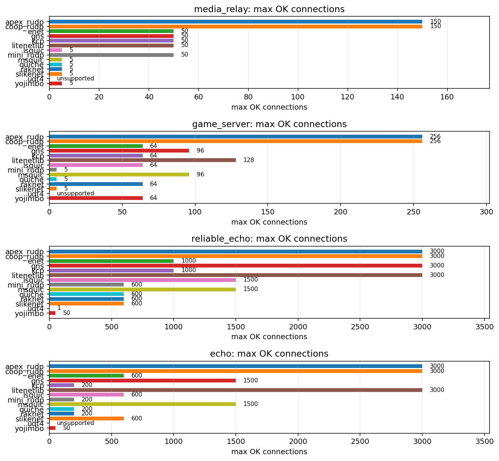

### `media_relay`

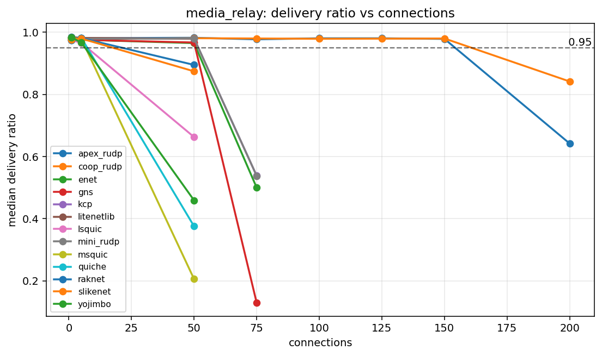

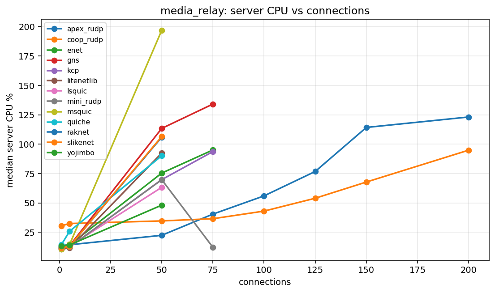

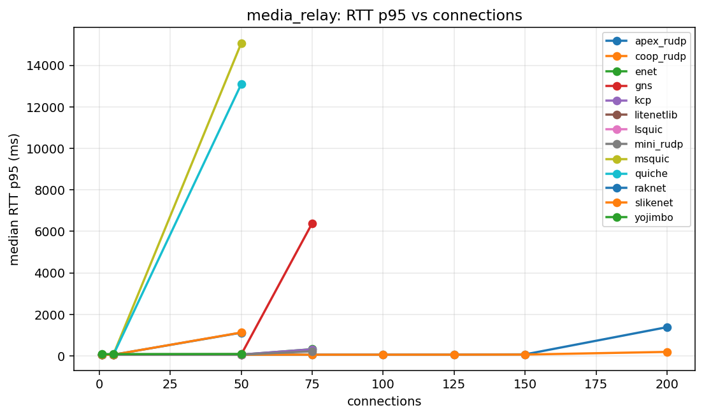

### `game_server`

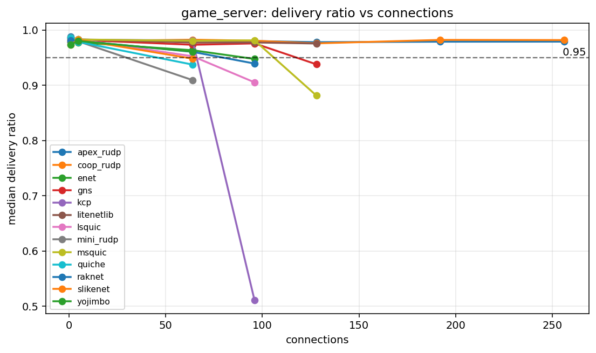

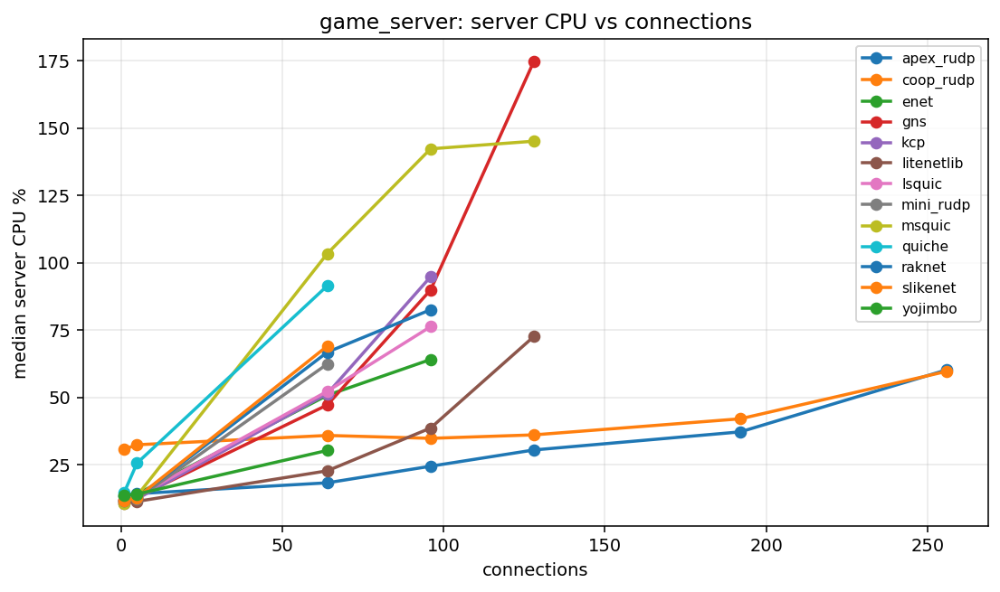

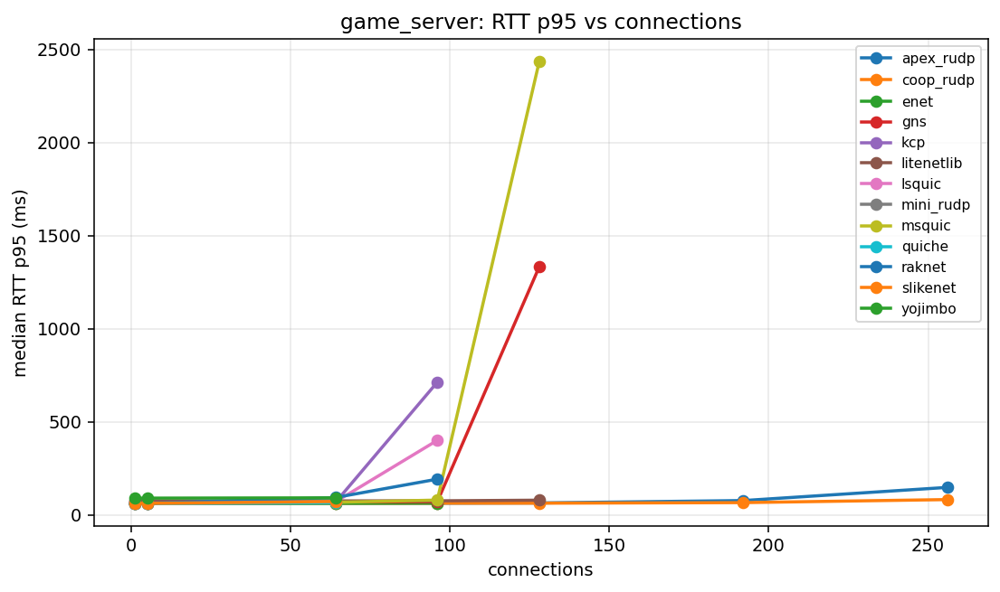

### `reliable_echo`

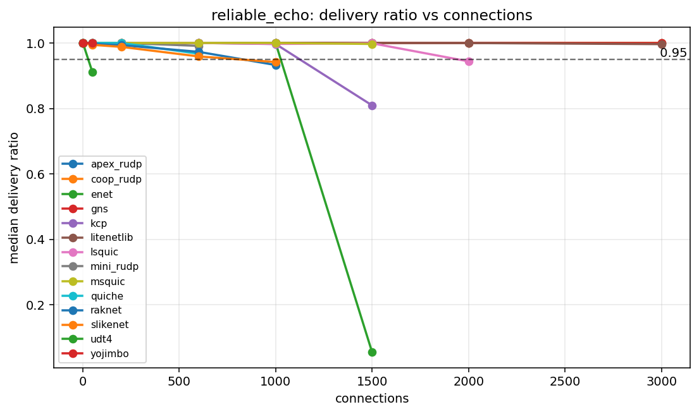

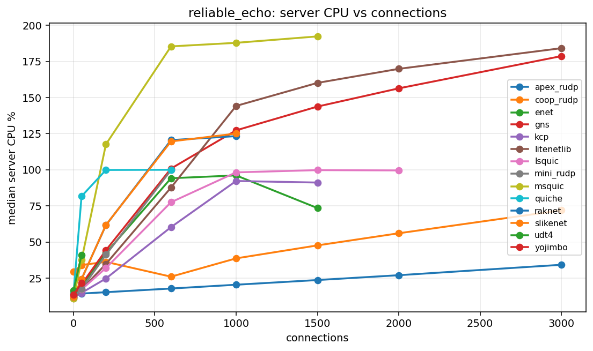

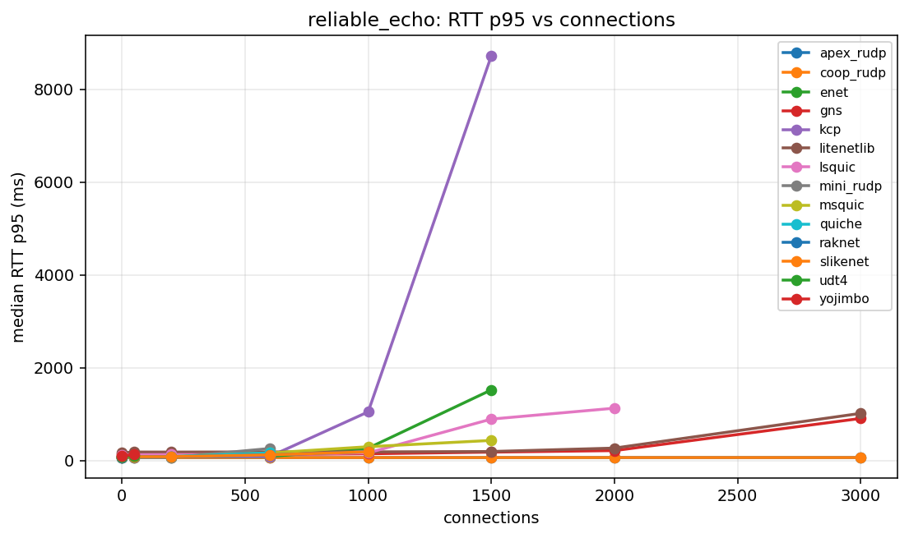

### `echo`

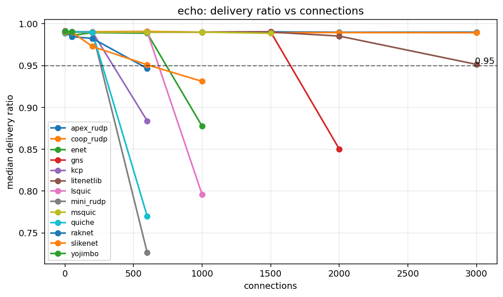

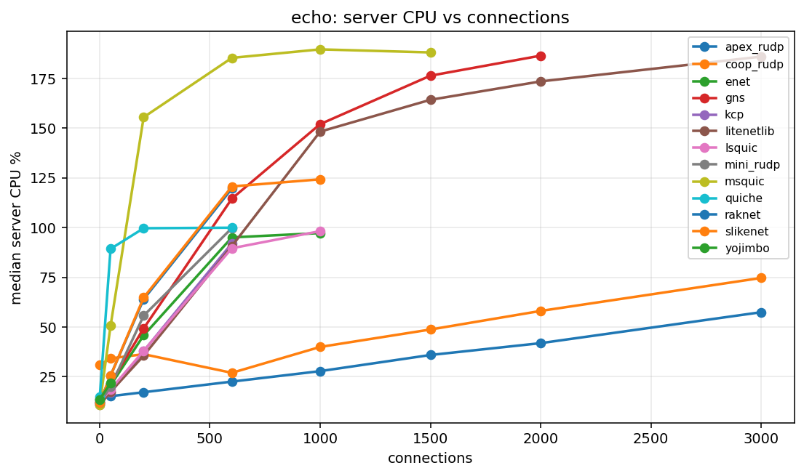

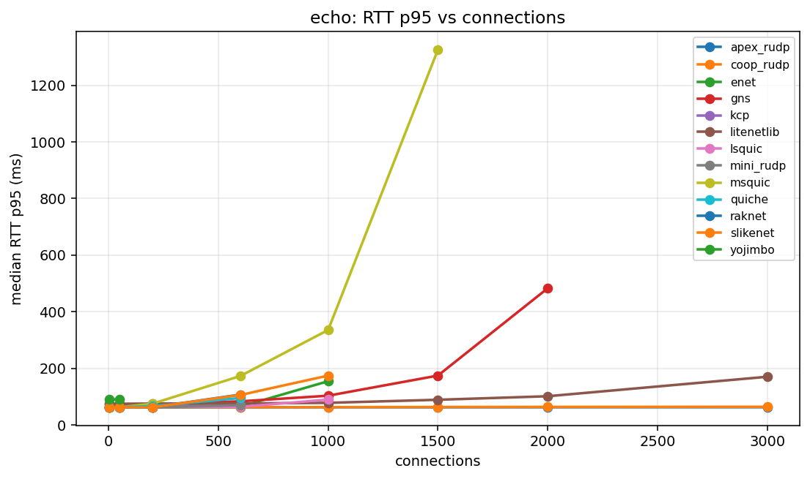

## Capacity Table

| profile | library | status | last OK | last OK delivery | last OK CPU | break | break reason | break delivery | break CPU |
| --- | --- | --- | --- | --- | --- | --- | --- | --- | --- |
| echo | apex_rudp | not_broken | 3000 | 0.9899 | 57.44 | not broken |  |  |  |
| echo | coop_rudp | not_broken | 3000 | 0.9892 | 74.68 | not broken |  |  |  |
| echo | enet | broken | 600 | 0.9886 | 95.07 | 1000 | delivery<0.95 | 0.8776 | 97.24 |
| echo | gns | broken | 1500 | 0.9902 | 176.42 | 2000 | delivery<0.95 | 0.8503 | 186.50 |
| echo | kcp | broken | 200 | 0.9901 | 37.88 | 600 | delivery<0.95 | 0.8839 | 92.05 |
| echo | litenetlib | not_broken | 3000 | 0.9514 | 186.02 | not broken |  |  |  |
| echo | lsquic | broken | 600 | 0.9901 | 89.62 | 1000 | delivery<0.95 | 0.7960 | 98.21 |
| echo | mini_rudp | broken | 200 | 0.9901 | 55.70 | 600 | delivery<0.95 | 0.7265 | 99.75 |
| echo | msquic | broken | 1500 | 0.9885 | 188.12 | 2000 | aggregate_invalid:client_tick |  |  |
| echo | quiche | broken | 200 | 0.9899 | 99.68 | 600 | delivery<0.95 | 0.7700 | 99.95 |
| echo | raknet | broken | 200 | 0.9824 | 64.00 | 600 | delivery<0.95 | 0.9465 | 119.65 |
| echo | slikenet | broken | 600 | 0.9509 | 120.70 | 1000 | delivery<0.95 | 0.9311 | 124.29 |
| echo | udt4 | unsupported | unsupported |  |  | 1 | unsupported_unreliable |  |  |
| echo | yojimbo | broken | 50 | 0.9903 | 21.88 | 200 | unsupported_conns |  |  |
| game_server | apex_rudp | not_broken | 256 | 0.9790 | 60.25 | not broken |  |  |  |
| game_server | coop_rudp | not_broken | 256 | 0.9818 | 59.69 | not broken |  |  |  |
| game_server | enet | broken | 64 | 0.9634 | 50.80 | 96 | delivery<0.95 | 0.9476 | 64.08 |
| game_server | gns | broken | 96 | 0.9758 | 89.89 | 128 | delivery<0.95 | 0.9379 | 174.71 |
| game_server | kcp | broken | 64 | 0.9809 | 51.41 | 96 | delivery<0.95 | 0.5106 | 94.79 |
| game_server | litenetlib | broken | 128 | 0.9756 | 72.61 | 192 | aggregate_invalid:client_tick |  |  |
| game_server | lsquic | broken | 64 | 0.9525 | 52.29 | 96 | delivery<0.95 | 0.9053 | 76.27 |
| game_server | mini_rudp | broken | 5 | 0.9794 | 12.33 | 64 | delivery<0.95 | 0.9093 | 62.41 |
| game_server | msquic | broken | 96 | 0.9813 | 142.27 | 128 | delivery<0.95 | 0.8813 | 145.09 |
| game_server | quiche | broken | 5 | 0.9785 | 25.60 | 64 | delivery<0.95 | 0.9374 | 91.46 |
| game_server | raknet | broken | 64 | 0.9605 | 66.80 | 96 | delivery<0.95 | 0.9393 | 82.55 |
| game_server | slikenet | broken | 5 | 0.9826 | 12.81 | 64 | delivery<0.95 | 0.9482 | 69.08 |
| game_server | udt4 | unsupported | unsupported |  |  | 1 | unsupported_unreliable |  |  |
| game_server | yojimbo | broken | 64 | 0.9610 | 30.33 | 96 | unsupported_conns |  |  |
| media_relay | apex_rudp | broken | 150 | 0.9786 | 114.22 | 200 | delivery<0.95 | 0.6419 | 123.11 |
| media_relay | coop_rudp | broken | 150 | 0.9799 | 67.79 | 200 | delivery<0.95 | 0.8416 | 94.91 |
| media_relay | enet | broken | 50 | 0.9650 | 75.38 | 75 | delivery<0.95 | 0.5000 | 95.07 |
| media_relay | gns | broken | 50 | 0.9671 | 113.38 | 75 | delivery<0.95 | 0.1294 | 134.09 |
| media_relay | kcp | broken | 50 | 0.9802 | 69.81 | 75 | delivery<0.95 | 0.5382 | 93.66 |
| media_relay | litenetlib | broken | 50 | 0.9791 | 92.42 | 75 | aggregate_invalid:client_tick |  |  |
| media_relay | lsquic | broken | 5 | 0.9657 | 13.33 | 50 | delivery<0.95 | 0.6628 | 63.26 |
| media_relay | mini_rudp | broken | 50 | 0.9804 | 69.82 | 75 | delivery<0.95 | 0.5378 | 12.30 |
| media_relay | msquic | broken | 5 | 0.9791 | 14.70 | 50 | delivery<0.95 | 0.2058 | 196.76 |
| media_relay | quiche | broken | 5 | 0.9816 | 25.90 | 50 | delivery<0.95 | 0.3757 | 90.14 |
| media_relay | raknet | broken | 5 | 0.9813 | 13.15 | 50 | delivery<0.95 | 0.8949 | 105.87 |
| media_relay | slikenet | broken | 5 | 0.9796 | 13.13 | 50 | delivery<0.95 | 0.8743 | 106.45 |
| media_relay | udt4 | unsupported | unsupported |  |  | 1 | unsupported_unreliable |  |  |
| media_relay | yojimbo | broken | 5 | 0.9667 | 14.30 | 50 | delivery<0.95 | 0.4591 | 48.13 |
| reliable_echo | apex_rudp | not_broken | 3000 | 1.0000 | 34.23 | not broken |  |  |  |
| reliable_echo | coop_rudp | not_broken | 3000 | 1.0000 | 71.96 | not broken |  |  |  |
| reliable_echo | enet | broken | 1000 | 0.9998 | 96.09 | 1500 | delivery<0.95 | 0.0557 | 73.49 |
| reliable_echo | gns | not_broken | 3000 | 0.9995 | 178.69 | not broken |  |  |  |
| reliable_echo | kcp | broken | 1000 | 0.9967 | 92.22 | 1500 | delivery<0.95 | 0.8093 | 91.15 |
| reliable_echo | litenetlib | not_broken | 3000 | 0.9964 | 184.17 | not broken |  |  |  |
| reliable_echo | lsquic | broken | 1500 | 0.9989 | 99.75 | 2000 | delivery<0.95 | 0.9437 | 99.55 |
| reliable_echo | mini_rudp | broken | 600 | 0.9911 | 99.75 | 1000 | aggregate_invalid:client_tick |  |  |
| reliable_echo | msquic | broken | 1500 | 0.9969 | 192.32 | 2000 | aggregate_invalid:client_tick |  |  |
| reliable_echo | quiche | broken | 600 | 0.9671 | 99.99 | 1000 | aggregate_invalid:client_tick |  |  |
| reliable_echo | raknet | broken | 600 | 0.9729 | 120.53 | 1000 | delivery<0.95 | 0.9326 | 123.30 |
| reliable_echo | slikenet | broken | 600 | 0.9589 | 119.62 | 1000 | delivery<0.95 | 0.9416 | 125.05 |
| reliable_echo | udt4 | broken | 1 | 1.0000 | 16.55 | 50 | delivery<0.95 | 0.9117 | 41.00 |
| reliable_echo | yojimbo | broken | 50 | 1.0000 | 21.61 | 200 | unsupported_conns |  |  |

## Profiles

| profile | mode | traffic | payload | conn sweep | client procs |
| --- | --- | --- | --- | --- | --- |
| media_relay | broadcast | r0/u30 | 1000 | 1 5 50 75 100 125 150 200 | 4 |
| game_server | broadcast | r1/u20 | 128 | 1 5 64 96 128 192 256 | 4 |
| reliable_echo | echo | r50/u0 | 64 | 1 50 200 600 1000 1500 2000 3000 | 8 |
| echo | echo | r50/u50 | 64 | 1 50 200 600 1000 1500 2000 3000 | 8 |

## Data Files

- [`capacity.csv`](capacity.csv)
- [`summary.csv`](summary.csv)
- [`profiles.csv`](profiles.csv)
