# Canonical Benchmark Report

Generated: 2026-06-21 13:16:17 UTC

Result directory: `docs/measurements/2026-06-21-canonical-070846Z (published from results/canonical_final_benchmark_20260621T070846Z)`

This report is generated by `go run ./cmd/rudp-bench-canonical`. It is the first file to open after a canonical benchmark run.

## Verdict

| profile | strongest | max OK | break | max OK readout |
| --- | --- | --- | --- | --- |
| media_relay | coop_rudp | 150 | 200 (delivery<0.95) | delivery 0.9824, CPU 66.55% |
| game_server | apex_rudp | 256 | not broken | delivery 0.9786, CPU 57.62% |
| reliable_echo | apex_rudp | 3000 | not broken | delivery 1.0000, CPU 32.83% |
| echo | apex_rudp | 3000 | not broken | delivery 0.9902, CPU 57.04% |

OK means aggregate valid runs meet the gate and median `delivery_ratio >= 0.95`.

## Graphs

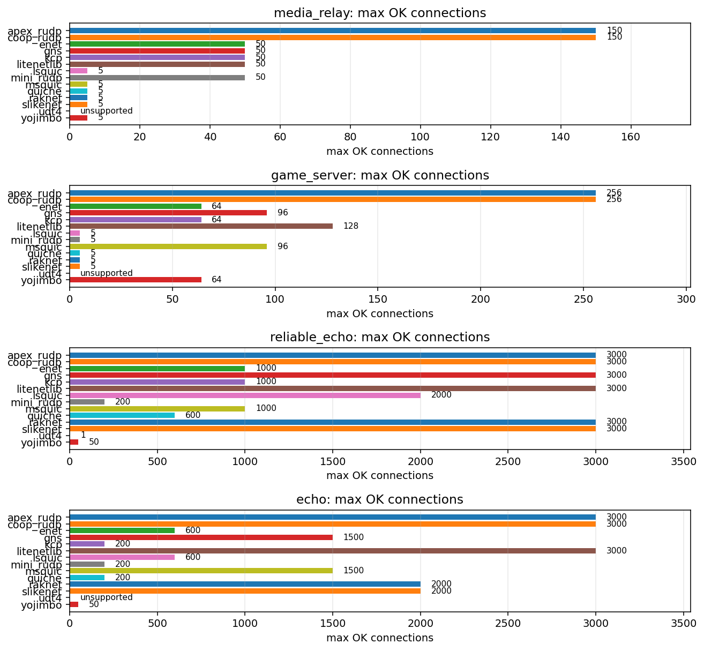

### `media_relay`

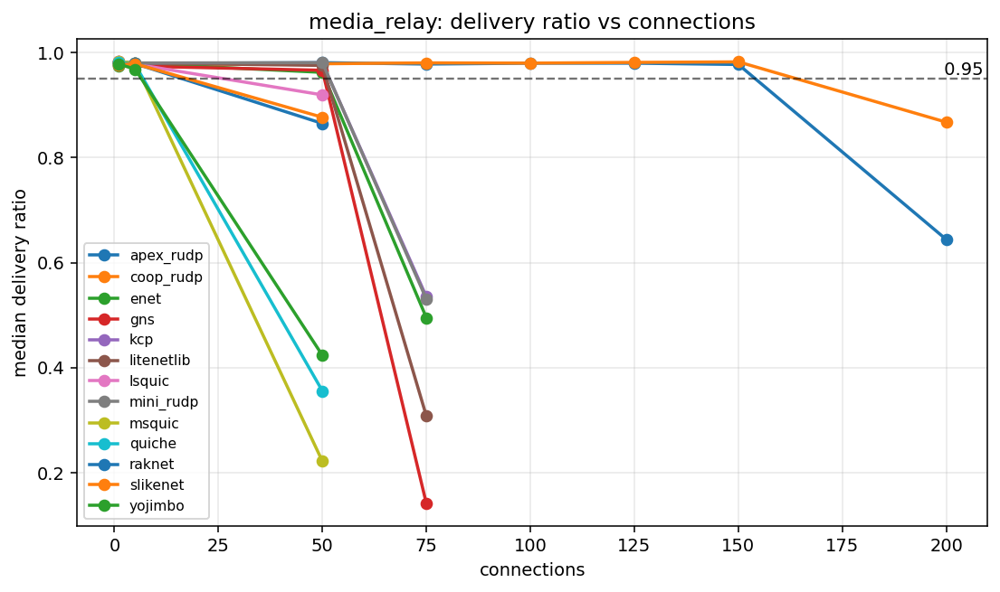

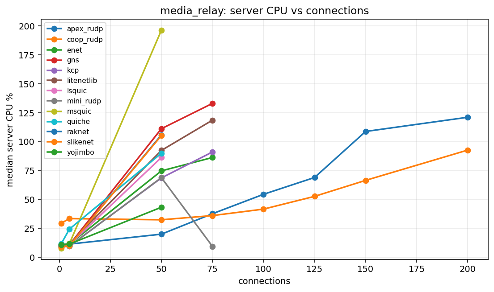

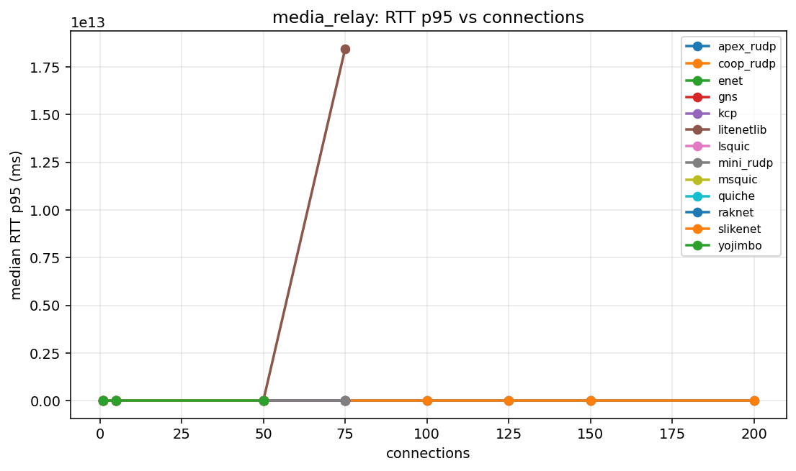

### `game_server`

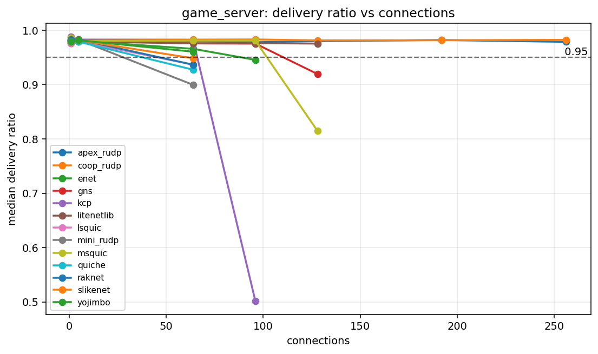

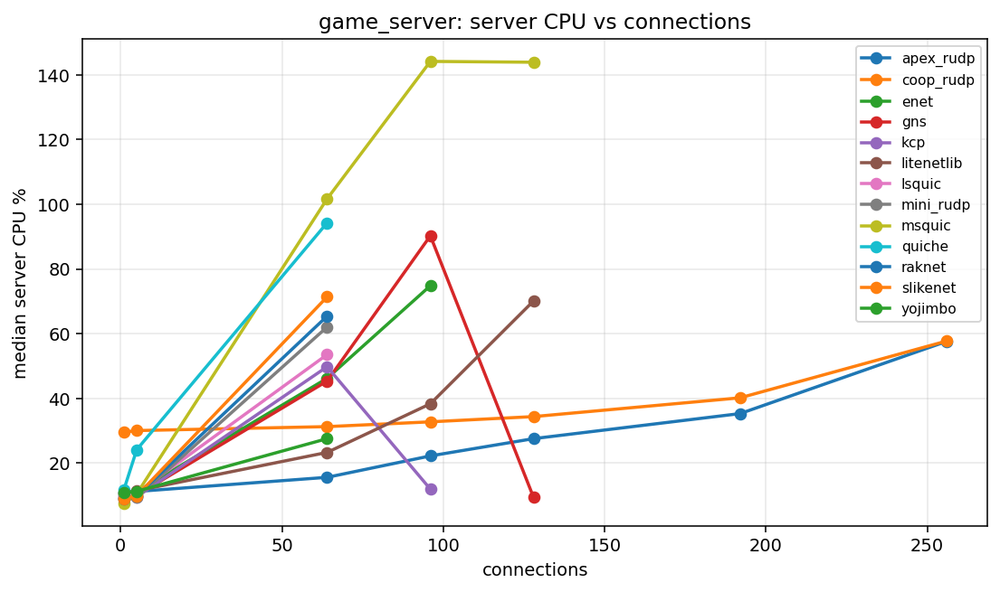

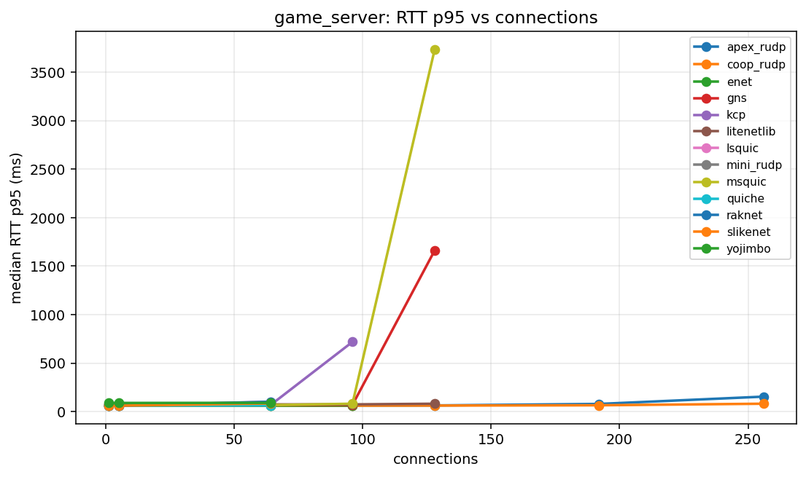

### `reliable_echo`

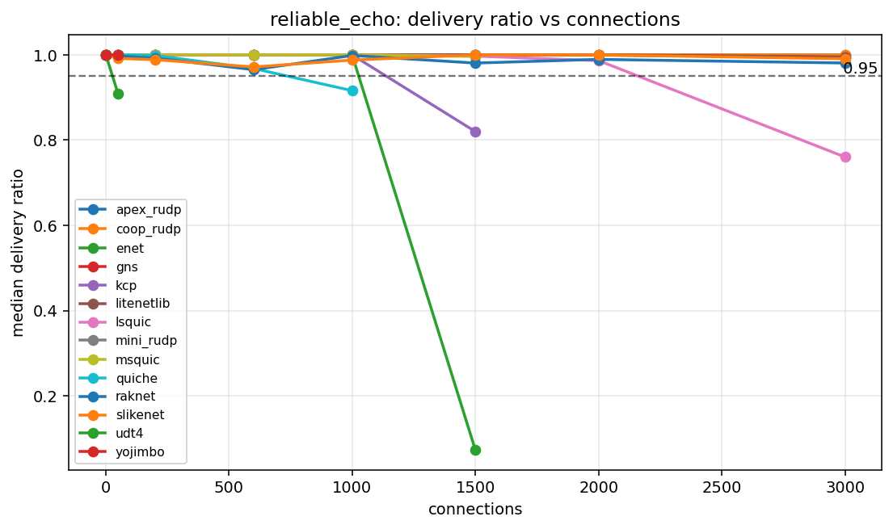

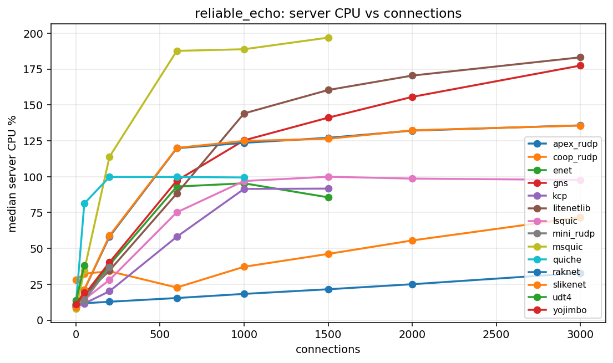

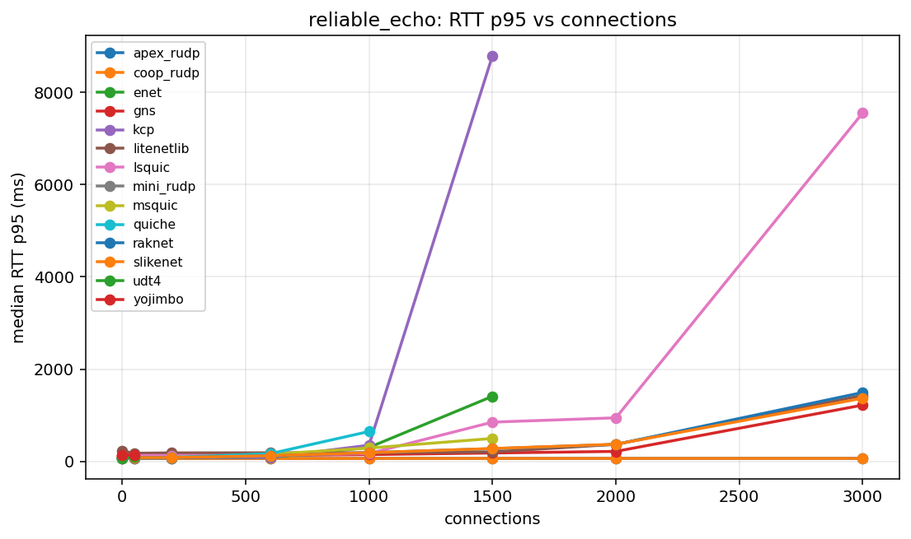

### `echo`

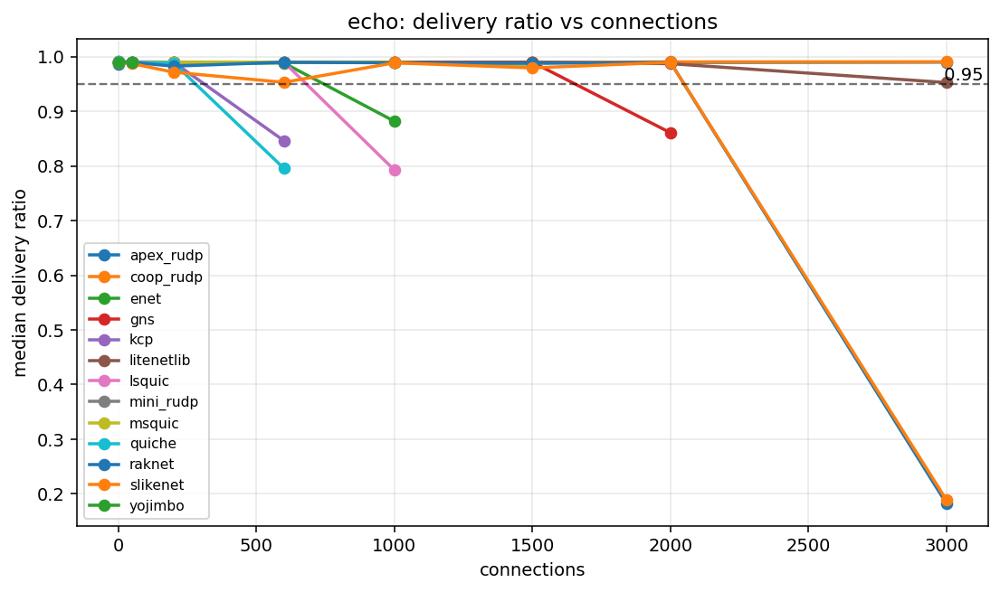

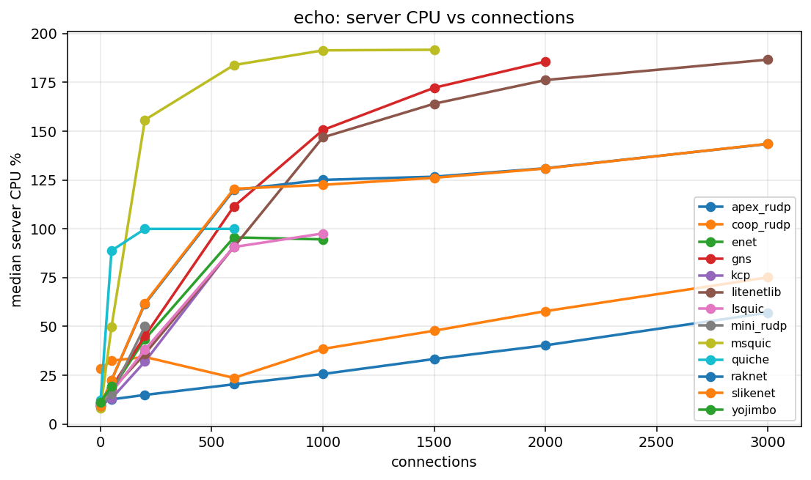

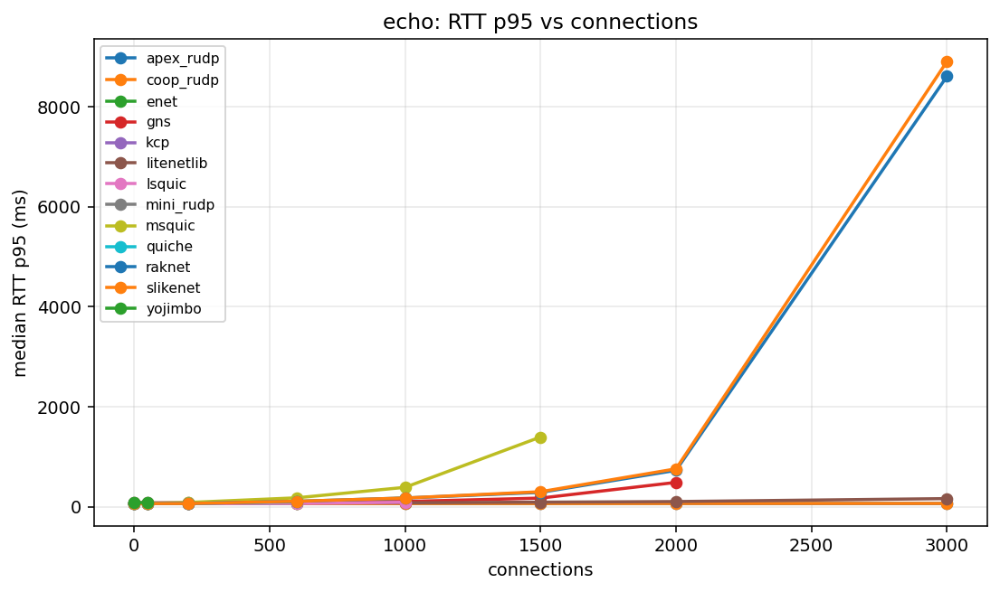

## Capacity Table

| profile | library | status | last OK | last OK delivery | last OK CPU | break | break reason | break delivery | break CPU |
| --- | --- | --- | --- | --- | --- | --- | --- | --- | --- |
| echo | apex_rudp | not_broken | 3000 | 0.9902 | 57.04 | not broken |  |  |  |
| echo | coop_rudp | not_broken | 3000 | 0.9908 | 75.11 | not broken |  |  |  |
| echo | enet | broken | 600 | 0.9885 | 95.59 | 1000 | delivery<0.95 | 0.8819 | 94.55 |
| echo | gns | broken | 1500 | 0.9900 | 172.19 | 2000 | delivery<0.95 | 0.8609 | 185.60 |
| echo | kcp | broken | 200 | 0.9901 | 31.96 | 600 | delivery<0.95 | 0.8462 | 91.10 |
| echo | litenetlib | not_broken | 3000 | 0.9528 | 186.60 | not broken |  |  |  |
| echo | lsquic | broken | 600 | 0.9901 | 90.65 | 1000 | delivery<0.95 | 0.7926 | 97.60 |
| echo | mini_rudp | broken | 200 | 0.9901 | 50.06 | 600 | aggregate_invalid:server_crash |  |  |
| echo | msquic | broken | 1500 | 0.9824 | 191.64 | 2000 | aggregate_invalid:client_tick |  |  |
| echo | quiche | broken | 200 | 0.9886 | 99.93 | 600 | delivery<0.95 | 0.7956 | 99.94 |
| echo | raknet | broken | 2000 | 0.9899 | 130.99 | 3000 | delivery<0.95 | 0.1822 | 143.40 |
| echo | slikenet | broken | 2000 | 0.9898 | 130.85 | 3000 | delivery<0.95 | 0.1886 | 143.51 |
| echo | udt4 | unsupported | unsupported |  |  | 1 | unsupported_unreliable |  |  |
| echo | yojimbo | broken | 50 | 0.9898 | 19.49 | 200 | unsupported_conns |  |  |
| game_server | apex_rudp | not_broken | 256 | 0.9786 | 57.62 | not broken |  |  |  |
| game_server | coop_rudp | not_broken | 256 | 0.9824 | 57.74 | not broken |  |  |  |
| game_server | enet | broken | 64 | 0.9658 | 46.21 | 96 | delivery<0.95 | 0.9454 | 74.84 |
| game_server | gns | broken | 96 | 0.9754 | 90.27 | 128 | delivery<0.95 | 0.9194 | 9.36 |
| game_server | kcp | broken | 64 | 0.9809 | 49.80 | 96 | delivery<0.95 | 0.5014 | 11.95 |
| game_server | litenetlib | broken | 128 | 0.9754 | 70.15 | 192 | aggregate_invalid:client_tick |  |  |
| game_server | lsquic | broken | 5 | 0.9796 | 10.76 | 64 | delivery<0.95 | 0.9366 | 53.56 |
| game_server | mini_rudp | broken | 5 | 0.9823 | 9.36 | 64 | delivery<0.95 | 0.8994 | 62.08 |
| game_server | msquic | broken | 96 | 0.9810 | 144.17 | 128 | delivery<0.95 | 0.8147 | 143.91 |
| game_server | quiche | broken | 5 | 0.9788 | 24.16 | 64 | delivery<0.95 | 0.9273 | 94.28 |
| game_server | raknet | broken | 5 | 0.9829 | 9.88 | 64 | delivery<0.95 | 0.9365 | 65.44 |
| game_server | slikenet | broken | 5 | 0.9816 | 9.90 | 64 | delivery<0.95 | 0.9484 | 71.39 |
| game_server | udt4 | unsupported | unsupported |  |  | 1 | unsupported_unreliable |  |  |
| game_server | yojimbo | broken | 64 | 0.9605 | 27.56 | 96 | unsupported_conns |  |  |
| media_relay | apex_rudp | broken | 150 | 0.9774 | 108.82 | 200 | delivery<0.95 | 0.6440 | 121.10 |
| media_relay | coop_rudp | broken | 150 | 0.9824 | 66.55 | 200 | delivery<0.95 | 0.8675 | 92.73 |
| media_relay | enet | broken | 50 | 0.9624 | 74.75 | 75 | delivery<0.95 | 0.4951 | 86.31 |
| media_relay | gns | broken | 50 | 0.9664 | 111.19 | 75 | delivery<0.95 | 0.1412 | 133.07 |
| media_relay | kcp | broken | 50 | 0.9804 | 68.65 | 75 | delivery<0.95 | 0.5350 | 91.09 |
| media_relay | litenetlib | broken | 50 | 0.9756 | 92.42 | 75 | aggregate_invalid:valid_runs=1/3 | 0.3078 | 118.58 |
| media_relay | lsquic | broken | 5 | 0.9781 | 10.93 | 50 | delivery<0.95 | 0.9195 | 86.35 |
| media_relay | mini_rudp | broken | 50 | 0.9808 | 68.92 | 75 | delivery<0.95 | 0.5306 | 9.51 |
| media_relay | msquic | broken | 5 | 0.9791 | 11.95 | 50 | delivery<0.95 | 0.2218 | 196.28 |
| media_relay | quiche | broken | 5 | 0.9769 | 24.47 | 50 | delivery<0.95 | 0.3557 | 89.97 |
| media_relay | raknet | broken | 5 | 0.9790 | 10.21 | 50 | delivery<0.95 | 0.8651 | 105.79 |
| media_relay | slikenet | broken | 5 | 0.9787 | 10.18 | 50 | delivery<0.95 | 0.8769 | 105.21 |
| media_relay | udt4 | unsupported | unsupported |  |  | 1 | unsupported_unreliable |  |  |
| media_relay | yojimbo | broken | 5 | 0.9684 | 11.51 | 50 | delivery<0.95 | 0.4235 | 43.31 |
| reliable_echo | apex_rudp | not_broken | 3000 | 1.0000 | 32.83 | not broken |  |  |  |
| reliable_echo | coop_rudp | not_broken | 3000 | 1.0000 | 71.64 | not broken |  |  |  |
| reliable_echo | enet | broken | 1000 | 0.9998 | 95.38 | 1500 | delivery<0.95 | 0.0728 | 85.60 |
| reliable_echo | gns | not_broken | 3000 | 0.9949 | 177.47 | not broken |  |  |  |
| reliable_echo | kcp | broken | 1000 | 0.9999 | 91.47 | 1500 | delivery<0.95 | 0.8200 | 91.69 |
| reliable_echo | litenetlib | not_broken | 3000 | 0.9946 | 183.22 | not broken |  |  |  |
| reliable_echo | lsquic | broken | 2000 | 0.9865 | 98.67 | 3000 | delivery<0.95 | 0.7602 | 97.74 |
| reliable_echo | mini_rudp | broken | 200 | 1.0000 | 36.78 | 600 | aggregate_invalid:server_crash |  |  |
| reliable_echo | msquic | broken | 1000 | 1.0000 | 188.86 | 1500 | aggregate_invalid:valid_runs=1/3 | 0.9964 | 196.94 |
| reliable_echo | quiche | broken | 600 | 0.9681 | 99.78 | 1000 | aggregate_invalid:valid_runs=1/3 | 0.9160 | 99.47 |
| reliable_echo | raknet | not_broken | 3000 | 0.9809 | 135.78 | not broken |  |  |  |
| reliable_echo | slikenet | not_broken | 3000 | 0.9907 | 135.65 | not broken |  |  |  |
| reliable_echo | udt4 | broken | 1 | 1.0000 | 13.84 | 50 | delivery<0.95 | 0.9096 | 38.10 |
| reliable_echo | yojimbo | broken | 50 | 1.0000 | 19.00 | 200 | unsupported_conns |  |  |

## Profiles

| profile | mode | traffic | payload | conn sweep | client procs |
| --- | --- | --- | --- | --- | --- |
| media_relay | broadcast | r0/u30 | 1000 | 1 5 50 75 100 125 150 200 | 4 |
| game_server | broadcast | r1/u20 | 128 | 1 5 64 96 128 192 256 | 4 |
| reliable_echo | echo | r50/u0 | 64 | 1 50 200 600 1000 1500 2000 3000 | 8 |
| echo | echo | r50/u50 | 64 | 1 50 200 600 1000 1500 2000 3000 | 8 |

## Data Files

- [`capacity.csv`](capacity.csv)
- [`summary.csv`](summary.csv)
- [`profiles.csv`](profiles.csv)
