# Canonical Benchmark Report

Generated: 2026-06-22 03:52:06 UTC

Result directory: `docs/measurements/2026-06-22-canonical-035206Z (published from results/bench_20260622T010825Z)`

This report is generated by `go run ./cmd/rudp-bench-canonical`. It is the first file to open after a canonical benchmark run.

## Verdict

| profile | strongest | max OK | break | max OK readout |
| --- | --- | --- | --- | --- |
| media_relay | coop_rudp | 150 | 200 (delivery<0.95) | delivery 0.9769, CPU 72.40% |
| game_server | apex_rudp | 256 | not broken | delivery 0.9775, CPU 50.75% |
| reliable_echo | apex_rudp | 3000 | not broken | delivery 1.0000, CPU 34.64% |
| echo | apex_rudp | 3000 | not broken | delivery 0.9906, CPU 48.91% |

OK means aggregate valid runs meet the gate and median `delivery_ratio >= 0.95`.

## Graphs

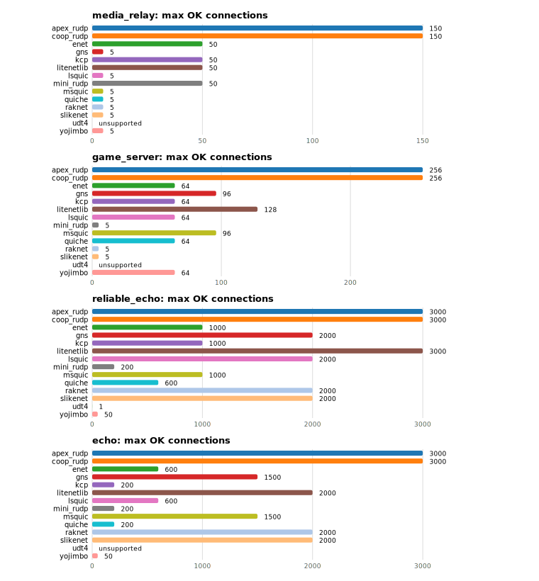

### `media_relay`

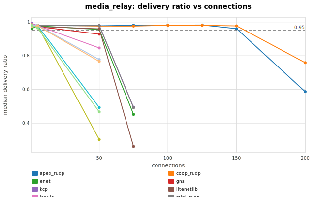

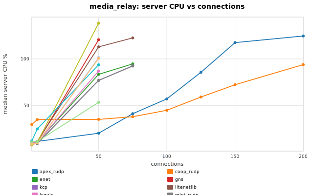

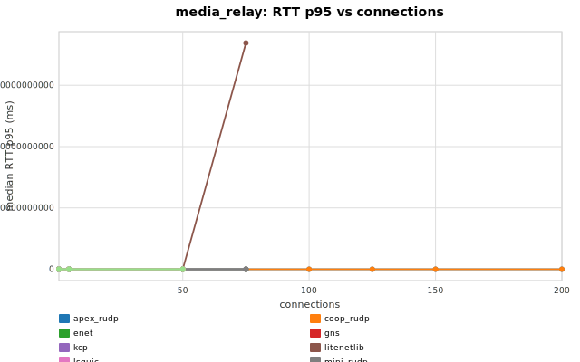

### `game_server`

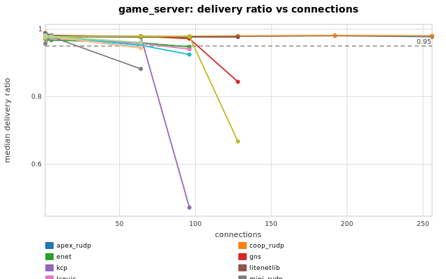

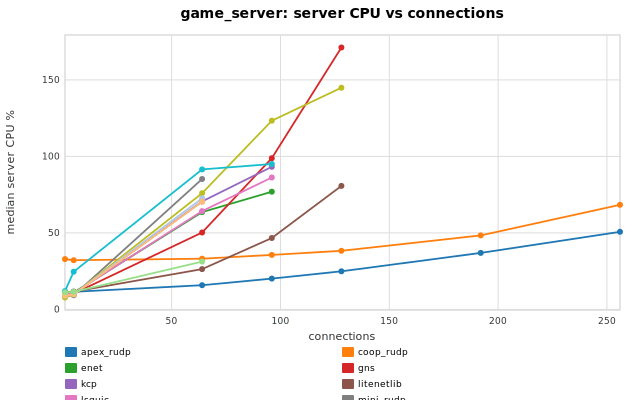

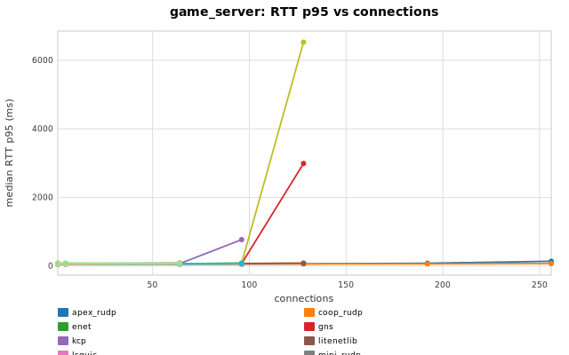

### `reliable_echo`

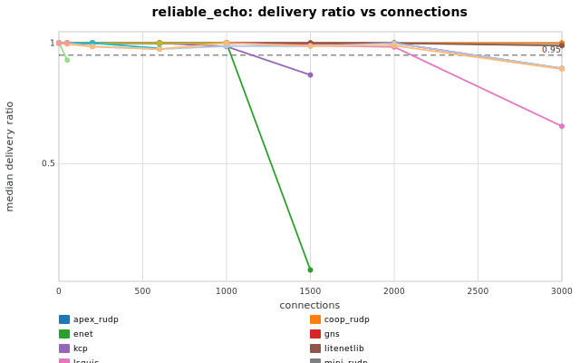

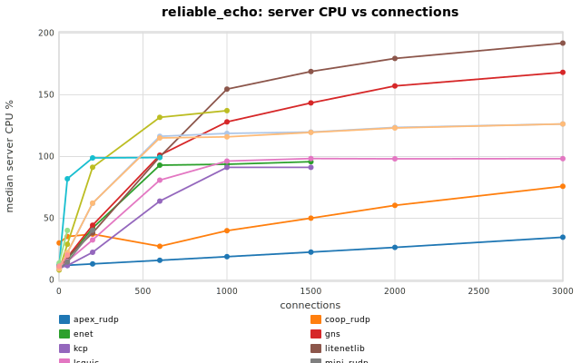

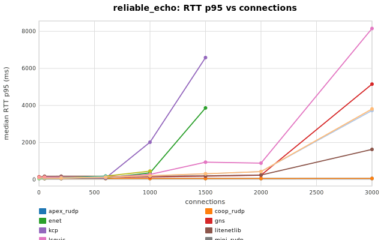

### `echo`

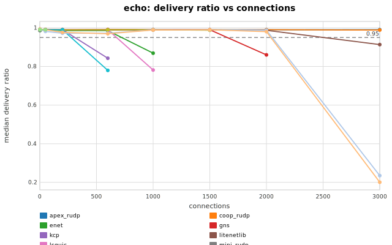

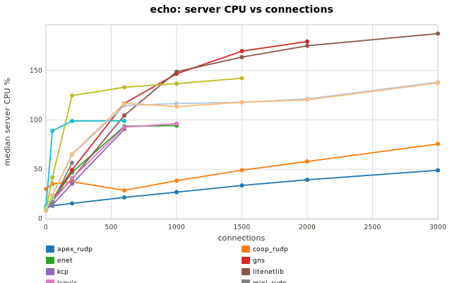

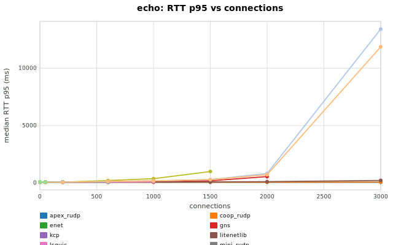

## Capacity Table

| profile | library | status | last OK | last OK delivery | last OK CPU | break | break reason | break delivery | break CPU |
| --- | --- | --- | --- | --- | --- | --- | --- | --- | --- |
| echo | apex_rudp | not_broken | 3000 | 0.9906 | 48.91 | not broken |  |  |  |
| echo | coop_rudp | not_broken | 3000 | 0.9888 | 75.58 | not broken |  |  |  |
| echo | enet | broken | 600 | 0.9857 | 93.54 | 1000 | delivery<0.95 | 0.8688 | 94.21 |
| echo | gns | broken | 1500 | 0.9901 | 169.77 | 2000 | delivery<0.95 | 0.8600 | 179.43 |
| echo | kcp | broken | 200 | 0.9904 | 35.26 | 600 | delivery<0.95 | 0.8427 | 90.53 |
| echo | litenetlib | broken | 2000 | 0.9870 | 175.11 | 3000 | delivery<0.95 | 0.9134 | 187.45 |
| echo | lsquic | broken | 600 | 0.9899 | 92.63 | 1000 | delivery<0.95 | 0.7817 | 96.19 |
| echo | mini_rudp | broken | 200 | 0.9899 | 56.43 | 600 | aggregate_invalid:server_crash |  |  |
| echo | msquic | broken | 1500 | 0.9876 | 142.25 | 2000 | aggregate_invalid:client_tick |  |  |
| echo | quiche | broken | 200 | 0.9900 | 98.89 | 600 | delivery<0.95 | 0.7797 | 99.00 |
| echo | raknet | broken | 2000 | 0.9881 | 121.25 | 3000 | delivery<0.95 | 0.2348 | 138.24 |
| echo | slikenet | broken | 2000 | 0.9803 | 120.33 | 3000 | delivery<0.95 | 0.2007 | 137.50 |
| echo | udt4 | unsupported | unsupported |  |  | 1 | unsupported_unreliable |  |  |
| echo | yojimbo | broken | 50 | 0.9899 | 20.47 | 200 | unsupported_conns |  |  |
| game_server | apex_rudp | not_broken | 256 | 0.9775 | 50.75 | not broken |  |  |  |
| game_server | coop_rudp | not_broken | 256 | 0.9799 | 68.39 | not broken |  |  |  |
| game_server | enet | broken | 64 | 0.9594 | 63.63 | 96 | delivery<0.95 | 0.9474 | 76.92 |
| game_server | gns | broken | 96 | 0.9718 | 98.85 | 128 | delivery<0.95 | 0.8440 | 171.18 |
| game_server | kcp | broken | 64 | 0.9779 | 70.59 | 96 | delivery<0.95 | 0.4720 | 93.21 |
| game_server | litenetlib | broken | 128 | 0.9765 | 80.72 | 192 | aggregate_invalid:client_tick |  |  |
| game_server | lsquic | broken | 64 | 0.9574 | 64.23 | 96 | delivery<0.95 | 0.9409 | 86.20 |
| game_server | mini_rudp | broken | 5 | 0.9775 | 9.22 | 64 | delivery<0.95 | 0.8821 | 85.26 |
| game_server | msquic | broken | 96 | 0.9783 | 123.32 | 128 | delivery<0.95 | 0.6675 | 144.93 |
| game_server | quiche | broken | 64 | 0.9522 | 91.49 | 96 | delivery<0.95 | 0.9248 | 95.06 |
| game_server | raknet | broken | 5 | 0.9783 | 9.88 | 64 | delivery<0.95 | 0.9470 | 72.65 |
| game_server | slikenet | broken | 5 | 0.9765 | 9.89 | 64 | delivery<0.95 | 0.9439 | 70.32 |
| game_server | udt4 | unsupported | unsupported |  |  | 1 | unsupported_unreliable |  |  |
| game_server | yojimbo | broken | 64 | 0.9602 | 31.27 | 96 | unsupported_conns |  |  |
| media_relay | apex_rudp | broken | 150 | 0.9605 | 117.50 | 200 | delivery<0.95 | 0.5867 | 124.58 |
| media_relay | coop_rudp | broken | 150 | 0.9769 | 72.40 | 200 | delivery<0.95 | 0.7586 | 93.94 |
| media_relay | enet | broken | 50 | 0.9556 | 83.51 | 75 | delivery<0.95 | 0.4518 | 94.75 |
| media_relay | gns | broken | 5 | 0.9727 | 10.94 | 50 | delivery<0.95 | 0.9277 | 120.62 |
| media_relay | kcp | broken | 50 | 0.9790 | 77.00 | 75 | delivery<0.95 | 0.4949 | 92.69 |
| media_relay | litenetlib | broken | 50 | 0.9593 | 112.96 | 75 | delivery<0.95 | 0.2614 | 122.51 |
| media_relay | lsquic | broken | 5 | 0.9786 | 10.84 | 50 | delivery<0.95 | 0.8458 | 87.06 |
| media_relay | mini_rudp | broken | 50 | 0.9790 | 77.13 | 75 | delivery<0.95 | 0.4919 | 92.39 |
| media_relay | msquic | broken | 5 | 0.9788 | 10.88 | 50 | delivery<0.95 | 0.3025 | 138.28 |
| media_relay | quiche | broken | 5 | 0.9787 | 25.11 | 50 | delivery<0.95 | 0.4928 | 93.73 |
| media_relay | raknet | broken | 5 | 0.9799 | 10.20 | 50 | delivery<0.95 | 0.7771 | 101.44 |
| media_relay | slikenet | broken | 5 | 0.9773 | 10.22 | 50 | delivery<0.95 | 0.7658 | 100.66 |
| media_relay | udt4 | unsupported | unsupported |  |  | 1 | unsupported_unreliable |  |  |
| media_relay | yojimbo | broken | 5 | 0.9647 | 11.71 | 50 | delivery<0.95 | 0.4668 | 53.58 |
| reliable_echo | apex_rudp | not_broken | 3000 | 1.0000 | 34.64 | not broken |  |  |  |
| reliable_echo | coop_rudp | not_broken | 3000 | 1.0000 | 75.90 | not broken |  |  |  |
| reliable_echo | enet | broken | 1000 | 0.9996 | 93.76 | 1500 | delivery<0.95 | 0.0585 | 95.79 |
| reliable_echo | gns | broken | 2000 | 1.0000 | 157.15 | 3000 | delivery<0.95 | 0.8945 | 168.18 |
| reliable_echo | kcp | broken | 1000 | 0.9857 | 91.21 | 1500 | delivery<0.95 | 0.8680 | 91.26 |
| reliable_echo | litenetlib | not_broken | 3000 | 0.9894 | 191.81 | not broken |  |  |  |
| reliable_echo | lsquic | broken | 2000 | 0.9840 | 98.14 | 3000 | delivery<0.95 | 0.6552 | 98.30 |
| reliable_echo | mini_rudp | broken | 200 | 1.0000 | 40.34 | 600 | aggregate_invalid:server_crash |  |  |
| reliable_echo | msquic | broken | 1000 | 1.0000 | 137.18 | 1500 | aggregate_invalid:client_tick |  |  |
| reliable_echo | quiche | broken | 600 | 0.9781 | 99.15 | 1000 | aggregate_invalid:client_crash |  |  |
| reliable_echo | raknet | broken | 2000 | 0.9997 | 123.54 | 3000 | delivery<0.95 | 0.8952 | 126.33 |
| reliable_echo | slikenet | broken | 2000 | 0.9893 | 123.11 | 3000 | delivery<0.95 | 0.8918 | 126.38 |
| reliable_echo | udt4 | broken | 1 | 1.0000 | 13.80 | 50 | delivery<0.95 | 0.9297 | 40.16 |
| reliable_echo | yojimbo | broken | 50 | 1.0000 | 20.22 | 200 | unsupported_conns |  |  |

## Profiles

| profile | mode | traffic | payload | conn sweep | client procs |
| --- | --- | --- | --- | --- | --- |
| media_relay | broadcast | r0/u30 | 1000 | 1 5 50 75 100 125 150 200 | 4 |
| game_server | broadcast | r1/u20 | 128 | 1 5 64 96 128 192 256 | 4 |
| reliable_echo | echo | r50/u0 | 64 | 1 50 200 600 1000 1500 2000 3000 | 8 |
| echo | echo | r50/u50 | 64 | 1 50 200 600 1000 1500 2000 3000 | 8 |

## Data Files

- [`capacity.csv`](capacity.csv)
- [`summary.csv`](summary.csv)
- [`profiles.csv`](profiles.csv)
