# Canonical Benchmark Report

Generated: 2026-06-29 21:22:56 UTC

Result directory: `docs/measurements/2026-06-29-canonical-212256Z (published from results/bench_20260629T185116Z)`

This report is generated by `go run ./cmd/rudp-bench-canonical`. It is the first file to open after a canonical benchmark run.

## Verdict

| profile | strongest | max OK | break | max OK readout |
| --- | --- | --- | --- | --- |
| media_relay | coop_rudp | 150 | 200 (delivery<0.95) | delivery 0.9808, CPU 69.68% |
| game_server | coop_rudp | 256 | not broken | delivery 0.9779, CPU 57.80% |
| reliable_echo | apex_rudp | 3000 | not broken | delivery 1.0000, CPU 32.86% |
| echo | apex_rudp | 3000 | not broken | delivery 0.9900, CPU 47.90% |

OK means aggregate valid runs meet the gate and median `delivery_ratio >= 0.95`.

## Graphs

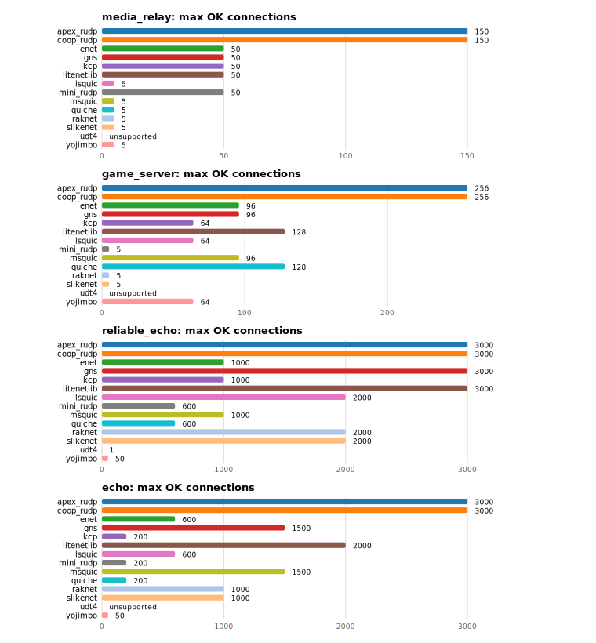

### `media_relay`

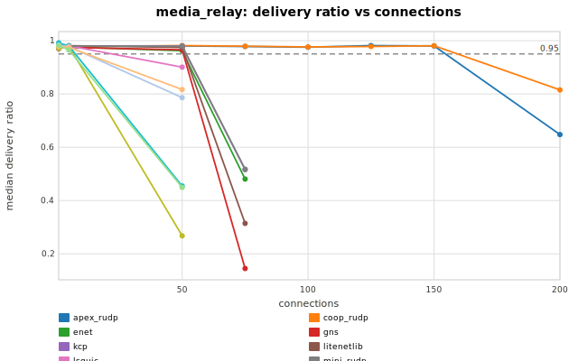

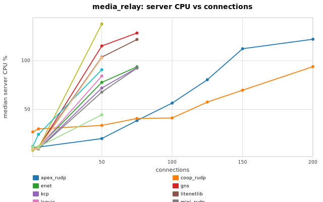

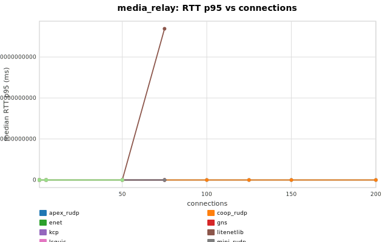

### `game_server`

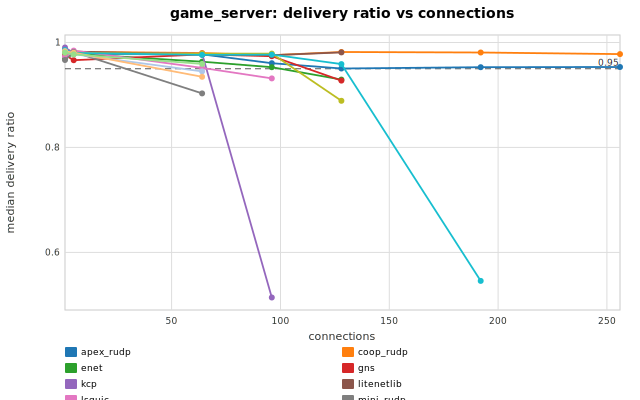

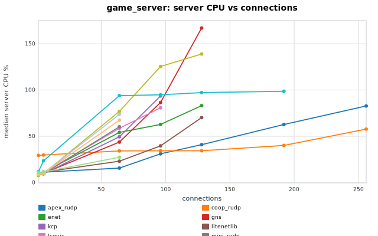

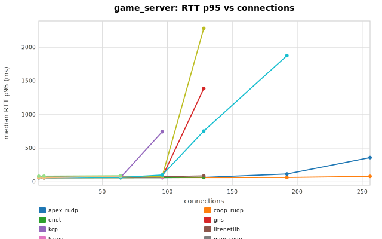

### `reliable_echo`

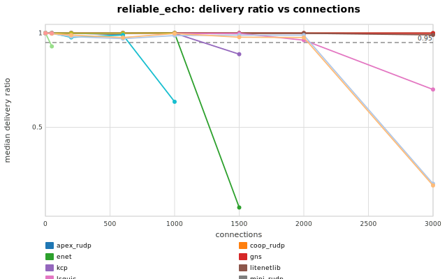

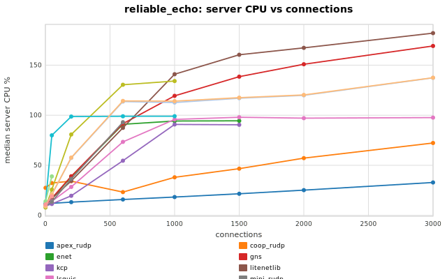

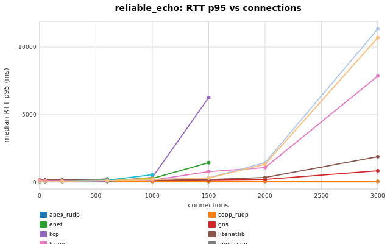

### `echo`

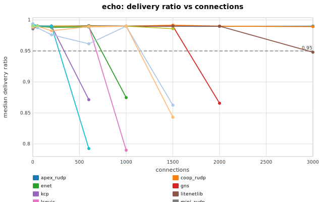

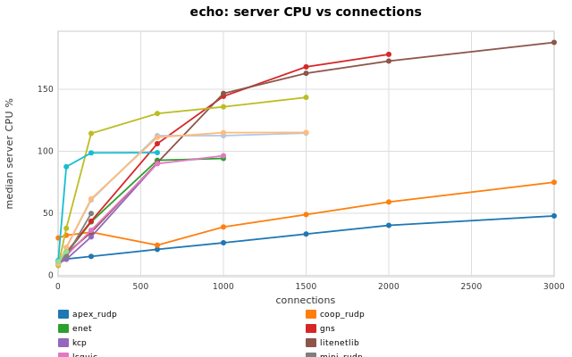

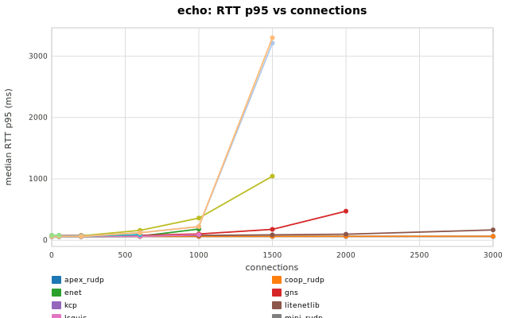

## Capacity Table

| profile | library | status | last OK | last OK delivery | last OK CPU | break | break reason | break delivery | break CPU |
| --- | --- | --- | --- | --- | --- | --- | --- | --- | --- |
| echo | apex_rudp | not_broken | 3000 | 0.9900 | 47.90 | not broken |  |  |  |
| echo | coop_rudp | not_broken | 3000 | 0.9893 | 75.04 | not broken |  |  |  |
| echo | enet | broken | 600 | 0.9886 | 92.74 | 1000 | delivery<0.95 | 0.8748 | 94.22 |
| echo | gns | broken | 1500 | 0.9901 | 168.10 | 2000 | delivery<0.95 | 0.8657 | 178.15 |
| echo | kcp | broken | 200 | 0.9903 | 30.98 | 600 | delivery<0.95 | 0.8714 | 90.33 |
| echo | litenetlib | broken | 2000 | 0.9900 | 172.78 | 3000 | delivery<0.95 | 0.9480 | 187.81 |
| echo | lsquic | broken | 600 | 0.9900 | 89.98 | 1000 | delivery<0.95 | 0.7899 | 96.35 |
| echo | mini_rudp | broken | 200 | 0.9899 | 49.81 | 600 | aggregate_invalid:client_tick |  |  |
| echo | msquic | broken | 1500 | 0.9859 | 143.49 | 2000 | aggregate_invalid:client_tick |  |  |
| echo | quiche | broken | 200 | 0.9901 | 98.70 | 600 | delivery<0.95 | 0.7927 | 98.92 |
| echo | raknet | broken | 1000 | 0.9899 | 112.56 | 1500 | delivery<0.95 | 0.8626 | 114.68 |
| echo | slikenet | broken | 1000 | 0.9901 | 115.01 | 1500 | delivery<0.95 | 0.8432 | 115.20 |
| echo | udt4 | unsupported | unsupported |  |  | 1 | unsupported_unreliable |  |  |
| echo | yojimbo | broken | 50 | 0.9899 | 19.30 | 200 | unsupported_conns |  |  |
| game_server | apex_rudp | not_broken | 256 | 0.9534 | 82.77 | not broken |  |  |  |
| game_server | coop_rudp | not_broken | 256 | 0.9779 | 57.80 | not broken |  |  |  |
| game_server | enet | broken | 96 | 0.9530 | 62.83 | 128 | delivery<0.95 | 0.9294 | 83.14 |
| game_server | gns | broken | 96 | 0.9740 | 86.58 | 128 | delivery<0.95 | 0.9275 | 167.05 |
| game_server | kcp | broken | 64 | 0.9787 | 49.45 | 96 | delivery<0.95 | 0.5140 | 93.66 |
| game_server | litenetlib | broken | 128 | 0.9811 | 70.24 | 192 | aggregate_invalid:client_tick |  |  |
| game_server | lsquic | broken | 64 | 0.9517 | 58.60 | 96 | delivery<0.95 | 0.9316 | 80.79 |
| game_server | mini_rudp | broken | 5 | 0.9819 | 9.34 | 64 | delivery<0.95 | 0.9030 | 60.32 |
| game_server | msquic | broken | 96 | 0.9789 | 125.47 | 128 | delivery<0.95 | 0.8889 | 138.96 |
| game_server | quiche | broken | 128 | 0.9588 | 97.25 | 192 | delivery<0.95 | 0.5457 | 98.67 |
| game_server | raknet | broken | 5 | 0.9777 | 9.88 | 64 | delivery<0.95 | 0.9449 | 73.69 |
| game_server | slikenet | broken | 5 | 0.9805 | 9.89 | 64 | delivery<0.95 | 0.9347 | 67.43 |
| game_server | udt4 | unsupported | unsupported |  |  | 1 | unsupported_unreliable |  |  |
| game_server | yojimbo | broken | 64 | 0.9592 | 27.36 | 96 | unsupported_conns |  |  |
| media_relay | apex_rudp | broken | 150 | 0.9803 | 112.21 | 200 | delivery<0.95 | 0.6476 | 121.90 |
| media_relay | coop_rudp | broken | 150 | 0.9808 | 69.68 | 200 | delivery<0.95 | 0.8152 | 93.78 |
| media_relay | enet | broken | 50 | 0.9621 | 77.69 | 75 | delivery<0.95 | 0.4805 | 93.65 |
| media_relay | gns | broken | 50 | 0.9656 | 115.02 | 75 | delivery<0.95 | 0.1450 | 128.28 |
| media_relay | kcp | broken | 50 | 0.9798 | 71.86 | 75 | delivery<0.95 | 0.5162 | 92.53 |
| media_relay | litenetlib | broken | 50 | 0.9745 | 103.59 | 75 | delivery<0.95 | 0.3143 | 121.65 |
| media_relay | lsquic | broken | 5 | 0.9805 | 10.53 | 50 | delivery<0.95 | 0.9005 | 84.22 |
| media_relay | mini_rudp | broken | 50 | 0.9792 | 67.71 | 75 | delivery<0.95 | 0.5176 | 92.30 |
| media_relay | msquic | broken | 5 | 0.9799 | 10.61 | 50 | delivery<0.95 | 0.2677 | 137.57 |
| media_relay | quiche | broken | 5 | 0.9801 | 24.26 | 50 | delivery<0.95 | 0.4546 | 90.61 |
| media_relay | raknet | broken | 5 | 0.9783 | 10.06 | 50 | delivery<0.95 | 0.7862 | 102.92 |
| media_relay | slikenet | broken | 5 | 0.9748 | 10.17 | 50 | delivery<0.95 | 0.8165 | 102.89 |
| media_relay | udt4 | unsupported | unsupported |  |  | 1 | unsupported_unreliable |  |  |
| media_relay | yojimbo | broken | 5 | 0.9652 | 11.55 | 50 | delivery<0.95 | 0.4491 | 44.42 |
| reliable_echo | apex_rudp | not_broken | 3000 | 1.0000 | 32.86 | not broken |  |  |  |
| reliable_echo | coop_rudp | not_broken | 3000 | 1.0000 | 72.28 | not broken |  |  |  |
| reliable_echo | enet | broken | 1000 | 0.9998 | 94.24 | 1500 | delivery<0.95 | 0.0743 | 94.39 |
| reliable_echo | gns | not_broken | 3000 | 0.9996 | 169.13 | not broken |  |  |  |
| reliable_echo | kcp | broken | 1000 | 0.9991 | 90.78 | 1500 | delivery<0.95 | 0.8880 | 90.47 |
| reliable_echo | litenetlib | not_broken | 3000 | 0.9908 | 181.97 | not broken |  |  |  |
| reliable_echo | lsquic | broken | 2000 | 0.9627 | 97.03 | 3000 | delivery<0.95 | 0.7009 | 97.59 |
| reliable_echo | mini_rudp | broken | 600 | 0.9913 | 93.02 | 1000 | aggregate_invalid:client_tick |  |  |
| reliable_echo | msquic | broken | 1000 | 1.0000 | 134.10 | 1500 | aggregate_invalid:client_tick |  |  |
| reliable_echo | quiche | broken | 600 | 0.9900 | 98.97 | 1000 | delivery<0.95 | 0.6355 | 99.03 |
| reliable_echo | raknet | broken | 2000 | 0.9890 | 119.86 | 3000 | delivery<0.95 | 0.2005 | 137.33 |
| reliable_echo | slikenet | broken | 2000 | 0.9767 | 120.26 | 3000 | delivery<0.95 | 0.1912 | 137.49 |
| reliable_echo | udt4 | broken | 1 | 1.0000 | 13.87 | 50 | delivery<0.95 | 0.9296 | 38.90 |
| reliable_echo | yojimbo | broken | 50 | 1.0000 | 19.01 | 200 | unsupported_conns |  |  |

## Profiles

| profile | mode | traffic | payload | conn sweep | client procs |
| --- | --- | --- | --- | --- | --- |
| media_relay | broadcast | r0/u30 | 1000 | 1 5 50 75 100 125 150 200 | 4 |
| game_server | broadcast | r1/u20 | 128 | 1 5 64 96 128 192 256 | 4 |
| reliable_echo | echo | r50/u0 | 64 | 1 50 200 600 1000 1500 2000 3000 | 8 |
| echo | echo | r50/u50 | 64 | 1 50 200 600 1000 1500 2000 3000 | 8 |

## Data Files

- [`capacity.csv`](capacity.csv)
- [`summary.csv`](summary.csv)
- [`profiles.csv`](profiles.csv)
